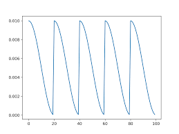
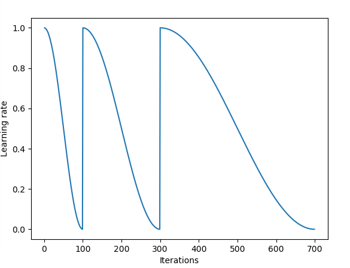

## Cosine Annealing


#### Cosine Annealing Learning Rate

An effective snapshot ensemble requires training a neural network with an aggressive learning rate schedule.

The function then returns the learning rate for the given epoch.
$$
\alpha(t)=\frac{\alpha_{0}}{2} \left (\cos\left(\frac{\pi mod(t-1,[T/M])}{[T/M]}+1\right) \right)
$$

> Where a(t) is the learning rate at epoch t, $a_0$ is the maximum learning rate, T is the total epochs, M is the number of cycles, mod is the modulo operation, and square brackets indicate a floor operation.


```python
# define custom learning rate schedule
class CosineAnnealingLearningRateSchedule(Callback):
	# constructor
	def __init__(self, n_epochs, n_cycles, lrate_max, verbose=0):
		self.epochs = n_epochs
		self.cycles = n_cycles
		self.lr_max = lrate_max
		self.lrates = list()
 
	# calculate learning rate for an epoch
	def cosine_annealing(self, epoch, n_epochs, n_cycles, lrate_max):
		epochs_per_cycle = floor(n_epochs/n_cycles)
		cos_inner = (pi * (epoch % epochs_per_cycle)) / (epochs_per_cycle)
		return lrate_max/2 * (cos(cos_inner) + 1)
 
	# calculate and set learning rate at the start of the epoch
	def on_epoch_begin(self, epoch, logs=None):
		# calculate learning rate
		lr = self.cosine_annealing(epoch, self.epochs, self.cycles, self.lr_max)
		# set learning rate
		backend.set_value(self.model.optimizer.lr, lr)
		# log value
		self.lrates.append(lr)
```


cosine annealing 방식은 epoch에 따라 학습률을 조절할 수 있다. Cosine annealing 방식은 **“SGDR: Stochastic Gradient Descent with Warm Restarts”** 라는 2017년 ICLR 논문에서 제안된 방식이다. 그림과 같이 cos 함수의 최고점에서 최저점으로 학습률을 감소시키고 일정 주기마다 다시 최고점으로 돌아오는 구조를 가지고 있다. 식은 다음과 같다.
$$
$\eta_{t}= \eta_{min}^{i}+\frac{1}{2}( \eta_{max}^{i}- \eta_{min}^{i})(1+\cos(\frac{T_{current}}{T_i}\pi))$
$$
 그림의 모양은 다음과 같다.




Cycling Learning Rates for Training Neural Networks



< 출처 >

https://machinelearningmastery.com/snapshot-ensemble-deep-learning-neural-network/

https://arxiv.org/abs/1608.03983 <SGDR: Stochastic Gradient Descent with Warm Restarts>

https://towardsdatascience.com/https-medium-com-reina-wang-tw-stochastic-gradient-descent-with-restarts-5f511975163

https://github.com/tensorflow/tensorflow/pull/11749

https://techburst.io/improving-the-way-we-work-with-learning-rate-5e99554f163b