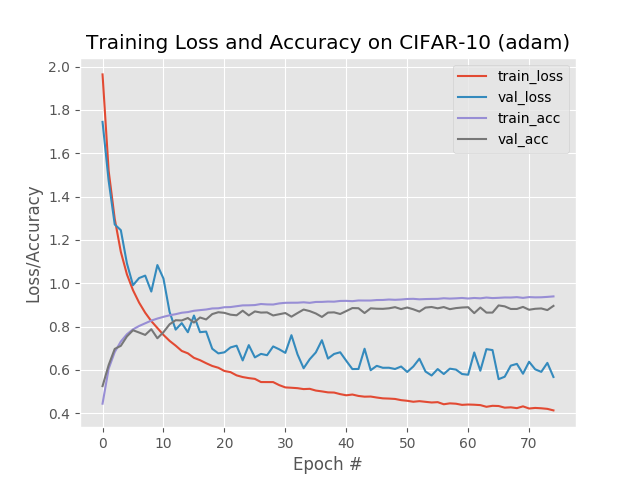
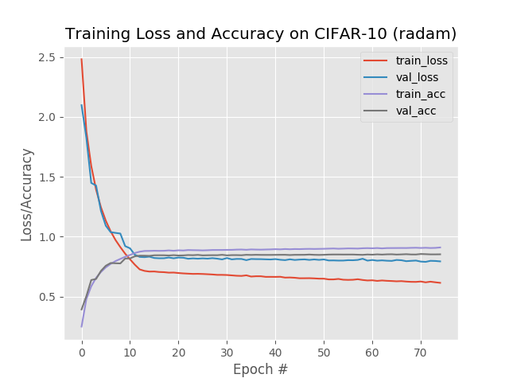
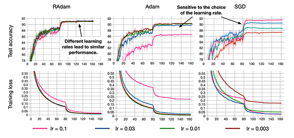
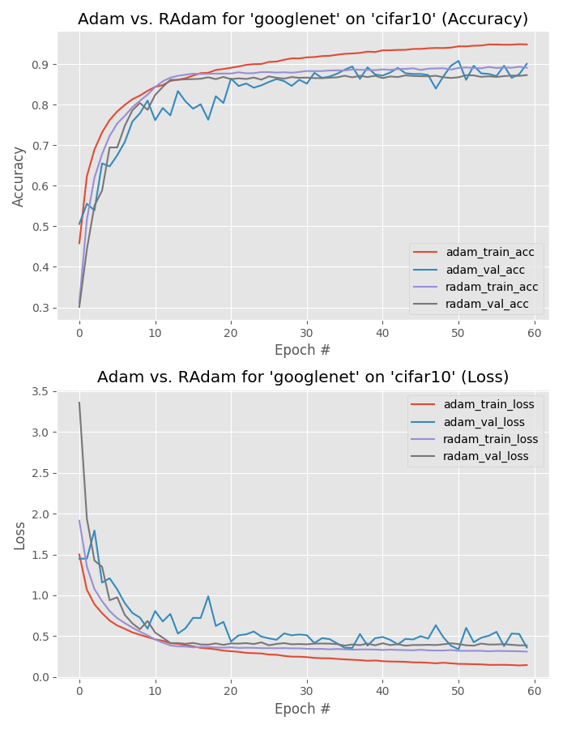

## Rectified Adam(RAdam)

#### 케라스에서 RAdam을 사용법

1. pip install keras-rectified-adam 로 인스톨 한다.

2. from keras_radam import RAdam 로 불러온다.

3. model.compile(RAdam()) 이런식으로 컴파일 할때 옵티마이저 부분을 대체해 줍니다.

4.  RAdam 의 옵션은 Adam과 동일하게 옵션을 줄 수 있고 그리고 total_steps=5000, warmup_proportion=0.1, min_lr=1e-5 다음과 같이 덧붙여 줄 수 있다.

<참고>

https://theonly1.tistory.com/1754

https://github.com/CyberZHG/keras-radam

https://github.com/LiyuanLucasLiu/RAdam

#### Rectified Adam (RAdam) optimizer with Keras

Recified Adam(RAdam) optimizer에 대해 아래의 두 링크에서 잘 설명해놓았고 간단히 요약해보고자 한다.

1. https://www.pyimagesearch.com/2019/09/30/rectified-adam-radam-optimizer-with-keras/

2. https://www.pyimagesearch.com/2019/10/07/is-rectified-adam-actually-better-than-adam/

1번 링크에 대한 요약

CIFAR-10 자료를 최적화시키기 위해 Adam optimizer를 사용한 손실과 정확도의 그래프이다. 중간에 보면 val_loss가 줄어드는 방향으로 가지만 중간중간 큰 요동(fluctuation)이 있는 것을 볼 수 있다. train_loss는 약 0.4 값으로 수렴하는 것을 볼 수 있다. 정확도는 약 90%에 다다랐다.

같은 CIFAR-10 자료를 최적화시키기 위해 RAdam 을 사용하여 나타낸 손실과 정확도 그래프이다. 이 그래프는 위와 비교해보면 요동없이 loss와 val_loss가 꾸준하게 감소하는 것을 볼 수 있다. 하지만 loss가 약 0.7정도로 수렴하는 것을 볼 수 있다. 정확도는 약 85%에 도달했다. 

이 둘을 비교해보면 오히려 Adam optimizer가 더 좋은 정확도를 만들어냈다. 즉, Adam이 RAdam보다 더 좋은 성능을 냈다고 할 수 있다. 그렇다면 Adam이 RAdam보다 좋다고 할 수 있을까?

2번 링크에서는 다음과 같은 질문으로 시작한다. Is the Rectified Adam (RAdam) optimizer actually ***better*** than the standard Adam optimizer? 

라는 질문으로 시작한다. 여러가지의 경우를 가지고 24번의 실험을 하는데 답은 아니라고 한다. 영어 표현을 보면according to my 24 experiments, the answer is no, typically not (but there are cases where you *do* want to use it instead of Adam).

In Liu et al.’s 2018 paper, *On the Variance of the Adaptive Learning Rate and Beyond*, the authors claim that Rectified Adam can obtain:

- **Better accuracy** (or at least identical accuracy when compared to Adam)
- And in **fewer epochs** than standard Adam

2018년 Liu et al.'s 논문에서는 RAdam은 Adam보다 더 좋거나 적어도 같은 정확도를 얻을수 있다고 한다 'standard Adam보다 더 적은 epoch에서'라고 말한다.

논문의 내용을 간단히 살펴보면 다음과 같다.

**Figure 1:** The Rectified Adam (RAdam) deep learning optimizer. Is it better than the standard Adam optimizer? (image source: Figure 6 from Liu et al.)

논문에 의하면 RAdam의 경우 어떤 learning rate를 가지던간에 비슷한 성능으로 수렴한다고 하는 것에 비해 Adam이나 SGD 같은 경우에는 learning rate에 민감하게 반응하고 그에 따라 정확도와 loss가 확연히 차이가 나는 것을 확인할 수 있다. 따라서 RAdam은 모델 훈련에 있어 robustness을 향상시키고 더 넓은 범위의 다양한 학습률을 적용할 수 있다고 한다.

그리고 다시 2번 링크의 내용으로 돌아오면 24개의 실험은 한다.

CNN의 1. ResNet 2. GoogLeNet 3. MiniVGGNet을 사용하고
데이터셋은 1. MNIST 2. Fashion MNIST 3. CIFAR-10 4. CIFAR-100
옵티마이저는 1. Adam 2. Rectified Adam을 사용하여 총 24개의 테스트를 한다.

#### MNIST

MiniVGGNet, GoogLeNet, ResNet의 경우 사용했을 때에는 정확도는 같았다. 세 경우 모두 큰 차이가 없었다.

#### Fashion MNIST

MiniVGGNet에서는 Adam의 경우가 정확도가 높았다. GoogLeNet에서는 정확도가 같았다. ResNet 경우는 정확도가 같았는데 Adam 옵티마이저의 경우 loss와 validation loss가 더 작았지만 RAdam의 경우 Adam에 비해서 더 적은 요동과 함께 loss가 안정적이었다.

#### CIFAR-10

MiniVGGNet에서는 Adam은 정확도가 84%, RAdam은 74%이었다. GoogLeNet의 경우에는 Adam의 정확도는 90%이고, RAdam은 87%였다. 여기서 주목해야 할점은 RAdam이다. Adam의 loss와 val_loss 사이 값으로 RAdam의 loss와 val_loss가 수렴한다. 반면에 Adam은 더 높은 정확도를 얻지만, 30 epoch을 지나면서 validation loss가 overfitting 되는 것을 확인할 수 있다. 아래의 그림을 보자.

ResNet의 경우에는 Adam의 경우 88%의 정확도에 비해  RAdam은 84%의 정확도였다.

#### CIFAR-100

MiNiVGGNet의 경우 Adam은 58%, RAdam은 46%이었다. GoogLeNet의 경우에는 Adam은 66%, RAdam은 59%정확도를 가졌다. 하지만 이경우 Adam으로 계산한 validation loss가 불안정하게 값이 요동쳤다.  ResNet의 경우 Adam은 68%, RAdam 51% 정확도였다. 이 경우에는 RAdam은 20 epoch을 지나고 나서 loss와 val_loss가 정체되었다. 즉, 20 epoch을 지나서 값이 거의 변하지 않았다. Adam의 경우에는 정확도가 높았지만 RAdam은 generalization 측면에서는 낫다고 할 수 있다.

위 실험을 정리하자면,  첫째로 RAdam optimizer가 더 stable한 훈련을 만들어준다. 즉, RAdam의 경우 더 적은 fluctuation과 spike를 볼 수 있었다. 그리고 validation loss는 역시 training loss를 거의 일치했다. 그리고 단순히 정확도가 높은 것이 전부가 아니라 generalization면에 있어 **stability(안정성)** 역시도 중요하다고 한다.

두번째로는 Adam은 매 실험에서 RAdam보다 더 작은 loss값을 가졌다. 이것이 항상 나쁜 것은 아니라고 한다. RAdam이 **generalization**에 있어서는 더 좋다고 한다.

강조하는데, 낮은 loss가 반드시 좋은 모델이 아니라고 한다. 0에 가까운 아주 작은 loss가 되더라도 아마 training set에 과적합(overfitting)될 것이라고 한다.

그리고 다음 **세 개의 옵티마이저**를 잘 다루라고 조언해 준다. 

1. SGD 2. RMSprop 3. Adam

특히 SGD는 거의 대부분의 최신의 컴퓨터 비젼 모델에서 사용되었다고 한다.

**결론은** **Adam**의 경우 **정확도**를 높이는 데 있어서 더 좋은 도구이지만, 학습률에 민감하지 않은 **RAdam**은 **일반화** 측면에 있어서 더 좋다고 할 수 있다.

