## 0. CNN

## 0. **ILSVRC**

ILSVRC은 ImageNet Large Scale Visual Recognition Challenge의 약자로 이미지 인식 경진대회이다. 
이미지 인식과 이미지 분류는 같은 의미
대용량의 이미지셋을 주고 이미지 인식 알고리즘의 성능을 평가하는 대회

2012년 이후로는 CNN 기반 딥러닝 알고리즘 AlexNet이 우승을 차지한 이후에는 깊은 구조를 가진 알고리즘들이 우승을 차지

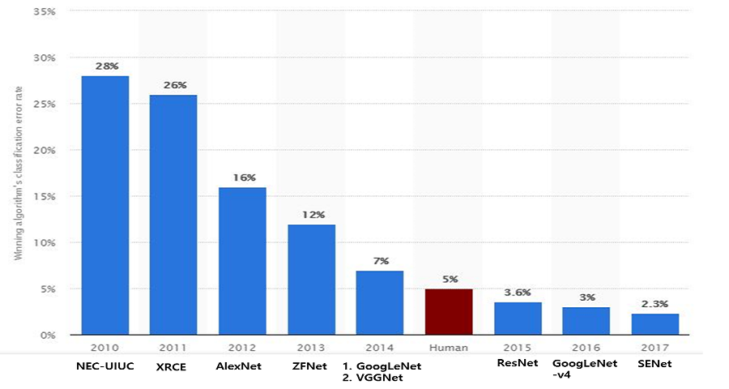

## 1. LeNet

LeNet은 얀 르쿤 연구팀이 1998년에 개발한 CNN 알고리즘

LeNet-5의 구조

Input층에 입력할 이미지의 크기는 32x32이고, 그 후로 3개의 컨볼루션 층과, 2개의 서브샘플링 층과 1개의 완전 연결층과 output 레이어로 만들어져 있다. 그리고 각 층의 활성화 함수는 모두 tanh이다.

| 레이어        | 특징                                       |
| ------------- | ------------------------------------------ |
| C1 레이어     | 5x5 필터가 6개 존재                        |
| S2 레이어     | 2x2 필터를 stride 2로 하여 평균 풀링       |
| C3 레이어     | 5x5 필터가 16개 존재                       |
| S4 레이어     | 2x2 필터를 stride 2로 하여 평균 풀링       |
| C5 레이어     | 5x5x16 필터와 컨볼루션                     |
| F6 레이어     | 84개의 노드를 가진 신경망                  |
| Output 레이어 | 10개의 RBF 유닛들로 구성(Machine Learning) |

C3 레이어에서 특성맵을 조합하는 방법

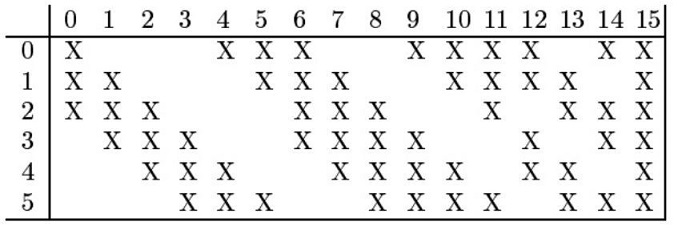

1. 6장의 14 x 14 특성맵에서 연속된 3장씩을 모아서 5 x 5 x 3 사이즈의 필터와 컨볼루션 해준다. 6장의 10 x 10 특성맵이 산출 

2. 6장의 14 x 14 특성맵에서 연속된 4장씩을 모아서 5 x 5 x 4 사이즈의 필터와 컨볼루션 해준다. 6장의 10 x 10 특성맵이 산출

3. 6장의 14 x 14 특성맵에서 불연속한 4장씩을 모아서 5 x 5 x 4 사이즈의 필터와 컨볼루션 해준다. 3장의 10 x 10 특성맵이 산출 

4. 6장의 14 x 14 특성맵 모두를 가지고 5 x 5 x 6 사이즈의 필터와 컨볼루션 해준다. 1장의 10 x 10 특성맵이 산출

총 16장의 10 x 10 특성맵 

## 2. AlexNet

AlexNet은 5개의 컨볼루션 레이어와 3개의 full-connected 레이어로 총 8개의 레이어로 구성

두번째, 네번째, 다섯번째 컨볼루션 레이어들은 전 단계의 같은 채널의 특성맵들과만 연결
**세번째 컨볼루션 레이어**는 전 단계의 두 채널의 특성맵들과 모두 연결

 AlexNet에 입력 되는 이미지의 크기는 224 x 224 x 3

### AlexNet의 특징

1. ReLU 함수

   같은 정확도를 유지하면서 tanh을 사용하는 것보다 6배나 빠르다고 한다.

   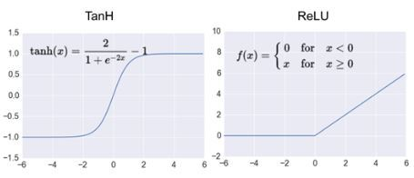

   

2. Dropout

   Fully-connected layer의 뉴런 중 일부를 생략하면서 학습을 진행

   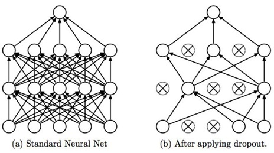

   

3. Overlapping Pooling

   LeNet-5의 경우 평균 풀링(average pooling)이 사용, AlexNet에서는 **최대 풀링(max pooling)**이 사용

   LeNet-5는 **non-overlapping 평균 풀링**을 사용, AlexNet은 **overlapping 최대 풀링**을 사용

   

   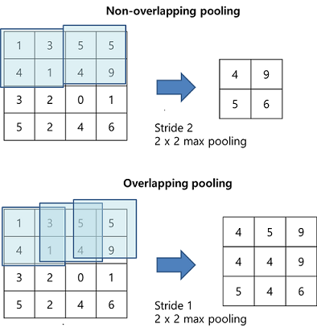

4. Local response normalization (LRN)

   

5. Data augmentation

   - 과적합을 막는 가장 좋은 방법 중 하나는 데이터의 양을 늘리는 것으로 과적합을 막기 위해 사용

   - 훈련시킬 때 적은 양의 데이터를 가지고 훈련시킬 경우 과적합될 가능성이 큼

   

   

   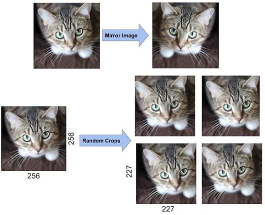

## 3. ZfNet

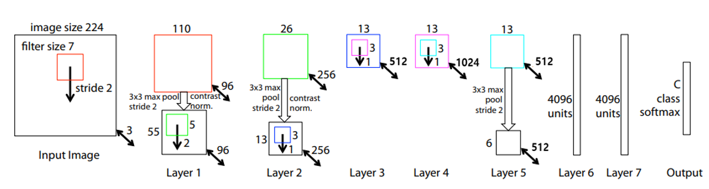

AlexNet을 기반으로 첫 Conv layer의 filter size를 11에서 7로, stride를 4에서 2로 바꾸고, 그 뒤의 Conv layer들의 filter 개수를 키워주는 등(Conv3,4,5: 384, 384, 256 –> 512, 1024, 512) 약간의 튜닝을 거쳤으며 이 논문은 architecture에 집중하기 보다는, 학습이 진행됨에 따라 feature map을 시각화하는 방법과, 모델이 어느 영역을 보고 예측을 하는지 관찰하기 위한 Occlusion 기반의 attribution 기법 등 시각화 측면에 집중한 논문

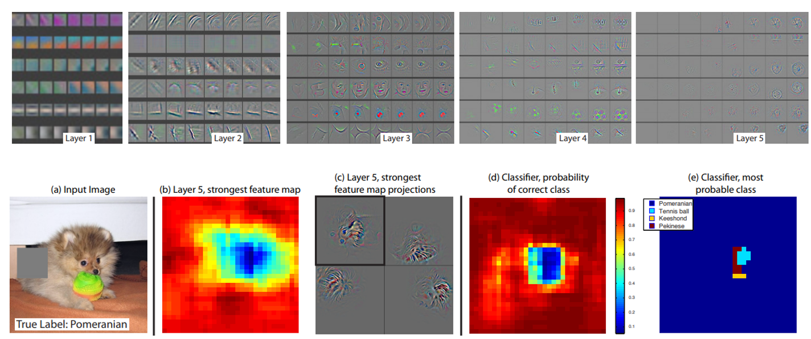

## 4. VGG16

VGGNet 모델부터 시작해서 네트워크의 깊이가 확 깊어짐

## 5. GoogLeNet(Inception_v1)

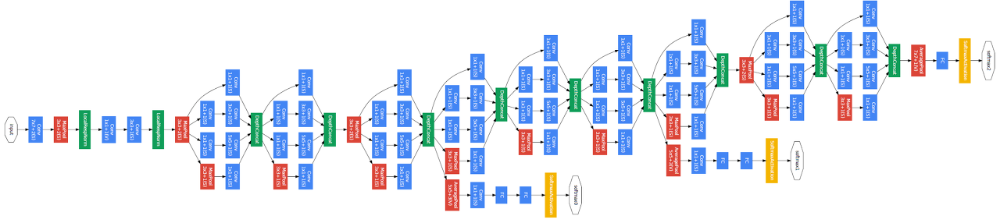

#### (1) **1 x 1 컨볼루션**

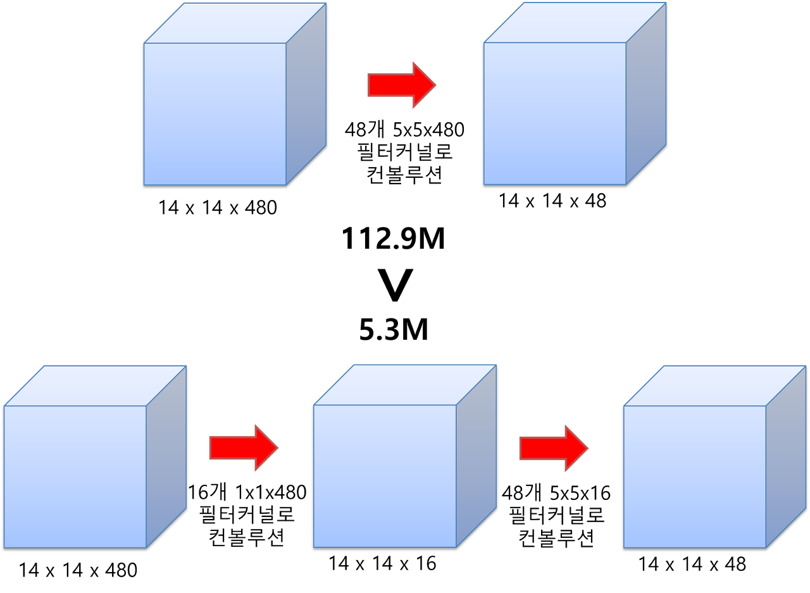

Bottleneck Structure

dimension reduction

#### (2) **Inception 모듈**

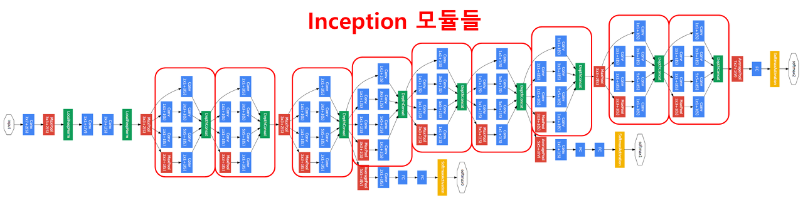

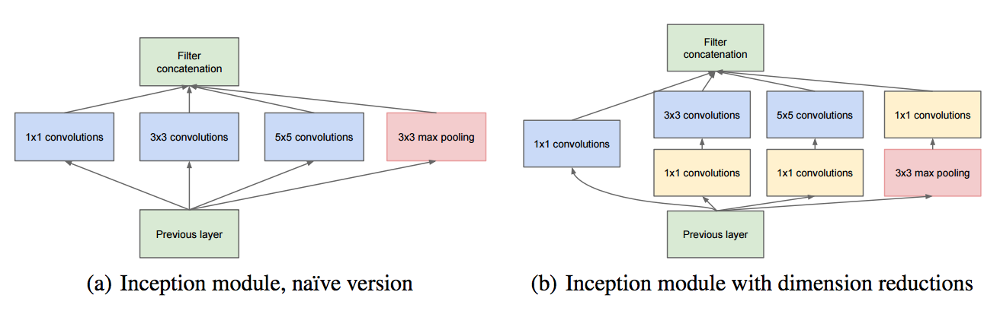

#### (3) global average pooling**

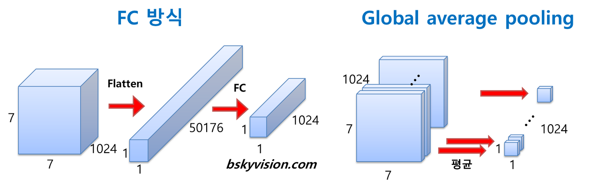

#### **(4) auxiliary classifier**

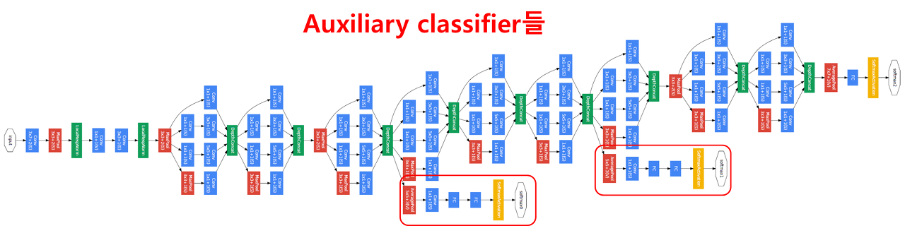

https://norman3.github.io/papers/docs/google_inception.html

https://datascienceschool.net/notebook/ETC/

## 6. ResNet

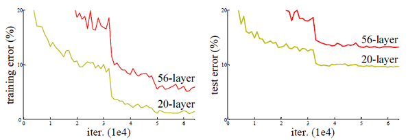

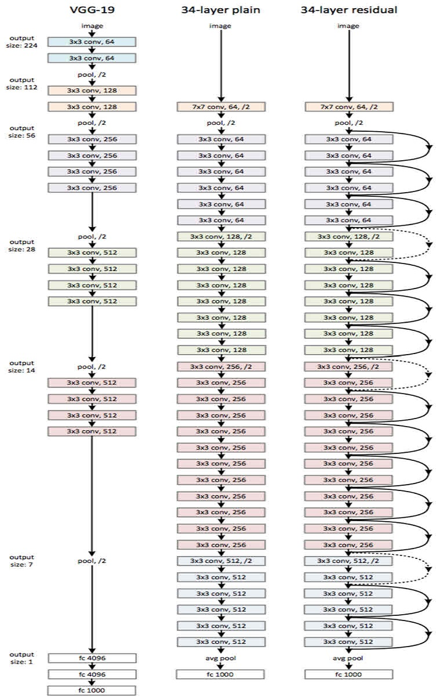

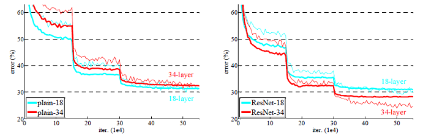

## 7. DenseNet

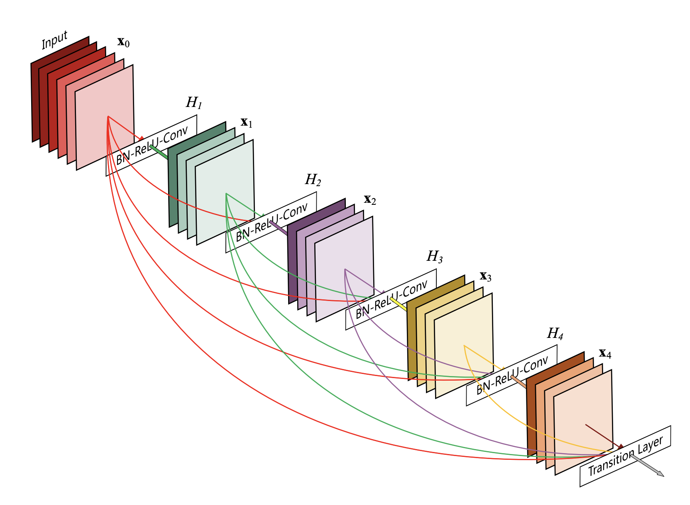

장점

1. Vanishing-gradient 문제 완화
2. 더 강력한 피쳐 프로파게이션이 가능
3. 피쳐 재사용을 촉진
4. 파라미터의 수를 감소
5. Regularlizing 효과와 Overfitting 감소

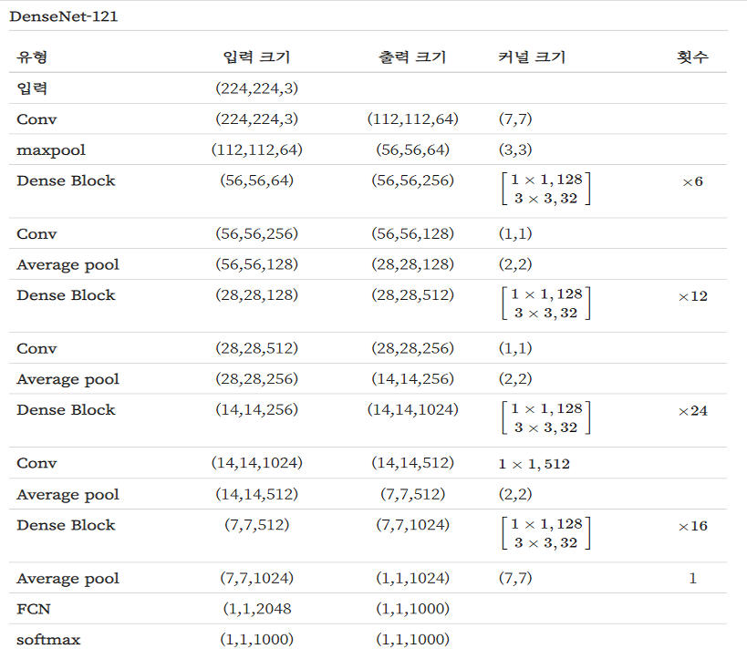

**Bottleneck layers**

## 8. Xception

Depth-wise separable convolution

 Inception은 연산량을 줄여 더 깊은 모델을 만들고자 했다고 하면 Xception은 이 모델의 prameter들을 더 효율적으로 사용하기위한 방법을 제시

## 9. Se-Network

[기타]

WideResNet, Pyramidal Net, ResNeXt

<참고>

https://arxiv.org/abs/1901.06032

https://bskyvision.com/

https://blog.naver.com/laonple/220643128255

https://j911.me/2019/07/densenet.html

https://datascienceschool.net/view-notebook/4ca30ffdf6c0407ab281284459982a25/

https://hichoe95.tistory.com/49

https://hoya012.github.io/blog/deeplearning-classification-guidebook-2/