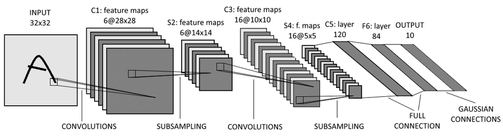
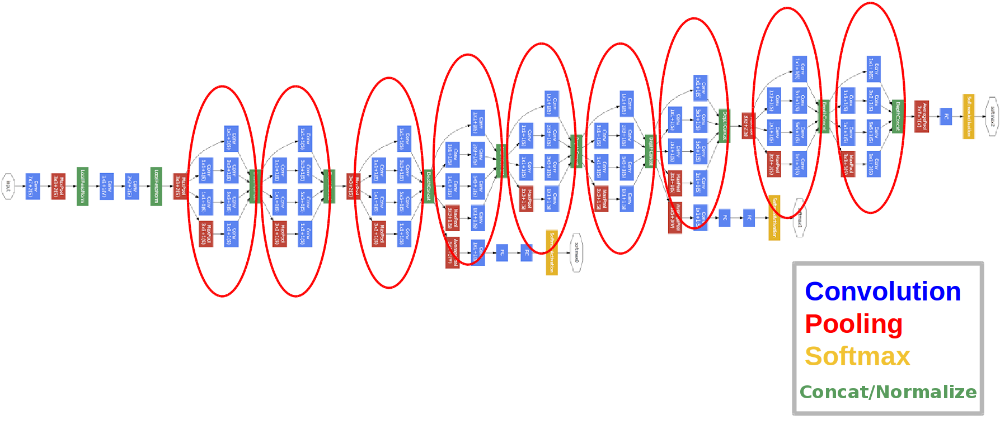
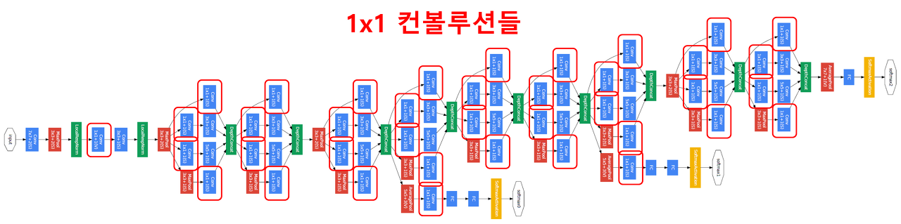
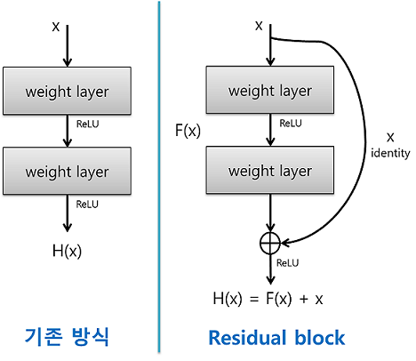

## 0. **ILSVRC**

ILSVRC은 ImageNet Large Scale Visual Recognition Challenge의 약자로 대용량의 이미지셋을 주고 이미지 인식 알고리즘의 성능을 평가하는 대회 이미지 인식 경진대회

2012년 이후로는 CNN 기반 딥러닝 알고리즘 AlexNet이 우승을 차지한 이후에는 깊은 구조를 가진 알고리즘들이 우승을 차지

## 1. LeNet

LeNet은 얀 르쿤 연구팀이 1998년에 개발한 CNN 알고리즘

LeNet-5의 구조

Input층에 입력할 이미지의 크기는 32x32이고, 그 후로 3개의 컨볼루션 층과, 2개의 서브샘플링 층과 1개의 완전 연결층과 output 레이어로 만들어져 있다. 그리고 각 층의 활성화 함수는 모두 tanh이다.

| 레이어        | 특징                                 |
| ------------- | ------------------------------------ |
| C1 레이어     | 5x5 필터가 6개 존재                  |
| S2 레이어     | 2x2 필터를 stride 2로 하여 평균 풀링 |
| **C3** 레이어 | 5x5 필터가 16개 존재                 |
| S4 레이어     | 2x2 필터를 stride 2로 하여 평균 풀링 |
| C5 레이어     | 5x5x16 필터와 컨볼루션               |
| F6 레이어     | 84개의 노드를 가진 신경망            |
| Output 레이어 | 10개의 RBF 유닛들로 구성             |

C3 레이어에서 특성맵을 조합하는 방법

1. 6장의 14 x 14 특성맵에서 연속된 3장씩을 모아서 5 x 5 x 3 사이즈의 필터와 컨볼루션 해준다. 6장의 10 x 10 특성맵이 산출 

2. 6장의 14 x 14 특성맵에서 연속된 4장씩을 모아서 5 x 5 x 4 사이즈의 필터와 컨볼루션 해준다. 6장의 10 x 10 특성맵이 산출

3. 6장의 14 x 14 특성맵에서 불연속한 4장씩을 모아서 5 x 5 x 4 사이즈의 필터와 컨볼루션 해준다. 3장의 10 x 10 특성맵이 산출 

4. 6장의 14 x 14 특성맵 모두를 가지고 5 x 5 x 6 사이즈의 필터와 컨볼루션 해준다. 1장의 10 x 10 특성맵이 산출

총 16장의 10 x 10 특성맵 

## 2. AlexNet

AlexNet은 5개의 컨볼루션 레이어와 3개의 full-connected 레이어로 총 8개의 레이어로 구성

두번째, 네번째, 다섯번째 컨볼루션 레이어들은 전 단계의 같은 채널의 특성맵들과만 연결
**세번째 컨볼루션 레이어**는 전 단계의 두 채널의 특성맵들과 모두 연결

 AlexNet에 입력 되는 이미지의 크기는 224 x 224 x 3

### AlexNet의 특징

1. ReLU 함수

   같은 정확도를 유지하면서 tanh을 사용하는 것보다 6배나 빠르다고 한다.

   

   

2. Dropout

   Fully-connected layer의 뉴런 중 일부를 생략하면서 학습을 진행

   

   

3. Overlapping Pooling

   LeNet-5의 경우 평균 풀링(average pooling)이 사용, AlexNet에서는 **최대 풀링(max pooling)**이 사용

   LeNet-5는 **non-overlapping 평균 풀링**을 사용, AlexNet은 **overlapping 최대 풀링**을 사용

   

   

4. Local response normalization (LRN)

   ReLU는 양수의 방향으로는 입력값을 그대로 사용
   그렇게되면 Conv나 Pooling시 매우 높은 하나의 픽셀값이 주변의 픽셀에 영향
   이것을 방지하기 위해 다른 Activation Map의 같은 위치에있는 픽셀끼리 정규화

   

5. Data augmentation

   - 과적합을 막는 가장 좋은 방법 중 하나는 데이터의 양을 늘리는 것으로 과적합을 막기 위해 사용

   - 훈련시킬 때 적은 양의 데이터를 가지고 훈련시킬 경우 과적합될 가능성이 큼

   

   

   

## 3. ZFNet

AlexNet을 기반으로 첫 Conv layer의 filter size를 11에서 7로, stride를 4에서 2로 바꾸고, 그 뒤의 Conv layer들의 filter 개수를 키워주는 등(Conv3,4,5: 384, 384, 256 –> 512, 1024, 512) 약간의 튜닝을 거침

이 모델은 architecture에 집중하기 보다는, 학습이 진행됨에 따라 feature map을 시각화하는 방법과, 모델이 어느 영역을 보고 예측을 하는지 관찰하기 위한 occlusion 기반의 attribution 기법 등 **시각화 측면**에 집중

Layer5에서는 위치나 자세 변화 등까지 포함한 사물이나 개체의 전부를 보임

영상을 대표할 수 있는 특징은 크게 3가지로 분류가 가능하다.

- Low-level feature: edge, corner, color

- Mid-level feature: edge junction

- High-level feature: object의 일부분이나 전체 object

## 4. VGG

VGGNet 연구팀이 그들의 논문 “Very deep convolutional networks for large-scale image recognition”에서 밝혔듯이, 원래는 망의 깊이(depth)가 어떤 영향을 주는지 연구를 하기 위해 VGGNet을 개발

2014년 이미지넷 이미지 인식 대회에서 준우승을 한 모델로 VGGNet은 16개(VGG16) 또는 19개(VGG19)의 층으로 구성된 모델을 의미

VGGNet 모델부터 시작해서 네트워크의 깊이가 확 깊어짐

2012년, 2013년 우승 모델들은 8개의 층으로 구성
2014년의 VGGNet(VGG19)는 19층으로 구성
GoogLeNet은 22층으로 구성

 3 x 3 필터가 3개면 총 27개의 가중치를 갖는다. 반면 7 x 7 필터는 49개의 가중치를 갖는다. 
큰 kernel 한 번 적용이  3x3의 작은 kernel을 여러번 적용하는 것보다 훨씬 더 많은 연산비용

CNN에서 가중치는 모두 훈련이 필요한 것들이므로, 가중치가 적다는 것은 그만큼 훈련시켜야할 것의 갯수가 작아진다. 따라서 학습의 속도가 빨라진다. 동시에 층의 갯수가 늘어나면서 특성에 비선형성을 더 증가시키기 때문에 특성이 점점 더 유용

## 5. GoogLeNet(Inception_v1)

##### 망이 깊어질때의 부작용은?

1. Overfitting

   우선 망이 커지면 커질수록 자유 파라미터(free parameter)의 수가 증가하게 되며, 이렇게 되면 특히 학습에 사용할 데이터 양이 제한적인 경우에 더 심각한 문제가 되지만, 망이 overfitting에 빠질 가능성이 높아짐

2. 많은 연산량

   또 다른 문제는 망의 크기가 커지면 그만큼 연산량이 늘어나게 된다.

GoogLeNet의 목표

- 차원 축소와 속도 향상
- Network in Network (NIN)

일반적인 CNN 구조는 feature extraction 부분(convolution layer + pooling layer)과 classifier 부분(fully connected neural network)으로 구성

NIN에서는 convolution 커널 대신에 MLP를 사용

MLP를 사용했을 때의 장점은 convolution kernel 보다는 non-linear 한 성질을 잘 활용할 수 있기 때문에 feature를 추출할 수 있는 능력이 우수

또한 1x1 convolution을 사용하여 feature-map을 줄일 수 있도록 하였으며, 이 기술은 GoogLeNet의 인셉션에 그대로 적용

GoogLeNet의 구조

#### (1) **1 x 1 컨볼루션**

#### (2) **Inception 모듈**

인셉션 모듈을 통해 GoogLeNet 은 AlexNet에 비해 망의 깊이는 훨씬 깊은데 free parameter의 수는 1/12 수준이고 전체 연산량도 AlexNet에 비해 적음

 GoogLeNet에는 총 9개의 인셉션 모듈이 적용

#### (3) Global average pooling

CNN에서 전통적인 FC를 대체하는 global average pooling이라는 방법을 제안

FC Layer 대신에 각 feature map에 대한 평균을 취하고 이를 직접 softmax layer에 연결

#### 장점

- FC 대신에 Global average pooling의 이점으로서 feature maps과 카테고리 사이를 연관지음으로서 convolution structure에 좀더 native하게 한다.
- 그렇기 때문에 feature maps은 categorical confidence maps으로 쉽게 해석될 수있다.
- 또다른 이점으로 global average pooling에서 파라미터를 최적화 할 필요가 없기 때문에 이 레이어에서 과적합을 피할 수 있다는 점이다.
- 게다가, global average pooling은 공간정보를 반영하기 때문에 입력값의 공간적인 해석에 좀 더 강하다.

https://flonelin.wordpress.com/2017/12/22/global-average-pooling/

#### **(4) Auxiliary classifier(보조 분류기)**

- softmax영역이 망 전체에 총 3 개가 있다.

- 실제 마지막 Layer 가 진짜 *softmax* 레이어이고 나머지 2개는 보조 *softmax* 레이어

- 이는 망이 깊어질 때 발생하는 vanishing 문제를 해결하고자 중간 층에서도 backpropagtion을 수행하여 weight 갱신을 시도

- Auxiliary classifier를 이용하여 vanishing gradient 문제를 피함

https://norman3.github.io/papers/docs/google_inception.html

결론

1. 인셉션 모듈 내부의 여러 곳에서 사용되는 1x1 convolution layer를 통해, 연산량을 크게 경감시킬 수 있게 되어, 결과적으로 망의 넓이와 깊이를 증가시킬 수 있는 기반이 마련 
2. 인셉션 모듈을 통해 NIN(Network-in-Network) 구조를 갖는 deep CNN 구현이 가능하게 되었다.

## 5-1. Inception. v2

#### Convolution Factorization

5x5 convolution은 3x3 convolution에 비해 더 넓은 영역에 걸쳐 있는 특징을 1번에 추출할 수 있지만, 25/9 = 2.78배 비싼 유닛이다. 이 5x5 convolution은 2단의 3x3 convolution을 사용해 구현이 가능하며,
이 경우는 free parameter의 수는 **18**(=9+9)로 5x5 convolution의 **25**와 비교하면 28% 만큼 절감이 가능

아래 그림은 이 방식을 적용하여 원래의 Inception을 변형시킨 결과

3x3 convolution을 1x3 convolution과 3x1 convolution으로 분해

이렇게 되면, free parameter의 수는 (3+3) = 6이 되어, 9와 비교하면 33% 절감

n x n convolution은 1xn 및 nx1로 분해가 가능하며, n이 클수록 파라미터 절감 효과 발생

구글이 자신들의 인셉선 구조를 발전시킨 Inception-V2 및 Inception-V3의 핵심 아이디어

1. 비대칭(Asymmetric) Conv 를 사용한 Factorization

   

   

2. 보조 분류기 (Auxiliary Classifiers)

- 이 중에 맨 하단 분류기는 삭제한다. 실험을 통해 성능에 영향을 주지 못하는 것으로 확인되었다.

3. 효율적인 그리드(Grid) 크기 줄이기

    Representation Bottleneck 을 없애는 구조
    
    - CNN 은 Feature Map의 Grid 크기를 줄여가는 과정을 Max-Pooling 을 이용해서 진행
    - 결론부터 말하면 둘 다 효율이 좋지 않음

오른쪽은 왼쪽보다는 좀 더 단순한 방법으로 stride 2를 갖는 convolution을 통해 320개의 feature-map을 추출하고 pooling layer를 통해 다시 320개의 feature-map을 추출함으로써 효율성과 연산량의 절감을 동시에 달성할 수 있음

#### Inception v2

## 5-2. Inception_v3

Inception_v3는 Inception_v2 를 만들고 나서 이를 이용해 이것저것 수정해 결과가 더 좋은 것들을 묶음

- **RMSProp** : Optimizer를 바꾼거다.
- Label Smoothing
  - 논문에 자세히 나와있긴 한데 간단히 설명하자면 Target 값을 one-hot encoding을 사용하는 것이 아니라,
  - 값이 0 인 레이블에 대해서도 아주 작은 값 e 를 배분하고 정답은 대충 1−(n−1)∗e1−(n−1)∗e 로 값을 반영하는 것이다.
- Factorized 7-7
  - 이게 좀 아리까리한게 맨 앞단 conv 7x7 레이어를 (3x3)-(3x3) 2 레이어로 Factorization 한 것이라고 한다. 
- BN-auxiliary
  - 마지막 Fully Conntected 레이어에 Batch Normalization(BN)을 적용한다.

## 5-3. Inception_v4

Inception v4 model structure

https://norman3.github.io/papers/docs/google_inception.html

## 6. ResNet

깊은 망의 문제점

1. Vanishing/Exploding Gradient
2. 어려워지는 학습 방법: 파라미터 수와 overfitting

##### Shortcut

1. 깊은 망도 쉽게 최적화 가능
2. 늘어난 깊이로 인해 정확도를 개선 가능

초기 단계에서 residual net의 수렴 속도가 plain network보다 빠르다는 점

**Deeper Bottleneck Architecture**

차원을 줄였다가 뒤에서 차원을 늘리는 모습이 병목

연산 시간을 줄이기 위한 구조

먼저 맨 처음 1x1 convolution은 NIN(Network-in-Network)이나 GoogLeNet의 Inception 구조에서 살펴본 것처럼 dimension을 줄이기 위한 목적
dimension을 줄인 뒤 3x3 convolution을 수행 한 후, 마지막 1x1 convolution은 다시 dimension을 확대시키는 역할
결과적으로 3x3 convolution 2개를 곧바로 연결시킨 구조에 비해 연산량을 절감시킬 수 있게 된다.

Plain 망은 일정 layer수가 넘어서면 layer 수가 증가함에 따라 결과가 더 나빠지는 경향성을 보임
Residual 망은 layer 수가 증가하더라도 결과가 더 좋아짐
특히 Residual 망에 대해서는 n = 18로 설정하여 101 layer까지 실험을 하였는데 56-layer 때에 비해 성능이 더 좋아짐

**Identity skip connection**

**Activation 함수위치에 따른 성능**

개선된 ResNet의 구조에 대하여 확인하고 실험 결과를 종합

short-cut connection의 구조는 간단할수록 결과가 좋으며 identity mapping을 사용하는 것이 가장 좋았다. Original ResNet에서는 ReLU의 위치가 addition 뒤에 위치되며, 결과를 forward/backward propagation 시킬 때 약간의 blocking 구실을 했었는데, 수학적인 조정을 통해 activation의 위치를 Residual net쪽에 위치를 시키고 그것도 weight layer 앞쪽에 위치를 시키면, 수학적으로 완결된 형태가 되고 이로 인해서 결과가 더욱 개선이 된다. 또한 개선된 구조에서는 forward/backward propagation이 쉬워지기 때문에 1000-layer가 넘는 deep network를 어렵지 않게 구현 가능

## 6-1. ResNeXt

ResNet과 ResNext의 가장 큰 차이점을 보여줌

기존 ResNet은 Res Block의 반복 구조로 이루어져 있음
여러 ResNet의 변형들도 ResNet의 width(filter 개수)와 depth(layer 개수)를 조절하는 시도

본 논문에서는 width와 depth 외에 **cardinality** 라는 새로운 차원의 개념을 도입

- Cardinality는 한글로 번역하면 집합의 크기 또는 집합의 원소 개수를 의미
- CNN에서는 하나의 block 안의 transformation 개수 혹은 path, branch의 개수 혹은 group의 개수 정도로 정의

## 6-2. Inception-ResNet

https://blog.naver.com/laonple/220800190798

## 7. DenseNet

ResNet은 feature map끼리 더하기를 이용
DenseNet은 feature map끼리의 Concatenation을 이용하였다는 것이 가장 큰 차이

**장점**

1. Vanishing-gradient 문제 완화
2. 더 강력한 피쳐 전달이 가능
3. 피쳐 재사용을 촉진
4. 파라미터의 수를 감소
5. Regularlizing 효과와 Overfitting 감소

## 8. Se-Network

AlexNet의 parameter를 50배 이상 줄여서 0.5MB 이하의 model size를 가질 수 있는 architecture 구조를 제안

Pruning, Compression 등 모델 경량화 기법들을 많이 사용하였지만 architecture 관점에서도 연산량을 줄이기 위한 시도

## 9. Xception

https://www.slideshare.net/ssuser06e0c5/convolution-77257148

https://www.slideshare.net/ssuser6135a1/ss-106656779

- **Depthwise Convolution**

- **Depthwise Seperable Convolution**

  

16개의 input 채널과 32개의 output 채널에 3x3 convolutional 레이어가 있다고 가정하겠습니다. 16개의 채널마다 32개의 3x3 커널이 지나가며 512(16*32)개의 feature map이 생성됩니다. 그 다음, 모든 입력 채널에서 1개의 feature map을 병합하여 추가합니다. 32번 반복하면 32개의 output 채널을 얻을 수 있습니다.

같은 예제에서 depthwise separable convolution을 위해 1개의 3x3 커널로 16 채널을 탐색해 16개의 feature map을 생성합니다. 합치기 전에 32개의 1x1 convolution으로 16개의 featuremap을 지나갑니다. 결과적으로 위에선 4068(16*32*3*3) 매개 변수를 얻는 반면 656(16*3*3 + 16*32*1*1) 매개변수를 얻습니다

- Depth-wise separable convolution(DepthwiseConv2D)

 Inception은 연산량을 줄여 더 깊은 모델을 만들고자 했다고 하면 Xception은 이 모델의 prameter들을 더 효율적으로 사용하기위한 방법을 제시

1. 연산의 순서가 다르다.

   Depthwise separable convolution은 기존의 1x1 $\rightarrow$ 3x3의 순서를 3x3 $\rightarrow$ 1x1로 변경
   먼저 channel-wise의 연산을 수행한 뒤, point-wise의 연산을 수행한다는 것이다

2. 첫번째 연산 후 non-linearity 사용 여부

   Depthwise Separable Conv은 대개 비선형 함수를 사용하지 않지만 Xception에서는 각 연산 이후 ReLU와 같은 비선형 함수를 사용한다.

Depthwise separable convolution에 기반한 네트워크를 제안
Cross-channel correlation과 spatial correlation사이의 분리가 완전히 이루어졌다고 가정
이러한 가정은 기존의 인셉션 구조가 가정했던 것을 더 stronger하게 만들었고 이러한 Extreme Inception을 Xception이라는 아키텍쳐로 제안

 

요약하면하면 Xception 아키텍쳐는 depthwise separable convolution layer를 여러 개 쌓았고 residual connection을 적용

- SeperableConv2D

- Pointwise convolution(1x1 convolution)

  공간방향의 convolution은 진행하지 않고, 채널 방향의 convolution을 진행

  

https://eremo2002.tistory.com/68?category=779320

[기타]

WideResNet, Pyramidal Net

<참고>

https://arxiv.org/abs/1901.06032

https://bskyvision.com/

https://blog.naver.com/laonple/220643128255

https://j911.me/2019/07/densenet.html

https://datascienceschool.net/view-notebook/4ca30ffdf6c0407ab281284459982a25/

https://hichoe95.tistory.com/49

https://hoya012.github.io/blog/deeplearning-classification-guidebook-2/

https://zzsza.github.io/data/2018/05/25/cs231n-cnn-architectures/

https://datascienceschool.net/notebook/ETC/

https://blog.naver.com/worb1605/221386398035

https://blog.naver.com/jaeyoon_95/221785695616

https://blog.naver.com/arar2017/221815156226