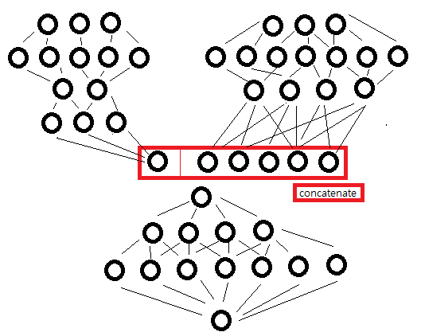
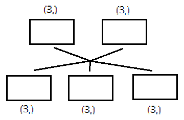
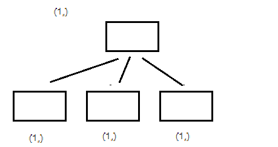

Keras 참고 사이트: http://www.keras.io/


Naming Rule (Java)

1. 첫 문자는 대문자로 시작한다 (?)
2. 둘 이상의 단어가 묶여서 하나의 이름을 구성할 때, 새로 시작하는 단어는 대문자로 시작한다.

Naming rule (Python)

함수를 만들 때, mother_eat_money()


#### keras.models 

1. keras sequential model(from keras.models import Sequential)

2. keras functional model(from keras.models import Model)

파이썬에서 함수이름 소문자로 시작, 클래스이름 대문자로 시작로 하는 통상적인 규칙을 갖는다.


#### keras.layers

Dense 모델 사용


#### 여러 변수의 train_test_split

변수를 한 개씩 넣어서 쪼개주거나 아니면 여러개를 넣어서 쪼개 주면 된다.

1. 한 개를 쪼갤 경우

```python
x1_train, x1_test = train_test_split(x1, test_size=0.2,train_size=0.8, shuffle=False,random_state=66)
```

2. 여러 개를 쪼갤 경우

```python
x1_train, x1_test, x2_train, x2_test, y1_train, y1_test = train_test_split(x1, x2, y1, test_size=0.2,train_size=0.8,shuffle=False,random_state=66)

```


#### keras11_function.py

#### 함수형 모델

함수형 모델은 모델의 정의는 끝에서 정의할 때 파라미터는 **input**과 **output**을 명시해줘야 한다. 모델을 미리 구성해 놓는다. Sequential은 순서대로 해서 output만 넣어주면 된다. **함수형 모델**은 input layer를 설정해주고 shape을 넣어주고 단을 층층히 쌓아주면서 앞 레이어의 변수를 넣어 준다.

순차적인 모델은 하나의 모델밖에 만들 수 밖에 없다. 물론 순차적인 모델을 여러개 만들면 된다. 하지만 여러 개의 모델을 만들어 합치거나 분리할 경우에는 함수형 API를 사용하는 것이 좋다.

| 모델 A          | 모델 B          |
| --------------- | --------------- |
| input_shape = 3 | input_shape = 3 |
| W(weight), bias | W(weight), bias |
| .....           | ......          |
| output = 1      | output = 1      |

모델 A와 모델 B 각각으로 새로운 예측을 해도 되지만, 모델 A와 모델 B를 합쳐서 예측을 하는 것도 가능하다. 그렇게 하면 더 정확할 수도 있다. 항상 그런 것은 아니다.

모델 A의 input은 3이고 output은 1이다. 모델 B의 input은 3이고 output은 1이다. 새로운 모델의 input은 2이고 output은 1이다. 


#### keras12_ensemble.py

두 개 입력 하나 출력 



output1과 output2는 이전에 모델을 만들었던 것처럼 꼭 1개여야 하는 것은 아니다. 왜냐하면 y 결과에 도착하기 전에 모두가 hidden layer층으로 간주하기 때문이다. 즉, input만 적절하게 입력하고  concatenate하기 전에는 모두 hidden layer이기 때문에 층의 값은 어떤 값을 가져도 된다. 물론 concatenate를 지나도 역시 hidden layer이기 때문에 어떤 값을 가져도 된다. 최종 결과로 나오는 층에 반드시 맞춰줘야 한다.


2개 이상의 input을 넣을 때는 반드시 **리스트 형태**로 넣어줘야 한다. 예를 들면,

```python
model.fit([x1_train, x2_train],y1_train, epochs=250, batch_size=1,verbose=0,validation_data=([x1_val,x2_val],y1_val))
```


왜 열이 6개를 input으로 하지 않았을까?

1. 모델을 다르게 하여 계산을 할 수 있다. 예를 들면 DNN, CNN과 RNN 각각으로 계산하는 모델을 만들 수 있다.


**열이 6개짜리인 단일모델과 열이 3개로 나눈 2개의 앙상블 모델 중 어떤게 성능이 좋을까? **

캐글이나 기타 대회에서 우승한 모델은 단일 모델이였다. 하지만 더 좋은 모델은 없다. 상황에 따라 다르다. 우수한 모델이 존재한다고 할 수 없다. CNN은 이미지에서, RNN 시계열에서, DNN은 일반적인 것에서 유리할 뿐이지 문제에 대해 정답 모델은 없다.


<u>**최적의 weight, 최소의 loss, optimizer(최적화)**</u> - 하이퍼파라미터 튜닝

이력서, 사회생활 - <u>취미(?) 하이퍼파라미터 튜닝. 특기(?) 데이터 전처리.</u>

행 무시 열 우선


이런 **분기** 모델을 작성할 수 있을까?



또 다른 분기 모델을 작성할 수 있을까?


#### keras13_ensemble2.py

두 개 입력 세 개 출력

**주의사항**: train_test_split 에서 shuffle을 하면 다음과 같은 방식을 따른다.

```python
x = [1,2,3,4,5]
y = [11,12,13,14,15] 를 셔플하면

x = [1,5,4,2,3]
y = [11,15,14,12,13] 과 같이 섞여야 한다.
# x와 y가 쌍으로 묶여 섞여야 한다. 대응되는 데이터 쌍은 함께 움직여야 한다.
# 그렇지 않을 경우에는 데이터 조작이 된다.
```


**wrapper class** - 하이퍼파라미터 튜닝과 함께 optimizer


#### keras14_ensemble3.py

1. 하나 입력 세 개 출력



mse가 3개인 이유를 곰곰히 생각해보자.


#### Conclusion

물론 이렇게 앙상블 하지 않고 한 개의 모델로 만들 수도 있다. 그렇지 않고 여러 개의 모델로 계산할 수 있다.
