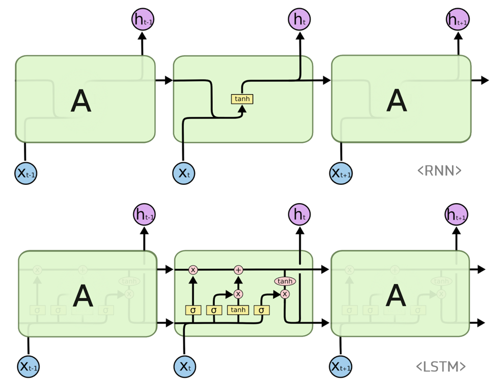
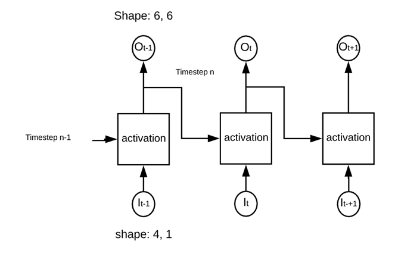
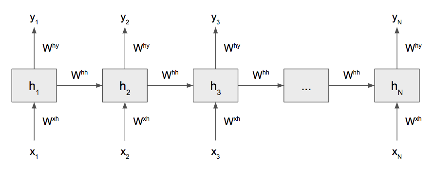

# REVIEW

## **Keras의 모델**

1. Sequential model

   모델을 위에서 정의 model=Sequential()

   keras.models

2. 함수형 모델의 특징

- 맨 마지막에 모델을 생성

- 다음 레이어의 끝에 앞 변수를 붙임.

  Input 역시도 keras.layers에 포함

## **train_test_split** 

- 변수가 여러 개라면 여러 변수를 입력하여 분리할 수 있다.

- 변수 한 개를 입력해서 분리해도 된다.


## **Ensemble Model**(실제로 merge가 되야 한다)

1. 다-대-일(many to one)
2. 다-대-다(many to many)
3. 일-대-다(one to many)


## **concatenate** 

가중치에 대한 곱하기, 더하기, 빼기 등이 존재한다.

concatenate, Concatenate, add, Add, 등등


- **대**문자 <u>Concatenate</u> 사용법

  #### Concatenate

  ```
  keras.layers.Concatenate(axis=-1)
  ```

  예제

  ```
  from keras.layers.merge import Concatenate
  merge1 = Concatenate()([output1, output2])
  ```

  대문자로 시작하면 관례적으로 클래스(class)이다.


- **소**문자 <u>concatenate</u> 사용법

  #### concatenate

  ```
  keras.layers.concatenate(inputs, axis=-1)
  ```

  예제

  ```
  from keras.layers.merge import concatenate # 모델을 합치는 방법
  merge1 = concatenate([output1, output2]) # 파라미터 두 개 이상은 리스트로 받는다.
  ```

  소문자로 시작하면 관례적으로 함수(function)이다.


출력 층이 n개 라면 evaluate의 개수는 loss, loss의 개수, metrics의 개수를 총 계산하면 나오는 변수의 개수는 $2n+1$개가 된다.


모델이 크게 1개라고 할 수 있지만 작은 모델 5개로 구성되어 있다.


# 수업 시작

### 딥러닝

- CNN: 이미지

- LSTM: 자연어, 시계열


### RNN(Recurrent Neural Network)

순차적으로 !



### **GRU(Gated Recurrent Unit)**

LSTM에서는 출력, 입력, 삭제 게이트라는 3개의 게이트가 존재했다. 반면, GRU에서는 업데이트 게이트와 리셋 게이트 두 가지 게이트만이 존재한다. GRU는 LSTM보다 학습 속도가 빠르다고 알려져있지만 여러 평가에서 GRU는 LSTM과 비슷한 성능을 보인다고 알려져 있다.

1.x 버전에서도 tf.keras 사용 가능!!

실무가 보이는 222쪽에 확인(LSTM)

### 

#### RNN(Recurrent Neural Network, 순환신경망)

시계열(time series)은 일반적으로 어떤 양의 관측결과를 일정한 기준에 따라 계열로 정리한 것을 통계계열이라고 한다.

RNN은 시퀀스 데이터를 모델링 하기 위해 등장했다. RNN이 기존의 뉴럴 네트워크와 다른 점은 ‘기억’(다른 말로 hidden state)을 갖고 있다. 네트워크의 기억은 지금까지의 입력 데이터를 요약한 정보라고 볼 수 있다. 새로운 입력이 들어올때마다 네트워크는 자신의 기억을 조금씩 수정한다. 결국 입력을 모두 처리하고 난 후 네트워크에게 남겨진 기억은 시퀀스 전체를 요약하는 정보이다. 이는 사람이 시퀀스를 처리하는 방식과 비슷하다. 이 글을 읽을 때도 우리는 이전까지의 단어에 대한 기억을 바탕으로 새로운 단어를 이해한다. 이 과정은 새로운 단어마다 계속해서 반복되기 때문에 RNN에는 Recurrent, 즉 순환적이라는 이름이 붙는다. RNN은 이런 반복을 통해 아무리 긴 시퀀스라도 처리할 수 있다.


- '<u>나는</u> <u>밥을</u> <u>먹었습니다</u>'은 시계열인가? 시계열이다.

<u>나는</u> <u>밥을</u> <u>먹었습니다</u> 는 3개의 데이터로 구성되었다고 할 수 있다.

<u>나</u> <u>는</u> <u>밥</u> <u>을</u> <u>먹</u> <u>었</u> <u>습</u> <u>니</u> <u>다</u> <u>.</u> 10개의 데이터로 구성되었다고 할 수 있다.

- 다음과 같이 볼 수 있다.

| x    | 나   | 는   | 밥   | 을   | 먹   | 었   | 습   | 니   | 다   | .    |
| ---- | ---- | ---- | ---- | ---- | ---- | ---- | ---- | ---- | ---- | ---- |
| x'   | 1    | 2    | 3    | 4    | 5    | 6    | 7    | 8    | 9    | 10   |
| y    | 1    | 2    | 3    | 4    | 5    | 6    | 7    | 8    | 9    | 10   |

이와 같은 데이터는 딥러닝 모델을 작성할 수 있다.


1~5까지 값은 왜 시계열인가?

RNN은 다음과 같은 구조라고 생각하면 된다.





예를 들면, 이전의 데이터($l_{t-1}$)와 가중치의 연산을 통해서 새로운 데이터($O_t$)를 계산한다. 이전의 요소가 다음의 요소에 영향을 미친다. 


RNN은 통상적으로 y 데이터를 만들어줘야 한다.

**RNN의 데이터 구조**

| 1    | 2    | 3    | 4    | 5    | 6    | 7    | 8    | 9    |
| ---- | ---- | ---- | ---- | ---- | ---- | ---- | ---- | ---- |
| x    | x    | x    | x    | x    | y    |      |      |      |

| 1    | 2    | 3    | 4    | 5    | 6    | 7    | 8    | 9    |
| ---- | ---- | ---- | ---- | ---- | ---- | ---- | ---- | ---- |
|      | x    | x    | x    | x    | x    | y    |      |      |

| 1    | 2    | 3    | 4    | 5    | 6    | 7    | 8    | 9    |
| ---- | ---- | ---- | ---- | ---- | ---- | ---- | ---- | ---- |
|      |      | x    | x    | x    | x    | x    | y    |      |

| 1    | 2    | 3    | 4    | 5    | 6    | 7    | 8    | 9    |
| ---- | ---- | ---- | ---- | ---- | ---- | ---- | ---- | ---- |
|      |      |      | x    | x    | x    | x    | x    | y    |

x - (4,5) , y - 4

행렬은 무조건 뒤에서 부터 채워준다고 생각하면 된다.


**RNN의 큰 종류**

1. simple RNN
2. LSTM
3. GRU


DNN 에서 input_shape에서는 [none, 열의 개수]

**RNN 에서 why input_shape는 [none, 행의 개수, 열의 개수] 이다.**

10개짜리 시계열 데이터를 변환한 모양

```python
    x     y
[1,2,3,4] 5
[2,3,4,5] 6
[3,4,5,6] 7
[4,5,6,7] 8
[5,6,7,8] 9
[6,7,8,9] 10
```

**x**는 6행 4열, **y**는 1행 6열

LSTM에 적용할 때 input_shape는 !?

1과 weight를 계산해서 2, 2와 weight를 계산해서 3을 계산할 수도 있지만, 1,2와 weight를 계산해서 3을 계산할 수도 있다. 즉, 1개씩 or 2개씩 엮어서 계산할 수 있다.


## keras15_lstm1.py


### input_shape는 실제로 (None(행), #1(열), #2(자르는 개수))


<u>**LSTM( input_shape=(4 <열>,  n <n개씩 자르는 개수>))**</u>

- n개씩 자르는 것도 hyper-parameter tuning이 된다.
- 데이터 정제 필요


# LSTM: INPUT_SHAPE과 INPUT DATA

### **LSTM( input_shape=( <열>,  n <n개씩 자르는 개수>))**

### input_data 형태는 reshape( 행, 열, #) - #은 자르는 개수

batch_size와 혼동하지 말자.

```
model.add(LSTM(units=256, input_dim=4096, input_length=16))

[(256 + 4096 + 1) * 256] * 4 = 4457472
```


#### keras15_lstm2_scale.py

시계열 데이터에서 만날 수 있는 최악의 경우??

**LSTM의 문제점**

1.  훈련 범위를 벗어나는 데이터를 주면 맞추지 못하는 경우도 있다.


#### keras15_lstm3_verbose.py

verbose=0 $\rightarrow$ 훈련 과정 정보가 나타나지 않음

verbose=1 $\rightarrow$ default option, 모든 정보가 나타남

verbose=2 $\rightarrow$ 실행막대가 보이지 않고, loss와 mae 출력

verbose=3 $\rightarrow$ epoch만 출력(간략해진다)

verbose>4 $\rightarrow$ verbose=3 과 같다.


#### keras15_lstm4_earlystopping.py

earlyStopping, 신경써야 할 옵션 patience

- monitor : 관찰하고자 하는 항목입니다. ‘val_loss’나 ‘val_acc’가 주로 사용됩니다.
- patience : 개선이 없다고 바로 종료하지 않고 개선이 없는 에포크를 얼마나 기다려 줄 것인 가를 지정합니다. 만약 10이라고 지정하면 개선이 없는 에포크가 10번째 지속될 경우 학습일 종료합니다.
- verbose : 얼마나 자세하게 정보를 표시할 것인가를 지정합니다. (0, 1, 2)

- mode : 관찰 항목에 대해 개선이 없다고 판단하기 위한 기준을 지정합니다. 예를 들어 관찰 항목이 ‘val_loss’인 경우에는 감소되는 것이 멈출 때 종료되어야 하므로, ‘min’으로 설정됩니다.
  - auto : 관찰하는 이름에 따라 자동으로 지정합니다.
  - **min** : 관찰하고 있는 항목이 감소되는 것을 멈출 때 종료합니다.
  - **max** : 관찰하고 있는 항목이 증가되는 것을 멈출 때 종료합니다.


#### keras15_lstm5_ensemble.py

```
___________________________________________________________________________
Layer (type)                    Output Shape         Param #     Connected to                     
===========================================================================
input_1 (InputLayer)            (None, 3, 1)         0                                            
___________________________________________________________________________
lstm_1 (LSTM)                   (None, 8)            320         input_1[0][0]                    
___________________________________________________________________________
input_2 (InputLayer)            (None, 3, 1)         0                                            
___________________________________________________________________________
dense_1 (Dense)                 (None, 4)            36          lstm_1[0][0]                     
___________________________________________________________________________
lstm_2 (LSTM)                   (None, 8)            320         input_2[0][0]                    
___________________________________________________________________________
dense_2 (Dense)                 (None, 6)            30          dense_1[0][0]                    
___________________________________________________________________________
dense_4 (Dense)                 (None, 6)            54          lstm_2[0][0]                     
___________________________________________________________________________
dense_3 (Dense)                 (None, 2)            14          dense_2[0][0]                    
___________________________________________________________________________
dense_5 (Dense)                 (None, 4)            28          dense_4[0][0]                    
___________________________________________________________________________
concatenate_1 (Concatenate)     (None, 6)            0           dense_3[0][0]                    
                                                                 dense_5[0][0]                    
___________________________________________________________________________
dense_6 (Dense)                 (None, 4)            28          concatenate_1[0][0]              
___________________________________________________________________________
dense_7 (Dense)                 (None, 10)           50          dense_6[0][0]                    
___________________________________________________________________________
dense_8 (Dense)                 (None, 4)            44          dense_7[0][0]                    
___________________________________________________________________________
dense_9 (Dense)                 (None, 16)           80          dense_8[0][0]                    
___________________________________________________________________________
dense_12 (Dense)                (None, 64)           320         dense_8[0][0]                    
___________________________________________________________________________
dense_10 (Dense)                (None, 32)           544         dense_9[0][0]                    
___________________________________________________________________________
dense_13 (Dense)                (None, 16)           1040        dense_12[0][0]                   
___________________________________________________________________________
dense_11 (Dense)                (None, 3)            99          dense_10[0][0]                   
___________________________________________________________________________
dense_14 (Dense)                (None, 3)            51          dense_13[0][0]                   
===========================================================================
Total params: 3,058
Trainable params: 3,058
Non-trainable params: 0
___________________________________________________________________________
```


**ensemble**

LSTM

#### LSTM의 데이터 차원은 항상 (#1, #2) 2차원 데이터뿐이다. 그 이유는 시계열 데이터의 형태는 저런 형태로 주어지기 때문이다. reshape해서 원하는 크기로 맞추어야 한다.