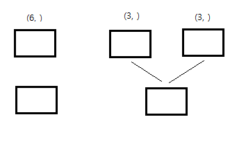
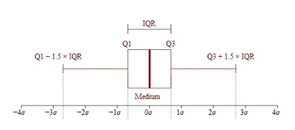
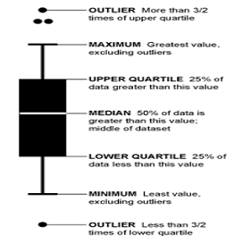
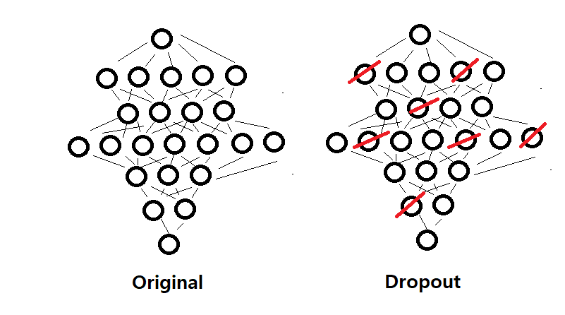

# REVIEW(2020-01-29)

#### x1.shape, x2.shape, ... , y1.shape, y2.shape, y3.shape를 알아보자.

shape에 따라 입력 input_shape(or input_dim)을 결정하는 방법과 마지막 출력층의 개수를 결정하는 방법을 자세히 살펴보자. 이것에서 규칙을 찾을 수 있다면 많은 입 출력 숫자에 대해 문제가 없을 것이다.

#### 1. DNN 모델

- One-to-One case

- One-to-Many case

- Many-to-Many case

- Many-to-One case

#### 2. LSTM 모델

input_shape=( 열의 수, 자르는 개수)

#### 3. CNN 모델

input_shape=(height, widht ,channel 수)


# <LSTM에서 중요한 코딩>

**LSTM input_shape, input_shape**

1. LSTM에서 input_shape가 중요하고, input_shape에 넣으려면 입력은 3차원 행렬 구조를 가져야 한다. input_shape=(열, 자르는 개수)
2. DNN에서 input_shape역시 중요하다. input_shape에 넣으려면 입력은 2차원 행렬 구조를 가져야 한다. input_shape=(열,)

<모양 모양 모양 모양 모양 모양 모양 모양 모양 모양 모양 모양 모양 모양 모양 모양 모양 모양>

**reshape** 했을 때 element의 개수가 는 유지되야 한다. <u>(4,3) $\rightarrow$ (4,3,1)</u>


**LSTM scale**

- LSTM scale !! 데이터 범위 안에서는 잘 맞는데, 데이터 범위 밖은 잘 못 맞추는 경향이 있다.


**LSTM ensemble**

n 개의 모델일 때, evaluate 반환 값은 $2n+1$개이다. 총 loss와 n개의 loss, n개의 metrics가 출력된다.


input_shape: (3, ) $\rightarrow$ DNN

input_shape: (3,1) $\rightarrow$ LSTM


**단일 모델 vs 앙상블 모델**



1. 별도로 파라미터 튜닝을 할 수 있다.
2. (3,)이 2개 따로 주어졌을 때 합치지 않고 별도로 계산이 가능하다.

- **앙상블 모델에서는 input data의 크기가 같아야 한다.**


**EarlyStopping**

keras.callbacks.callbacks.**EarlyStopping**

- monitor='val_loss', 'loss', 'accuracy', 'val_accuracy'

- patience=0

- verbose=0

- mode='auto'

  

keras.layers $\rightarrow$ Dense, LSTM


### Keras16_lstm1.py

##### MultiLayer LSTM

옵션 return_sequences를 True로 해야 다음 LSTM이 연결이 된다. output_shape와 관련이 있다.


입력 데이터: (13, 3, 1) $\rightarrow$ (None, 3, 1) $\rightarrow$ (3, 1)

LSTM의 입력은 3차원이고, input_shape는 2차원이다.

LSTM $\rightarrow$ (None, 10)

Dense $\rightarrow$ (None, 5)

Dense $\rightarrow$ (None, 1)


LSTM 1 $\rightarrow$ 3차원을 2차원으로 돌린다.

LSTM 2 $\rightarrow$ 위에서 받은 것은 2차원 이므로 에러가 발생

따라서, **return_sequence**는 위에서 LSTM1은 2차원 결과를 3차원으로 바꾸어 입력하겠다는 것이다.


**layers.Reshape**

> keras.layers.Reshape(target_shape)

```python
# as first layer in a Sequential model
model = Sequential()
model.add(Reshape((3, 4), input_shape=(12,)))
# now: model.output_shape == (None, 3, 4)
# note: `None` is the batch dimension

# as intermediate layer in a Sequential model
model.add(Reshape((6, 2)))
# now: model.output_shape == (None, 6, 2)

# also supports shape inference using `-1` as dimension
model.add(Reshape((-1, 2, 2)))
# now: model.output_shape == (None, 3, 2, 2)
```


return_sequences를 사용하지 않고 **Reshape** 사용하여 연결하기.

```python
model.add(LSTM(10, activation='elu', input_shape=(3,1),return_sequences=False))
model.add(Reshape((10,1)))  
```

**LSTM에서 이어지는 층을 reshape하는 방법은 model.add(Reshape((자르는 개수,이전층의 개수)))** return_sequences=True 한거랑 같은 효과.

!!! Reshape값은 이전 층의 LSTM 개수와 일치해야 한다.


-----------------------------------------------


|        | INPUT (N, 3, 1) |                 |
| :----: | :-------------: | :-------------: |
|        |      가정       |      실제       |
| 1번층  |  Dense (N, 10)  | LSTM (N, 3, 10) |
| 2번층  |  Dense (N, 2)   | LSTM (N, 3, 2)  |
| 3번층  |  Dense (N, 3)   | LSTM (N, 3, 3)  |
| .....  |      .....      |     ......      |
| 10번층 |                 |   LSTM (N,10)   |
| 11번층 |                 |   Dense(N, 5)   |
| 12번층 |                 |   Dense(N, 1)   |

**좋은 결과가 절대 나올 수 없다. Why?** 

1번 층에서 시계열 데이터를 분석했을 때, 또 시계열 데이터가 나올까? 그리고 또 LSTM을 했을 때 그것이 시계열 데이터 일까? 많은 LSTM 층을 쌓으면 뒤 층으로 갈수록 시계열 데이터 구조를 가진다고 확신 할 수 없다.

LSTM 층은 많다고 좋지 않다. 통상적으로 LSTM 층은 몇 개를 쓸까? **2~3개** 정도 쓴다.


**이 실습의 결론**

1. **LSTM은 2개이상 할 수 있고, 그 때에는 return_sequences를 사용한다.**

-------------------------


**Activation Function**

activation $\rightarrow$ 기본(default) 옵션: linear 이다. 하지만 대체로 효율적인 것은 relu 함수이다. sigmoid, elu, tanh 도 있다. 이진 분류에서는 sigmoid 다중 분류에서는 softmax이다. 중간에 hidden layer는 활성화 함수롤 골라서 넣는다.


# **Hyper-Parameter Tuning(매우 중요!)**

1. layer 깊이

2. node 개수

3. epoch

4. batch size

5. loss

6. optimizer

7. activation

8. cross-validation


```python
optimizer = keras.optimizers.Adam(lr=0.001)
\# model.compile(loss = "binary_crossentropy", optimizer = "adam", metrics=["accuracy"])
model.compile(loss = "mse", optimizer = optimizer, metrics=["accuracy"])
```


# 데이터 전처리(매우 중요!!)

1. **숫자 처리(Scaling)**

- MinMaxScaler() - 정규화(Normalization)
  $$
  x_{norm}^{i}=\frac{X_{i}-X_{min}}{X_{max}-X_{min}}
  $$
  
- StandardScaler() - 표준화(Standardization)
  $$
  x_{std}^{i}=\frac{x_{i}-\mu_{x}}{\sigma_{x}}
  $$


2. **결측치 제거**

3. **이상치 제거**


------------------

### 정규화(Normalization), 표준화(Standardization)

지금까지는 정제된 데이터를 가지고 모델을 만들었다. 지금부터는 정제되지 않은 데이터를 정제를 하여 모델에 적용하겠다.

##### from sklearn.preprocessing import MinMaxScaler, StandardScaler

스케일링을 통해 **다차원의 값들을 비교 분석하기 쉽게** 만들어주며, 자료의 **오버플로우(overflow)나 언더플로우(underflow)를 방지** 하고, 독립 변수의 공분산 행렬의 조건수(condition number)를 감소시켜 <u>**최적화 과정에서의 안정성 및 수렴 속도를 향상**</u> 시킨다.

0과 1사이의 값으로 수렴시키는 이유는?? **데이터가 가진 feature의 스케일이 심하게 차이가 나는 경우 문제가 되기 때문이다.**


1. **MinMaxScaler**: 모든 feature 값이 0~1사이에 있도록 데이터를 재조정한다. 다만 이상치가 있는 경우 변환된 값이 매우 좁은 범위로 압축될 수 있다.즉, MinMaxScaler 역시 **아웃라이어의 존재에 매우 민감하다. Normalization(정규화)**

2. **StandardScaler**: 평균을 제거하고 데이터를 단위 분산으로 조정한다. 그러나 이상치가 있다면 평균과 표준편차에 영향을 미쳐 변환된 데이터의 확산은 매우 달라지게 된다.**따라서 이상치가 있는 경우 균형 잡힌 척도를 보장할 수 없다. Standardization(표준화)**

3. MaxAbsScaler:  절대값이 0~1사이에 매핑되도록 한다. 즉 -1~1 사이로 재조정한다. 양수 데이터로만 구성된 특징 데이터셋에서는 MinMaxScaler와 유사하게 동작하며, 큰 **이상치에 민감할 수 있다.**

4. RobustScaler: <u>**아웃라이어**의 영향을 최소화</u>한 기법이다. `중앙값(median)과 IQR(interquartile range)`을 사용하기 때문에 StandardScaler와 비교해보면 **표준화 후 동일한 값을 더 넓게 분포** 시키고 있음을 확인 할 수 있다. **IQR = Q3 - Q1 : 즉, 25퍼센타일과 75퍼센타일의 값들을 다룬다.**

------------


- Robust scaler

$$
\frac{x_{i}-Q_{1}(x)}{Q_{3}(x)-Q_{1}(x)}
$$



- Quartile 설명




모델을 만들어서 실행했지만 loss: 27억이다. 이는 잘못된 데이터를 처리했기 때문이다. **데이터의 늪**에 빠져 아무리 계산을 해도 좋지 않은 결과가 나왔다.

y에 대해 scaler를 하지 않는 이유??? 변환 된 x를 가지고 y를 예측하기 때문에 y를 굳이 scaler를 적용하지 않아도 된다(하지만 적용해도 상관 없다?). 

x와 y의 쌍을 유지하는 상태라면 한쪽은 전처리 할 필요가 없다.

- X를 어떤한 정규화 이전의 값(원래 데이터)

| X    | X    | X    | Y    |
| ---- | ---- | ---- | ---- |
| 1    | 2    | 3    | 4    |
| 2    | 3    | 4    | 5    |
| 3    | 4    | 5    | 6    |
| 4    | 5    | 6    | 7    |

- X만 어떤 정규화한 값

| X    | X    | X    | Y    |
| ---- | ---- | ---- | ---- |
| 0.1  | 0.2  | 0.3  | 4    |
| 0.2  | 0.3  | 0.4  | 5    |
| 0.3  | 0.4  | 0.5  | 6    |
| 0.4  | 0.5  | 0.6  | 7    |


-------------------------

#### y는 데이터 처리를 안하지만 데이터 x의 데이터 전처리를 모두 해야 할까?

즉, x_train, x_test, x_validation, x_predict를 해야할까?


**y_predict**는 우리가 계산해야 할 값(없는 값)이다.

|            | X     | Y                        |
| ---------- | ----- | ------------------------ |
| train      | known | known                    |
| test       | known | known                    |
| validation | known | known                    |
| predict    | ?     | **##Predict(Unknown)##** |

train data로 모델을 fit 한다. evaluate에서는 test data를 사용한다. 그리고 evaluate는 fit에서 나온 모델을 사용한다. 역시 test에도 데이터 전처리를 해야 한다.


만약 데이터가 범위 밖이면? 문제가?

train_test_split할 때, **shuffle**을 해주는 편이 좋다.

```python
_ , _ = train_test_split(~~~~~~~~~~~~~~~~~)
x_train = scaler.transform(x_train)
x_test = scaler.transform(x_test)
```


train, test,  predict 를 transform 하는 방법!! (Validation도 해야 한다.)

```python
from sklearn.model_selection import train_test_split
from sklearn.preprocessing import MinMaxScaler
from sklearn.svm import SVC

data = datasets.load_iris()
X = data.data
y = data.target

#2. 데이터 분리
X_train, X_test, y_train, y_test = train_test_split(X, y, test_size=0.3, random_state=0)

scaler = MinMaxScaler()
X_train_scaled = scaler.fit_transform(X_train)

#3. 훈련
model = SVC()
model.fit(X_train_scaled, y_train)

#4. 평가를 위한 것
X_test_scaled = scaler.transform(X_test)
y_pred = model.predict(X_test_scaled)

#5. 값 예측
X_predict = ~~~~~ # Sample data
X_predict_scaled = scaler.transform(X_predict)

res1=model.predict(X_predict_scaled)
```


train, test, validation, predict???

### Keras18_new_scaler1.py, Keras18_new_scaler2.py

처음에 원했던 전처리는 0~1사이의 값을 가지게 하려고 했다.  하지만 MinMaxScaler로 처리해도 1을 넘는 혹은 0보다 작은 값을 가질 수 있다.

다시 말해, Keras18_new_scaler2.py에서 x_test의 값들은 1을 넘었다고 해서 잘못된 것이 아니다. test 값들은 train 값의 범위를 넘었지만. 적절한 가중치...를 만들어 내기 때문이다.

Scale을 할 경우에는

<u>train만 **fit** 하고! train, test, validation, predict 모두 **transform** 해야 한다.</u>

**요약: fit은 한번만 해도 되고 transform은 모두 적용해야 한다.**

StandardScaler 역시도 train만 fit 하면 된다.


### Keras19_dropout.py


**model.add(dropout(0.2)) - 위 노드의 0.2*100(%) 감소를 의미한다.**

**model.add(BatchNormalization()) - 레이어(layer)에서 가중치를 처리하는 방법**


BatchNormalization을 하는 이유는 가중치 값들이 퍼져있는 것들은 일정하게 모아준다. 즉, 가중치 값들을 변형해주는 역할을 한다. 전처리를 하면 모델에서 좋은 값을 줄 가능성이 높다. 

**Dropout과 BatchNormalization을 통상적으로 동시에 쓰지 않는다.**

하지만, GAN에서는 Dropout과 BatchNormalization을 동시에 사용한다.

