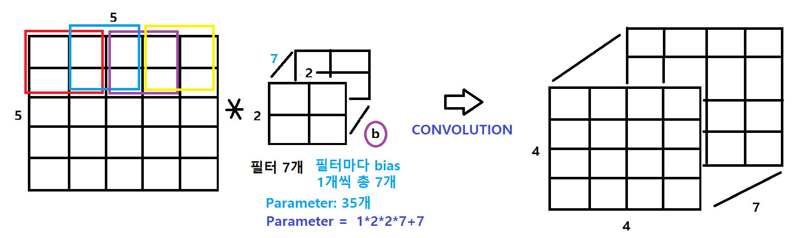
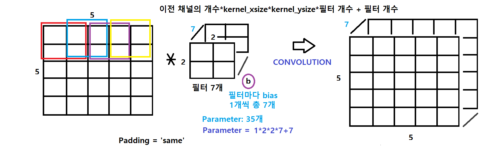
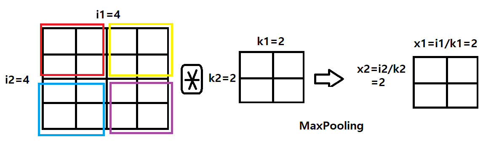
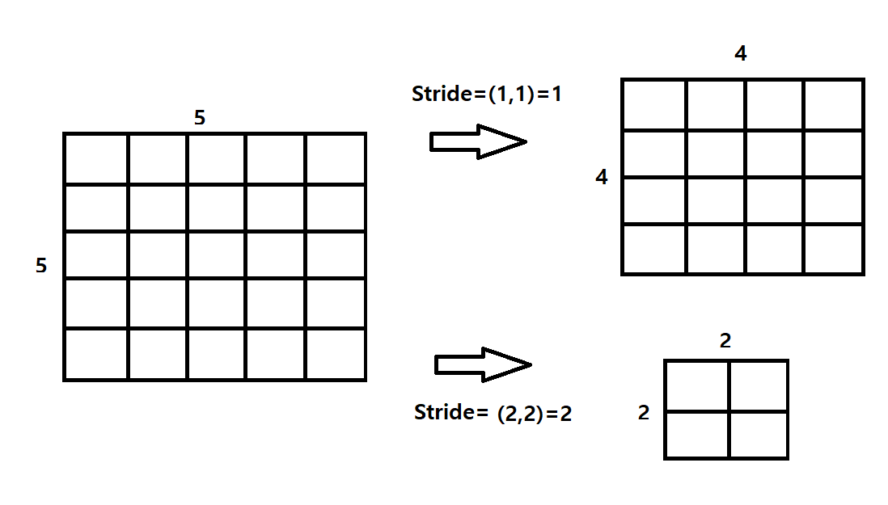

어제 421x5x5 구조였는데, (개수, 날짜, 컬럼) 형태였다. LSTM은 연속적인 숫자를 선택해야 한다.

- 날짜 < 컬럼 or 날짜 = 컬럼은 엄밀히 LSTM으로 구현해도 효과가 없다. **텐서의 모양**은 반드시 의미있는 모양으로 맞추어 주어야 한다.


https://www.kaggle.com/goldens/bank-marketing-eda-model-and-plotly


## CNN

#### Image with no padding



#### Image with padding




#### MaxPool




#### Stride



Padding 하는 이유?


### What is OneHotEncoding?

만약 y의 값이 0~9까지 값 10개를 가지는 행렬 y의 크기는 (60000,)이고 OneHotEncoding을 적용하면, (60000, 10)이 된다.

```python
to_categorical(y_train)

0 => [1, 0, 0, 0, 0, 0, 0, 0, 0, 0]
1 => [0, 1, 0, 0, 0, 0, 0, 0, 0, 0]
2 => [0, 0, 1, 0, 0, 0, 0, 0, 0, 0]
...
7 => [0, 0, 0, 0, 0, 0, 0, 1, 0, 0]
8 => [0, 0, 0, 0, 0, 0, 0, 0, 1, 0]
9 => [0, 0, 0, 0, 0, 0, 0, 0, 0, 1]
```


MNIST 실습 예제는 모두 DNN, CNN, LSTM으로 분석 가능하다.


### 머신 러닝

- PCA 차원축소를 사용하여 MNIST
- DecisionTree, RandomForest, XGBoost -> ???