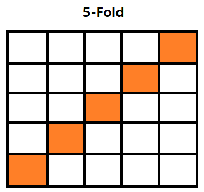

# AND, OR, XOR

| OR   | 0    | 1    |
| ---- | ---- | ---- |
| 0    | 0    | 1    |
| 1    | 1    | 1    |

| AND  | 0    | 1    |
| ---- | ---- | ---- |
| 0    | 0    | 0    |
| 1    | 0    | 1    |

| XOR  | 0    | 1    |
| ---- | ---- | ---- |
| 0    | 0    | 1    |
| 1    | 1    | 0    |

linearSVC : 선형 회귀 모델

차원축소(PCA)는 열을 뽑는게 아니라 이전의 열들을 특정 몇개의 열로 압축

## 머신러닝 모델들

##### 1. LinearSVC 

##### 2. KNeighborsClassifier

##### 3. SVC(Support Vector Classifier)

#### 4. RandomForest

| Keras          | Scikit-Learn  |
| -------------- | ------------- |
| model.fit      | model.fit     |
| model.evalutae | model.score   |
| model.predict  | model.predict |

https://brunch.co.kr/@chris-song/54

#### 5. LinearRegression

#### 6. Ridge

#### 7. Lasso

약 85% 이상.

RandomForest 성능 >> Deep Learning (?)

ML06_wine3_graph

#### ML06_wine4

원래 데이터를 분류하는 모양을 바꾸는 것이 방법!!!!! 

**분류의 기준**을 바꾸었다.

#### K-Fold Cross Validation

중복을 허락하지 않고 훈련 데이터셋을 k개의 폴드로 랜덤하게 나눈다. k-1개의 폴드로 모델을 훈련하고 나머지 하나의 폴드로 성능을 평가한다. 이 과정을 k번 반복하여 k개의 모델과 성능 추정을 얻는다.

##### Stratified k-fold cross validation

RandomSearch(), Scaler() -> pipeline