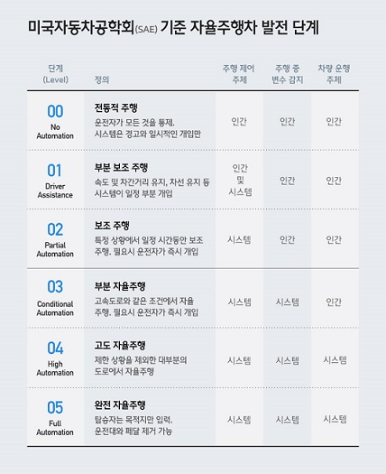

## 자율주행 자동차

이미지분석 수요산업

자율주행

- 얼굴인식, 위험감지, 자율주행자동차

1. 단일객체 인식 $\rightarrow$ <u>CNN</u>

2. 다중객체 인식 & 감지 $\rightarrow$ R-CNN, Fast R-CNN, <u>YOLO</u>, 객체 감지와 다중객체 인식

3. 다중객체픽셀 단위 인식 $\rightarrow$ SegNet, FCN, <u>U-Net</u>, 

   Semantic Segmentation, **Instance Segmentation**

단일객체 인식의 예 captcha.

**미국자동차공학회 기준 자율주행차 발전단계**

자율주행자동차 실험도시(K-CITY)

## 대화처리 개념 및 대화 시나이로 구축(TALK BOT)

<u>CHAT BOT, TALK BOT의 차이?</u>

**아담 톡봇(saltlux)**

TALK BOT - 챗봇과는 비교 불가(?), 스마트한 챗봇, 지식기반의 심층 대화 시스템, 대화 처리를 지원한다. 

- NLU와 대화인지, 다양한 메신저와 앱 제공, 다채널 지원

**Intent 와 Entity**

인텐트(의도)를 구성하는 단어들(엔티티) $\rightarrow$  물건, 사람, 서비스, 날짜

예를 들면, 인텐트가 회의실 예약이면 엔티티는 소회의실, 수요일, 시간, 인원 등

톡봇

1. 대화모델 계획/준비(고객, 구축자와 함께 어떤 서비스를 어떻게 제공할 지 결정)

   선택한 업무/서비스는 어떤 형태의 톡봇 인가? 대화 스타일 결정 

   업무/서비스에 적합한 페르소나 선택

   - 정보제공
   - 개인 비서
   - 전자상거래
   - 교육

2. 만들기(톡봇 빌더를 활용해 대화 시나리오 입력)

   Single bot: 봇 1개로 구성(단순 업무 처리에 적합)

   Group bot: 여러개의 봇으로 구성(복잡 업무처리에 적합, 메모리 사용, 연산 복잡도 증가)

   인텐트 정의를 분명히 정의해야 한다. Intent는 분류 모델을 만드는 것과 유사하다.

   객체지향 엔티티 설계

3. 시험

4. 배포

5. 평가

인공지능신문 http://aitime.co.kr

## 디지털 헬스케어와 인공지능

##### AI 의료서비스의 종류

1. 전자의무기록이나 차트에 저장된 기록을 분석하는 인공지능
2. 의료영상 판독하는 인공지능
3. 환자의 임상 데이터 등 연속적인 의료 데이터를 모니터링해 질병을 예측하는 인공지능

Keywords Agenta: 스마트, 디지털 트윈, Cyber-Physical System(CPS) 등

< connected, sensor(IoT), data-driven, autonomous >

##### Connected Health

의사와 데이터, 환자와 의료 공급자, 의료 행위를 네트워크에 연결하는 것으로 정의하며, 통합된 의료 및 건강 결과를 제공을 목표

<~하는것(?)>

##### Health ICT 병원 환경 변화

1세대 Digital hospital: 병원 장비/기록 전산화

2세대 Smart Hospital: ICT 기술을 활용한 병원 솔루션

3세대 Connected care의 중심 hospital: 환자 맞춤형 의료서비스

 환자 모니터링 시스템 사례

1. 목표 및 계획 준비

   - Enviroment sensor

   - Vital Signs sensor

   - Beacon
   - Cloud 
   - PoC(Proof of concept)

Sigfox

MYCIN

## 데이터 분석 관련 자격증

분석: 데이터 분석(Advanced Data Analytics): [데이터 사이언티스트] **<u>ADsP</u>**, ADP<실기>

설계: 데이터 아키텍쳐(Data Architecture): DAP(국가공인DA 전문가), DAoP(DA준전문가(민간))

개발: SQL(Structured Query Language) : SQL(국가공인SQL 전문가), SQL(국가공인 SQL 개발자)

<참고> http://kdata.or.kr

- 새로운 시험 **<u>빅데이터 분석기사</u>**

**기획**

1. **프로젝트 명(추상적이지 않고 구체적으로)**
2. **프로젝트 배경(주제 선정 배경)**
3. **프로젝트 목표(프로젝트의 최종 목표)**
4. **프로젝트 범위(프로젝트 목표 달성을 위해 주요 작업 내용이 무엇인지? 구체적으로)**
5. **프로젝트 추진전략(수행방향을 구체적인 일정 및 목표를 달성하기 위한 실천사항)**
6. **프로젝트 기대효과(해당 프로젝트로 기대되는 효과?)**