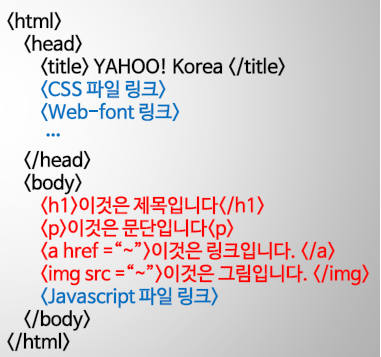
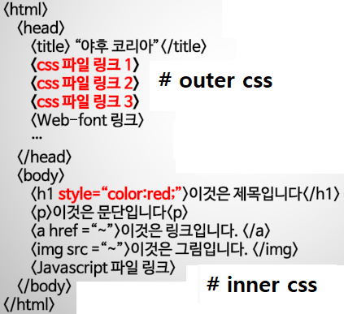
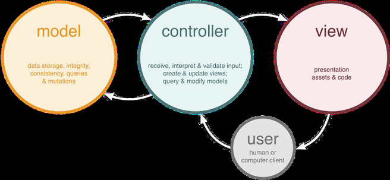
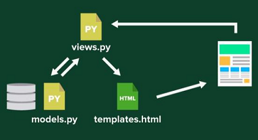
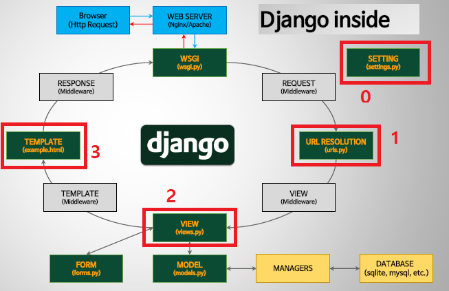

## Django Basic 1


#### Web Browser의 구성

- Front-end: 시각화의 영역으로 실제로 보여지는 부분이다. 전체골격은 HTML, 디자인은 CSS, 상호작용으로 움직이거나 변하는 부분은 JavaScript 프로그램을 사용한다. 

  Web publisher: HTML, CSS, light-JS
  Front-end developer: Programmer

- Back-end: 서버와 DB등으로 보이지 않는 부분이며 데이터 처리와 데이터 연산 등을 처리한다. 즉, Front-end로 부터 요청을 받아 데이터를 처리하고 되돌려 보내주는 역할을 한다. 주로 logic(알고리즘)과 데이터를 다룬다. Server는 컴퓨터를 의미하고 Java, Python, Node.js를 사용하여 프로그래밍한다. Database는 MySQL, OracelDB 등을 사용한다. 서버와 DB를 담는 그릇은 AWS, GCP, MS Azure 등이 있다. 

  1. Server-side developer, Back-end: programmer

  2. Database administrator

  3. Architect: 모든 것을 관리하는 사람(CTO와는 다름.?)

     

#### Mobile Applications(Apps)

네이티브 앱들은 Front-end와 Back-end를 나누지 않음

- Android OS 혹은 iOS로 개발되어 디바이스에 최적화된 전용 앱들은 Native apps

- HTML/CSS/JS 로 만들어진 앱들 or 만든 후 커버를 씌운 앱들: Webapp, Hybrid apps

보여지는 부분을 위한 UI code, 내부 처리 및 DB 연동을 위한 logic code


#### HTML

HTML: Hypertext Markup Language

<u>HTML tag</u>

- HTML의 구조



Javascript 파일은 맨 마지막에 둔다.


#### CSS

CSS(Cascading Style Sheets)는 여러 CSS 속성들이 동일한 HTML 택에 차례대로 위에서부터아래로 중첩되어 적용된다.

```
@ HTML (index.html - 기본파일)
<h1 class='mainhead'>
이것은 제목입니다
 <a href='~'>링크입니다.</a> 
</h1>

@ CSS (main.css - 기본파일)
#mainhead a{
 color: red;
 text-align: center;
 text-decoration: underline;
}
```

> .mainhead - 
>
> #mainhead -


CSS 내부 형태




- 부트스트랩

http://bootstrapk.com/


**IDE**: Integrated Development Environment(통합 개발 환경)

- SublimeText (간편하고 가벼움)
- Brackets (실시간 브라우저 연동 preview, 프론트개발에 추천)

- Atom (프로젝트 단위로 프로그래밍하기에 편리함)


#### Java

JVM 위에서 작동하므로 OS에 제약받지 않고 범용성 & 속도에서 유리하다.


#### HTTP Request? HTTP Response?

HTTP(HyperText Transfer Protocol): WWW상에서 정보를 주고받을 수 있는 통신 프로토콜로 클라이언트와 서버 사이에 이루어지는 **요청/응답(requset/response)** 프로토콜을 의미한다. 

- Request: 서버로의 요청을 의미한다. 아래 <u>4가지</u>를 주로 사용한다.

  **GET**: 정보를 가져오는 역할
  **POST**: 정보를 입력(및 수정)하는 역할
  PUT: 
  DELETE: 

  **C**(post), **R**(get), **U**(put), **D**(delete)

- Response: 서버로부터의 응답

  응답코드: 200(반응), 400(Bad requset), 404(Not found) etc

  응답에 담긴 데이터: HTML, JS, CSS, JSON, XML etc


#### 

#### @ Original Design Pattern

- MTC Pattern

Model: 데이터베이스 조작
View: 사용자 인터페이스 구현
Controller: 내부 계산, 데이터 처리 로직



#### @ Django

- MTV Pattern

Model: 데이터베이스 조작

Template: 사용자 인터페이스 구현

View: 내부 계산, 데이터 처리 로직




#### Django Inside

장고 내부의 파일 체계는 다음과 같다.



 Http Request가 시작지점이다. views.py는 특정반응에 대한 대응 함수를 쓴다. 그것이 실행되면 render 함수를 사용해서 template.html에 보내고 response하게 한다.

forms.py는 외부에서 요청 받을 때 작동하는 파일이다.

주로 0,1,2,3 파일과 model.py와 forms.py 파일을 수정하면 된다.


?? django-admin startproject proj_1


#### 0. Django 셋팅!

ananconda prompt를 실행

django_env/Scripts/activate --> Scripts 폴더 내의 **activate** 파일을 실행해 가상 환경을 활성화한다.

Atom 에서 프로젝트 폴더 연다. File --> Add Project 에서 django_mldl 폴더가 아니라  django_mldl > site_1 폴더 선택하자.


#### 1. settings.py

대문자로 된

BASE_DIR = 파일의 위치를 알려준다
**SECRET_KEY**는 실제로는 숨겨야 한다.


**보통 다음의 4개의 과정을 해야 한다.**

1. INSTALLED_APPS 에 'lotto'를 추가

2. LANGUAGE_CODE는 'en-us'를 $\rightarrow$ 'ko-kr'로 변경

3. TIME_ZONE은 'UTC'를 $\rightarrow$ 'Asia/Seoul'로 변경

4. STATIC_ROOT = os.path.join(BASE_DIR, 'static') STATIC_URL 밑에 **추가**한다.

   

ROOT_URLCONF - site_1.urls <URL의 정보를 손 대는 파일>


#### 2. urls.py

urlpatterns 리스트에 path('', views.index),  를 추가

from lotto import views


#### 3. views.py

```python
from django.http import HttpResponse
```

**index** 함수 추가

```python
def index(request):
    return HttpResponse('<h1>Hello, World!</h1>')
```


CMD 창은 listening 중이다.

[10/Feb/2020 16:55:46] "GET / HTTP/1.1" 200 22 은 **LOG**

favicon은 웹사이트 상에 넣은 작은 이미지. 예를 들면 Naver를 나타내는 이미지


#### 4. 추가사항

**urls.py**에 urlpatterns에 path('hello/', views.hello, name='hello_main')
**views.py**에 다음을 추가하고

```python
def hello(request):
	return HttpResponse("<h1 style='color:red;'>Hello, world!</h1>")
```

http://127.0.0.1:8000/hello에 접속하여 변경 사항 확인한다. 그럼 Hello, world!가 빨간 글씨가 되어있다.


#### 5. 템플릿 (pdf 과정 10. 참고)

**views.py**에서

```python
def index(request):
	return render(request, 'lotto/index.html', {})
```

<u>collect static</u>

lotto 폴더 아래에 templates 아래에 lotto폴더를 만들고 안에 index.html파일을 생성하고 다음과 같이 입력한다.

```html
<html>
<body>
  <h1> This is index.html </h1>
  <p> This is paragraph. </p>
  <a href="http://www.naver.com">Naver main</a>
</body>
</html>
```

views.py 안에 def index 아래에 다음과 같이 추가.

```python
def index(request):
    sample_str = 'Hi this is python str'
    return render(request, 'lotto/index.html',{'main_str':sample_str})
```


