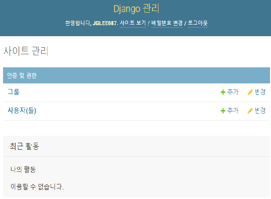
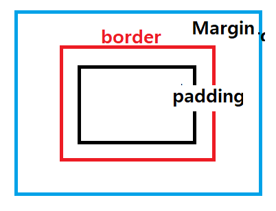

# Django Basic 2


## Review

#### 1. Django 시작하기

conda prompt에서 다음을 실행한다.

1. c:\work_django\django_mldl\django_env\Scripts 로 이동하고 나서 **activate**

2. django-admin startproject site_1 을 입력하면 site_1 폴더가 생성(어제 했던 명령어)


**views.py**가 홈페이지를 꾸미는데 중요한 요소이다.


#### 2. Atom 프로그램을 실행

add project에서 만든 프로젝트 site_1을 추가해준다.
기본적으로 settings.py를 몇 가지를 수정한다. 추가하면 반드시 INSTALL_APPS 리스트에 추가해준다. 

그리고 실행하려면 site_1 폴더에 가서 python manage.py runserver (포트번호 옵션) 을 입력하여 홈페이지가 실행되고 접속은 http://127.0.0.1/8000 할 수 있다.

site_1 아래에 site_1에 가서 urls.py로 이동한다.

다음의 명령어는 메인 화면에 나타내려고 하는데 위에 선언을 보면 views는 lotto와 연결되어있다. 그래서 lotto안에 views.py로 가 본다.

```python
from lotto import views
# 127.0.0.1:8000/
path('', views.index),
```
views.py에  가보면 index 함수는 HttpResponse로 h1 tag를 사용하여 Hello, World를 출력하고 있다.

```python
def index(request):
    return HttpResponse('<h1>Hello, World</h1>')

HttpResponse를 사용하기 위해 
from django.http import HttpResponse 를 추가하였다.
```


### 2월 11일 수업 시작!~!

클래스 instance variable instance를 object(객체)라고 한다.
ORM(Object-Relational Mapping)은 파이썬 문법으로 ... 내부적으로 SQL로 변환해주는 역할을 해준다.


#### 6. models.py 코드 추가

다음과 같이 추가

```python
from django.utils import timezone
import random

# Create your models here.
class GuessNumbers(models.Model):
    name= models.CharField(max_length=24)
    text= models.CharField(max_length=255)
    lottos = models.CharField(max_length=255, default='[1,2,3,4,5,6]')
    num_lotto=models.IntegerField(default=5)
    update_date=models.DateTimeField()

    def generate(self):
        self.lottos=""
        origin=list(range(1,46))

        for _ in range(0, self.num_lotto):
            random.shuffle(origin)
            guess=origin[:6]
            guess.sort()
            self.lottos += str(guess) +'\n'
        self.update_date=timezone.now()
        self.save()

    def __str__(self):
        return "pk {} : {} - {}".format(self.pk, self.name, self.text)
```

database에서 중요한 것 중 하나는 **pk(private key)**이다. Django에서는 pk(or id)는 자동으로 생성된다. 
CharField는 character field의 줄임말로 다른 언어의 string과 비슷한 역할을 한다. 

이미지를 데이터에 저장하려고 하면 ImageField를 사용하여 저장하는 것으로 착각할 수 있는데,  파일 자체는 media라는 폴더에 저장되고 ImageField, FileField라는 변수에는 파일이 존재하는 **경로명**이 적힌다.

ForeignKey 참고


models.py에서 변경된 내용을 적용하려면 다음을 입력한다. 

```python
python manage.py makemigrations
```

그리고 lotto폴더 아래에 migrations 폴더가 생성되고 그 아래에 0001_initial.py가 생성된다. 이 파일은 손대지 않는다. 그리고 나서 실행한다!

```
python manage.py migrate
```


#### 7. db.sqlite3 파일 열어보면 정보가 적혀있다.

#### 8. 그리고 python manage.py runserver를 실행

http://127.0.0.1/8000/admin으로 접속한다. 사용자 이름과 비밀번호를 만들어줘야 한다. 즉 관리자 페이지의 계정을 생성해야 한다. 다음을 실행하고 사용자 이름과 메일주소와 비밀번호를 입력한다.

```python
python manage.py createsuperuser
```

그리고 나서 cmd에서 python manage.py runserver를 실행하고 admin 페이지로 다시 접속한다.



#### 9. lotto 폴더 아래에 admin.py로 이동

admin.py 파일에 다음과 코드를 추가한다.

```python
admin.site.register(GuessNumbers)
```

models.py와 있는 클래스를 불러와야 하므로 다음과 같이 입력한다.

```python
from lotto.models import GuessNumbers
```

하고 관리자 계정에 들어가면 Guess Numberss 라는 것이 추가되어 있다.
내부에 들어가서 이름, text 등등 기타 사항을 적용해 준다.

#### 

#### 10. tests.py 

```python
from lotto.models import GuessNumbers

class GuessNumbersTestCase(TestCase):
    def test_generate(self):
        g=GuessNumbers(name='Test numbers', text='selected nums')
        g.generate()
        g.lottos
        print(g.update_date)
        print(g.lottos)

        self.assertTrue(len(g.lottos) > 20 )
        
```

python manage.py test를 실행


```python
tests.py에서

self.assertTrue(len(g.lottos) < 20 )
로 바꾸고 python manage.py test를 실행하면 에러 발생

    self.assertTrue(len(g.lottos) < 20 )
AssertionError: False is not true
```


#### 11. python manage.py shell

```python
>>> from lotto.models import GuessNumbers
>>> GuessNumbers.objects.all()
>>> GuessNumbers.objects.get(pk=1)
>>> guess_object = GuessNumbers()
>>> guess_object.generate()
>>> guess_object.lottos

로또 번호를 확인할 수 있다.
```


#### 12. views.py와 Template 연동하기

urls.py 에 

```python
    #path('', views.index), 주석 처리
    path('lotto/', views.index, name='index') 를 추가하고
```

views.py 에

```python
    return render(request, 'lotto/default.html',{})
```


설명했는데 templates 파일들의 충돌을 막고 정리하기 위해서 폴더를 만드는 방법이라고 하는데 아직까진 정확히 모르겠다.

```python
site_1\lotto\templates\lotto\default.html

site_1\member\templates\index.html (127.0.0.1:8000/member/)
site_1\products\templates\index.html (127.0.0.1:8000/products/)
site_1\history\templates\index.html (127.0.0.1:8000/history/)

templates\index.html, index.html, index.html

site_1\member\templates\member\index.html (127.0.0.1:8000/member/)
site_1\products\templates\products\index.html (127.0.0.1:8000/products/)
site_1\history\templates\history\index.html (127.0.0.1:8000/history/)

templates\index.html, index.html, index.html
```

일일이 폴더를 만드는 방식 대신에 atom에서 lotto를 우클릭하고 new folder 대신 new file을 해서 한꺼번에 만들기(p73 참조)


default.html 파일에 추가할 내용

```python
<html>
<body>
  <h1> 메인 페이지입니다.</h1>
</body>
</html>

```


views.py

return render 뒤에 있는 {} (dictionary)에는 {'pass_str':sample_str}를 추가로 입력하고

default.html 파일을 수정

```
<html>
<body>
  <h1> 메인 페이지입니다.</h1>
  <p style="color:red;"> {{pass_str}} </p>
</body>
</html>
```


dafault.html에 추가할만한 내용

bootstrap 에서 css 파일 가져와서.......................................................

```python
<!DOCTYPE html>
<html lang="ko">
<head>
  <title>My Little Lotto</title>
  <meta name="viewport" content="width=device-width, initial-scale=1">
  <link rel="stylesheet" href="//maxcdn.bootstrapcdn.com/bootstrap/3.2.0/css/bootstrap.min.css">
  <link rel="stylesheet" href="//maxcdn.bootstrapcdn.com/bootstrap/3.2.0/css/bootstrap-theme.min.css">
  <link href="//fonts.googleapis.com/css?family=Space+Mono" rel="stylesheet">
</head>

<body>
  <div class="page-header">
  <h1>Selected Lotto Numbers</h1>
  </div>
  <div class="container lotto">
	<h2>Good luck!</h2>
	<p> last update:2030/12/31</p>
	<p> 1, 10, 19, 15, 20, 35 </p>
  </div>
</body>
</html>
```

html은 들여쓰기를 따지지 않는다...............................


#### 13. css 파일 연결하여 디자인 적용하기 (static 파일 연결)

lotto에 우클릭하여 lotto\static\css\lotto.css 파일 생성 (p. 76 참고)

css에서 .(점)으로 시작하면 클래스를 의미한다. 즉 .page-header, .container는 클래스이다. css에서 #으로 시작하면 id를 의미한다. 예를 들면 #652596; 은 id이다.


default.html에

```
<!DOCTYPE html> 아래에 
 추가해 준다.

  <link href="//fonts.googleapis.com/css?family=Space+Mono" rel="stylesheet"> 이 줄 아래에 다음 내용을 추가한다.
  <link rel='stylesheet' href=""
```

그리고 cmd 창으로 가서 <u>**python manage.py collectstatic**</u>을 실행하면 static이라는 총 120개의 파일과 함께 atom에서 폴더가 만들어진다. 


그리고 적용후에 홈페이지에 들어간다. 그래서 제목 selected Lotto Numbers를 개발자 도구를 사용하여 접근해 보자. 그 모양은 다음과 같다.



`ctrl`+`shift`+`I`개발자 도구에서 styles에서 element.style에 

1. margin: 30px;
2. padding: 15px;
3. border: 5px solid red; 

위와 같이 적용하면 모양이 바뀌는 것을 확인할 수 있다. 패딩인 위 오른쪽 아래쪽 왼쪽순서로 폭을 정한다.

padding: 15px(위) 20px(오른) 25px(아래) 30px(왼);


#### 14. 본격적으로 views.py 수정

```python

from lotto.models import GuessNumbers
~~~
	lottos = GuessNumbers.objects.all()
    return render(request, 'lotto/default.html',{'lottos':lottos})
```


default.html에서

```html
  <div class="container lotto">
    
      <h2> {{ lotto.text}} </h2>
      <p> {{ lotto.update_data }} </p>
      <p> {{ lotto.lottos }} </p>
    
```


#### 15. lotto 폴더 아래에 forms.py 만든다.

forms.py가 주인공역할이란다. database 에서 class는 DB table을 의미하고, class's variable은 column(열)을 뜻하고, class object는 row(행)를 뜻한다.

```python
from django import forms
from .models import GuessNumbers

class PostForm(forms.ModelForm):

    class Meta:
        model=GuessNumbers
        fields =  ('name', 'text', )

```

그리고 urls.py로 가서 다음을 추가한다.

```python
path('lotto/new', views.post, name='new_lotto')
```

다음은 views.py로 가 다음을 추가한다.

```python
def post(request):
    form = PostForm()
    return render(request, 'lotto/form.html', {'form':form})
```

templates 아래에 lotto라는 폴더에 form.html 파일을 생성하고, 다음을 붙여넣는다.

```python
<!DOCTYPE html>

<html lang="ko">
 <head>
  <title>My Little Lotto</title>
  <meta name="viewport" content="width=device-width, initial-scale=1">
  <link rel="stylesheet" href="//maxcdn.bootstrapcdn.com/bootstrap/3.2.0/css/bootstrap.min.css">
  <link rel="stylesheet" href="//maxcdn.bootstrapcdn.com/bootstrap/3.2.0/css/bootstrap-theme.min.css">
  <link href="//fonts.googleapis.com/css?family=Space+Mono" rel="stylesheet">
  <link rel="stylesheet" href="">
 </head>
 
 <body>
  <div class="page-header">
   <h1>Generate your new lotto numbers!</h1>
  </div>
  <div class="container lotto">
   <form method="POST" class="post-form">
	 <!-- CSRF (Cross Site Request Forgery) 공격 방지를 위한 Token 생성 -->
	{{ form.as_p }} <!-- form을 p 태그로 감싸서 출력 -->
	<button type="submit" class="save btn btn-default">Save</button>
   </form>
  </div>
 </body>
</html>
```


중에서 중요한 문장은 다음과 같다.

```python
   <form method="POST" class="post-form">
	 <!-- CSRF (Cross Site Request Forgery) 공격 방지를 위한 Token 생성 -->
	{{ form.as_p }} <!-- form을 p 태그로 감싸서 출력 -->
	<button type="submit" class="save btn btn-default">Save</button>
   </form>
```


위에서 중요하지 않은걸 삭제하면 다음과 같다. 삭제한 부분을 찾아보자.?

```python
   <form method="POST">
	 <!-- CSRF (Cross Site Request Forgery) 공격 방지를 위한 Token 생성 -->
	{{ form.as_p }} <!-- form을 p 태그로 감싸서 출력 -->
	<button type="submit">Save</button>
   </form>
```


http://127.0.0.1:8000/lotto/new 사이트에 접속해서 하기 위해 Enter를 누르면 **GET**요청이지만, 아래 창에 Name과 Text를 누르고 입력하고 Enter를 누르면 Get요청이 아니라 자기 자신에게 돌려주고Post 요청이 되어 views.py의 Post 함수가 적용된다. 


views.py를 다음과 같이 수정한다.

```
def post(request):
    print("**********")
    print(request.method)
    print("**********")
    form = PostForm()
    return render(request, 'lotto/form.html', {'form':form})
```

http://127.0.0.1:8000/lotto/new 에 접속하면 cmd 창에 다음이 출력된다.

```python
*****
GET
*****
```

 

`Name:` `Text:`  란에 임의의 문자를 입력하고 save를 하고 cmd 창을 보면 POST가 출력된다.
즉, post면 사용자가 입력한 것을 post로 반환.


views.py 파일 안에서

```python
def post(request):
    if request.method == 'POST':

        form = PostForm(request.POST)
        if form.is_valid():
            lotto=form.save(commit=False)
            lotto.generate()
            return redirect('index')
    else:
        form=PostForm()
        return render(request, 'lotto/form.html', {'form':form})
```

을 수정해준다.! 그리고 까먹지 않고 

```python
from django.shortcuts import redirect
```

를 입력해 준다.

#### 

urls.py 파일 안에

```python
    path('lotto/<int:lottokey>/detail/', views.detail, name='detail' ),
```


templates 밑 lotto 밑에 detail.html을 만들고 그 안에 다음을 넣는다.

```html
<!DOCTYPE html>

<html lang="ko">
<head>
 <title>My Little Lotto</title>
 <meta name="viewport" content="width=device-width, initial-scale=1">
 <link rel="stylesheet" href="//maxcdn.bootstrapcdn.com/bootstrap/3.2.0/css/bootstrap.min.css">
 <link rel="stylesheet" href="//maxcdn.bootstrapcdn.com/bootstrap/3.2.0/css/bootstrap-theme.min.css">
 <link href="//fonts.googleapis.com/css?family=Space+Mono" rel="stylesheet">
 <link rel="stylesheet" href="">
</head>

<body>
 <div class="page-header">
 <h1>Information of the selected lotto num list</h1>
 </div>
 <div class="container lotto">
 <h2>{{ lotto.text }}</h2>
 <p> by {{ lotto.name }}</p>
 <p> {{ lotto.update_date }}</p>
 <p> {{ lotto.lottos | linebreaksbr }}</p>
 </div>
</body>
</html>
```


default.html로 돌아와서

```html
  <h1>
    Selected Lotto Numbers
    <a href="">
      <span class="glyphicon glyphicon-plus btn btn-default"></span>
    </a>
  </h1>
  
과

   <h2> {{lotto.text}} </h2>
   <h2><a href="">{{lotto.text}}</a></h2>
   <p> {{ lotto.update_data }} </p>
   <p> {{ lotto.lottos | linebreaksbr }} </p>
   
```

둘다 추가한다.


Django의 for문

{ % for ~~ }

{ % endfor }