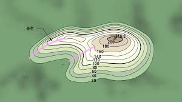
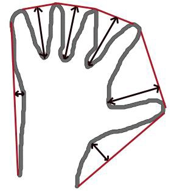

### 이미지 컨투어 1

컨투어란 윤곽선, 외곽선이라는 사전적 의미를 가지며 같은 색상, 밝기, 픽셀 값이 같은 연속된 점을 찾아내어 연결한 선으로 모양 분석과 객체 인식을 하는데 사용한다. 이미지의 moments라는 속성을 통해 객체의 무게중심점이나 면적 등과 같은 몇가지 특성을 계산할 수 있습니다. 

아래의 그림은 산의 등고선인데, 고도가 같은 지점을 이은 선을 등고선 또는 컨투어라고 한다.



이런 컨투어는 대상의 외형을 파악하는데 유용하게 사용된다.

컨투어 함수를 사용하여 이미지를 처리할 때 몇 가지 주의사항이 있다.

- 정확도를 높히기 위해서 binary image를 사용한다. threshold나 canny edge를 선처리로 수행한다.
- `cv2.findContours()` 함수는 원본 이미지를 직접 수정하기 때문에, 원본 이미지를 보존하려면 copy함수를 사용해야 한다.
- OpenCv에서는 컨투어를 찾는 것은 검은색 배경에서 하얀색 배경 대상을 찾는 것과 비슷하다. 그래서 대상은 흰색, 배경은 검은색으로 해야 한다.

### Image Contour

1. findContours

   ```
   image, contours, hierarchy = cv2.findContours(src, mode, method[, contours, hierarchy, offset])
   이미지의 컨투어 정보, 컨투어의 상하구조정보를 출력(흑백, 이진화 이미지만 사용 가능)
   
   ** version 차이에 따라 image가 들어갔을 때 오류가 발생할 수있다.
   OpenCV4) contours, _ = cv2.findContours()
   OpenCV3) _, contours, _ = cv2.findContours()
   
   src : 입력 이미지
   mode: 컨투어 제공방식
   > cv2.RETR_EXTERNAL: 가장 바깥쪽 라인만 제공
   > cv2.RETR_LIST: 모든 라인을 계층 없이 제공
   > cv2.RETR_CCOMP:모든 라인을 2계층으로 제공
   > cv2.RETR_TREE: 모든 라인의 모든 계층 정보를 트리 구조로 제공
   
   method: 근사 값 방식 선택
   > cv2.CHAIN_APPROX_NONE: 근사 계산하지 않고 모든 좌표 제공
   > cv2.CHAIN_APPROX_SIMPLE: 컨투어 꼭짓점 좌표만 제공
   > cv2.CHAIN_APPROX_TC89_L1: The-Chain 알고리즘으로 좌표 개수 축소
   > cv2.CHAIN_APPROX_TC89_KCOS: The-Chain 알고리즘으로 좌표 개수 축소
   ```

2. drawContours

   ```
   cv2.drawContours(img, contours, contour_Idx, color, thickness)
   cv2.findContours() 함수로 얻은 컨투어 좌표를 선으로 표시하고 싶을 때 컨투어 연결선을 손쉽게 그리는 함수
   
   img: 입력
   contours: 그림 그릴 컨투어 배열
   contourIdx: 그림 그릴 컨투어 인덱스 ( -1 : 모든 컨투어 표시 )
   color: 색상 값
   thickness: 선 두께, 0 : 채우기
   ```

### Contour Feature

1. Moments

   Image moment는 대상을 구분할 수 있는 특징을 의미한다. 특징으로는 area, permeter, 중심점 등이 있다. Image moments는 대상을 구분한 후, 다른 대상과 구분하기 위해 대상을 설명하는 자료로 사용된다. 

   ```
   img = cv2.imread('~~~')
   imgray = cv2.cvtColor(img,cv2.COLOR_BGR2GRAY)
   ret, thresh = cv2.threshold(imgray,127,255,0)
   
   image, contours, hierachy = cv2.findContours(thresh, cv2.RETR_TREE,cv2.CHAIN_APPROX_SIMPLE)
   
   # 첫번째 contours의 moment 특징 추출
   cnt = contours[0]
   M = cv2.moments(cnt)
   area=cv2.contourArea(contour) # Contour의 면적을 구합니다.
   length= cv2.arcLength(contour) # Contour의 둘레를 구합니다.
   
   print(M.items())
   ```

   

   Moment에 해당하는 정보는 총 24개이다. 이 중에 moment의 m00는 또는 contourArea() 함수를 사용하여 ,객체의 넓이를 구할 수 있다. 그리고 moment의 m10/m00은 x의 무게 중심점 m01/m00은 y의 무게 중심점이다. 그리고 컨투어의 둘레 길이를 리턴하는 함수 cv2.arcLength()는 2개의 인자를 가지는데 두 번째 인자는 컨투어가 폐곡선인지 아니면 양끝이 열려 있는 호인지를 나타내는 boolean 값이다. 이 값이 True이면 컨투어가 폐곡선임을, False이면 컨투어가 열려있는 호임을 나타낸다.

   ```python
   cx= int(M['m10']/M['m00'])
   cy= int(M['m01']/M['m00'])
   ca= M['m00'] # ContourArea
   ca= cv2.contourArea(contours[@])
   perimeter = cv2.arcLength(contours[@], True or False)
   ```

2. Contour Approximation

   cv2.findContours() 함수로 찾은 컨투어 선들은 각각의 contours point를 가지고 있다. 이 점들을 연결하여 선을 그리게 된다. 이때 이 point의 수를 줄여 근사하여 선을 그릴 때 사용 되는 방법이다.

   ```
   cv2.approxPolyDP(curve, epsilon, closed[, approxCurve]) → approxCurve
   
   curve: contours point array
   epsilon: original cuve와 근사치의 최대거리. 최대거리가 클 수록 더 먼 곳의 Point까지 고려하기 때문에 Point수가 줄어듬.
   closed: 폐곡선 여부
   ```

   ```
   image = cv2.imread('~~~')
   image_gray = cv2.cvtColor(image, cv2.COLOR_BGR2GRAY) 
   
   ret, thresh = cv2.threshold(image_gray, 30, 255, 0) # 수행결과는 흰배경에 검은 객체
   thresh = cv2.bitwise_not(thresh) # 반전
   
   contours, hierarchy = cv2.findContours(thresh, cv2.RETR_TREE, cv2.CHAIN_APPROX_SIMPLE) # 모든계층의 정보를 트리구조로 제공, 컨투어 꼭지점 좌표만이용
   image =cv2.drawContours(image, contours, -1, (0,0,255), 4) #모든 외곽(-1)의 contour 추출
   
   plt.imshow(cv2.cvtColor(image, cv2.COLOR_BGR2RGB))
   plt.show()
   
   # 하나의 contour # epsilon 값이 작을 수록 정확도가 높아진다. 
   
   contour=contours[0]
   epsilon = 1.e-2*cv2.arcLength(contour, True)
   approx=cv2.approxPolyDP(contour, epsilon, True)
   image=cv2.drawContours(image, [approx], -1, (0, 255, 0), 4)
   
   plt.imshow(cv2.cvtColor(image, cv2.COLOR_BGR2RGB))
   plt.show()
   
   ```

3. Convex Hull

   Convex Hull이란 contours point를 모두 포함하는 볼록한 외관선을 의미한다. Contour Approximation과 유사한 결과지만, 방법은 전혀 다르다. Convex Hull은 이미지의 대략적인 형태의 컨투어를 구한다.

   아래 그림에서 붉은 선이 Convex Hull을 나타내고 화살표의 차이가 convexity defect라고 합니다. convexity defect는 contours와 hull과의 최대차이를 나타냅니다.

   

   ```python
   image = cv2.imread('~~~'')
   image_gray = cv2.cvtColor(image, cv2.COLOR_BGR2GRAY) 
   
   ret, thresh = cv2.threshold(image_gray, 230,255,0) # 수행결과는 흰배경에 검은 객체
   thresh = cv2.bitwise_not(thresh) #반전
   
   plt.imshow(cv2.cvtColor(image, cv2.COLOR_BGR2RGB))
   plt.show()
   
   #하나의 contour
   _, contours, hierachy = cv2.findContours(thresh, cv2.RETR_TREE,cv2.CHAIN_APPROX_SIMPLE)
   
   contour=contours[0]
   hull=cv2.convexHull(contour)
   
   cv2.drawContours(image, [hull], 0,(0,255,0), 3)
   
   plt.imshow(cv2.cvtColor(image, cv2.COLOR_BGR2RGB))
   plt.show()
   ```

4. Bounding Rectangle

   `cv2.boundingRect()`는 컨투어를 포함하는 사각형을 그리는 함수이다.

   ```
   x,y,w,h = cv2.boundingRect(contour) 
   x,y: 사각형 왼쪽 상단 좌표
   w, h: 폭, 높이
   contour: 다각형 좌표
   ```

   ```python
   image= cv2.imread('~~~')
   image_gray = cv2.cvtColor(image, cv2.COLOR_BGR2GRAY) 
   
   ret, thresh = cv2.threshold(image_gray, 127,255,cv2.THRESH_BINARY) 
   thresh = cv2.bitwise_not(thresh) #반전
   
   plt.imshow(cv2.cvtColor(thresh, cv2.COLOR_GRAY2RGB)) 
   plt.show()
   
   _, contours, hierarchy = cv2.findContours(thresh, cv2.RETR_TREE, cv2.CHAIN_APPROX_SIMPLE)
   image =cv2.drawContours(image, contours, -1, (0,0,255), 4) #모든 외곽(-1)의 contour 추출
   
   contour=contours[0]
   x,y,w,h = cv2.boundingRect(contour)
   
   # 첫번째 contuor를 포함하는 사각형 그리기
   image= cv2.rectangle(image, (x,y), (x+w,y+h), (0,0,255), 3) 
   
   plt.imshow(cv2.cvtColor(image, cv2.COLOR_BGR2RGB))
   plt.show()
   ```

   

### Contour Property

1. Extreme Points

   컨투어 라인의 좌우상하의 끝점을 찾는 방법이다. cnt는 컨투어 점들이 포함된 배열이다. 여기서 `cnt[:,:,0]` 의 의미는 점의 x 좌표 값만 포함하는 배열이다. 여기에 `argmin()` 을 적용하면 x좌표가 가장 작은 array의 위치가 나오게 된다. 그 위치를 다시 cnt에서 찾으면 가장 왼쪽에 있는 좌표를 얻을 수 있다. 나머지도 동일한 방법으로 좌우상하의 끝점을 찾을 수 있다.

   ```python
   img = cv2.imread('images/UK.jpg')
   img1 = img.copy()
   
   imgray = cv2.cvtColor(img,cv2.COLOR_BGR2GRAY)
   ret, thresh = cv2.threshold(imgray,125,255,0)
   
   image, contours, hierachy = cv2.findContours(thresh, cv2.RETR_TREE,cv2.CHAIN_APPROX_SIMPLE)
   
   cnt = contours[14] # 14번째가 지도의 contour line
   
   # 끝점 좌표 찾기
   leftmost = tuple(cnt[cnt[:,:,0].argmin()][0])
   rightmost = tuple(cnt[cnt[:,:,0].argmax()][0])
   topmost = tuple(cnt[cnt[:,:,1].argmin()][0])
   bottommost = tuple(cnt[cnt[:,:,1].argmax()][0])
   
   # 좌표 표시하기
   cv2.circle(img1,leftmost,20,(0,0,255),-1)
   cv2.circle(img1,rightmost,20,(0,0,255),-1)
   cv2.circle(img1,topmost,20,(0,0,255),-1)
   cv2.circle(img1,bottommost,20,(0,0,255),-1)
   
   img1 = cv2.drawContours(img1, cnt, -1, (255,0,0), 5)
   
   titles = ['Original','Result']
   images = [img, img1]
   
   for i in xrange(2):
       plt.subplot(1,2,i+1), plt.title(titles[i]), plt.imshow(images[i])
       plt.xticks([]), plt.yticks([])
   
   plt.show()
   ```

   

< 참고 >

http://www.gisdeveloper.co.kr/?paged=18&cat=130

https://opencv-python.readthedocs.io/en/latest/doc/18.imageContourHierarchy/imageContourHierarchy.html