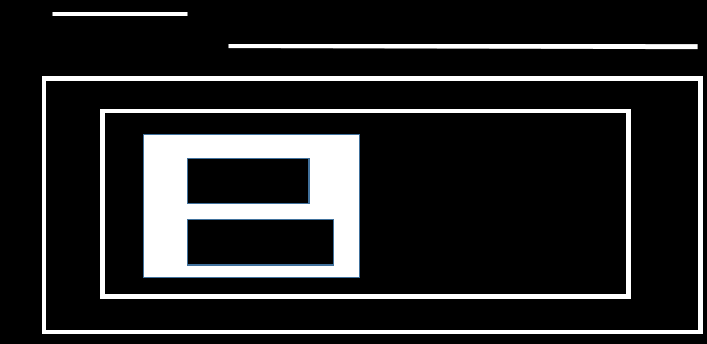
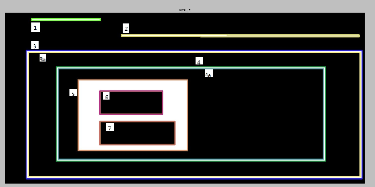
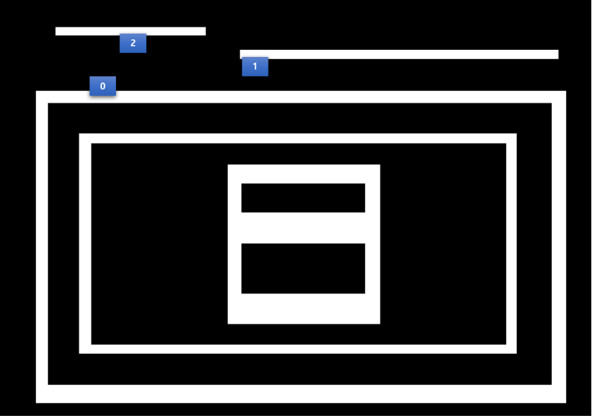
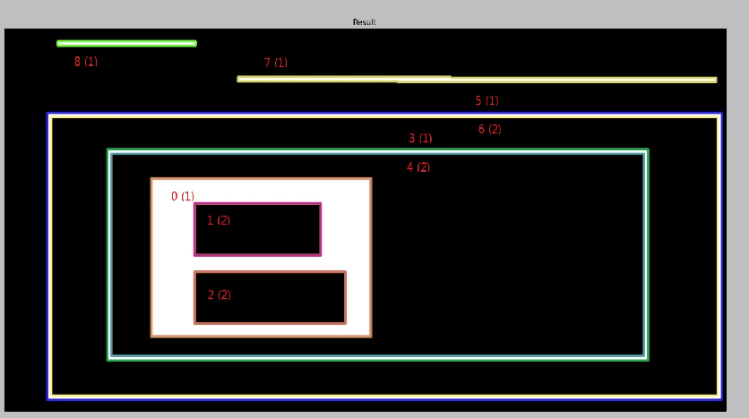
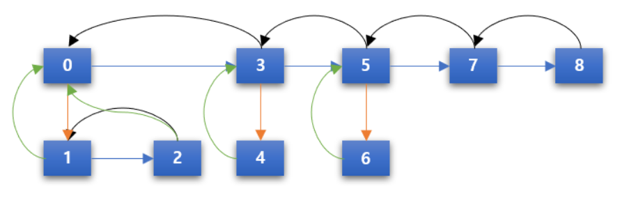
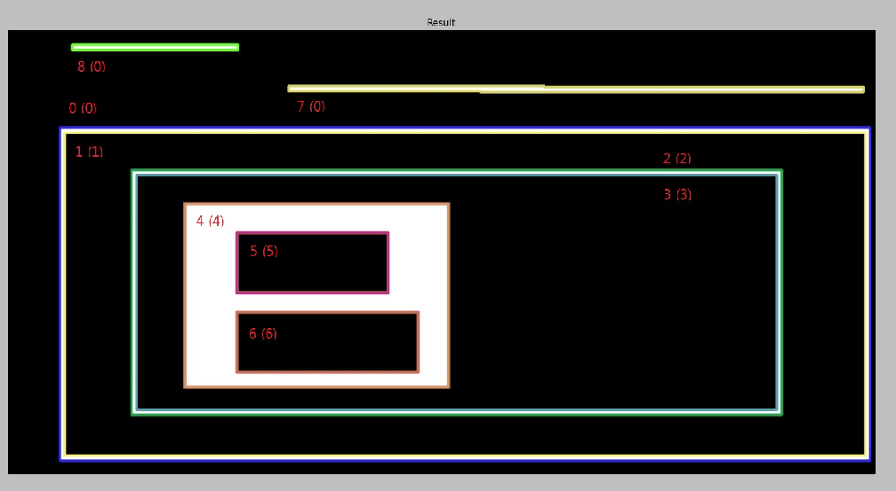
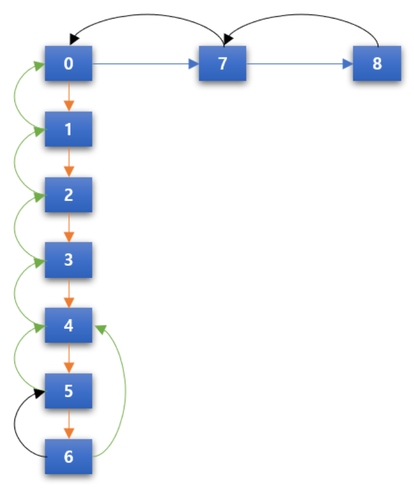

### 이미지 컨투어 2

### Contour Hierarchy

이미지에는 여러 개의 컨투어가 존재하고, 그 사이에는 서로 포함하는 관계가 존재하고, 그 사이에는 서로 포함하는 관계가 존재한다. 그 관계를 contours hierarchy라고 한다. 이전, 이후, Parent, Child 관계를 파악할 수 있다. 이런 관계를 파악하기 위해서는 `cv2.findContours()` 에 contour retrieval mode값에 의해서 결정이 된다..

1. **Hierarchy**

   아래 원본 이미지에 contour line을 적용해 보자.

   

   ```
   img = cv2.imread('images/imageHierarchy.png')
   
   imgray = cv2.cvtColor(img,cv2.COLOR_BGR2GRAY)
   ret, thresh = cv2.threshold(imgray,125,255,0)
   
   image, contours, hierarchy = cv2.findContours(thresh, cv2.RETR_TREE,cv2.CHAIN_APPROX_SIMPLE)
   
   for i in xrange(len(contours)):
       b = random.randrange(1,255)
       g = random.randrange(1,255)
       r = random.randrange(1,255)
   
       cnt = contours[i]
       img = cv2.drawContours(img, [cnt], -1,(b,g,r), 2)
   
   titles = ['Result']
   images = [img]
   
   for i in xrange(1):
       plt.subplot(1,1,i+1), plt.title(titles[i]), plt.imshow(images[i])
       plt.xticks([]), plt.yticks([])
   
   plt.show()
   ```

   

   위 결과는 총 9개의 contour line으로 구성이 되어 있다. 주의해서 봐야할 부분은 3,3a와 4,4a이다. Hirerarchy 구성시 child의 child가 있을 경우 바깥선과 안쪽선이 서로 분리가 되어 contour line을 구성합니다. 이는 포함 관계를 표현하기 위해서이다(5의 경우는 child만 있기 때문에 contour line이 분리되지 않았다).

   이제 contour retrival mode에 따라서 hirerarchy값이 어떻게 표현이 되는 지 확인해 보겠습니다.
   
   

- RETR_LIST

  Hierarchy의 shape는 (1, x, 4)의 형태이다. 여기서 3번째 차원의 4개의 값이 hierarchy를 표현합니다. 각 값의 의미는 **(next, prev, child, parent)** 이다. RETR_LIST는 선/후 관계만을 표현하고, parent/child관계를 표현하지 않는 mode이다.

  mode의 특성대로 next와 prev는 값이 있지만, child와 parent는 모두 -1 이다(-1은 대상이 없음을 의미).  예를 들어 보면 contour 0는 next가 contour 1이고, prev와 child, parent가 없다는 의미 입니다. contour 1은 next가 contour 2이고, prev가 contour 0이고, child와 parent는 해당 사항이 없다. Hierarchy를 구할 필요가 없을 때 사용하면 좋다.

  ```python
  >>> hierarchy
  array([[[ 1, -1, -1, -1],
          [ 2,  0, -1, -1],
          [ 3,  1, -1, -1],
          [ 4,  2, -1, -1],
          [ 5,  3, -1, -1],
          [ 6,  4, -1, -1],
          [ 7,  5, -1, -1],
          [ 8,  6, -1, -1],
          [-1,  7, -1, -1]]])
  ```

- RETR_EXTERNAL

  이 mode는 가장 바깥쪽(다른 contours line에 포함되지 않는다)에 있는 contour만을 반환한다. 위 예에서는 1,2,3번 line입니다.(parent/child는 구성하지 않습니다.)

  ```python
  >>> hierarchy
  array([[[ 1, -1, -1, -1],
          [ 2,  0, -1, -1],
          [-1,  1, -1, -1]]])
  ```

  

  

- RETR_CCOMP

  이 mode는 Hierarchy를 2-level로 표현한다. 바깥쪽(외곽선)은 모두 1-level, 안에 포함된 것은 2-level이 된다.

  

  위 그림을 보면 괄호 밖 숫자는 contours의 순서이고, 괄호 안 숫자는 hierachy를 나타냅니다. 이전과 다른 점은 가장 안쪽에서 부터 contour의 순서를 부여하게 됩니다.

  먼저 contour 0은 2개의 contour를 포함하기 때문에 hierarchy 1이다. 동일 level의 next는 3이고, previous는 없다. child는 contour 1이고, parent는 없다. 그래서 결과적으로 [3,-1,1,-1]의 값을 갖게 된다.

  contour 1은 contour 0에 포함이 되기 때문에 hierachy 2가 됩니다. 동일 level의 next는 contour 2가 되고, previous와 child는 없으며, parent는 contour 0입니다. 그래서 [2,-1,-1,0]의 값을 갖게 됩니다. 

  위와 같은 방식으로 나머지 contour 값을 찾으면 아래와 같다.
  
  ```python
  >>> hierarchy
  array([[[ 3, -1,  1, -1],
          [ 2, -1, -1,  0],
          [-1,  1, -1,  0],
          [ 5,  0,  4, -1],
          [-1, -1, -1,  3],
          [ 7,  3,  6, -1],
          [-1, -1, -1,  5],
          [ 8,  5, -1, -1],
          [-1,  7, -1, -1]]])
  ```
  
  
  
- RETR_TREE

  이 mode는 Hierarchy를 완전한게 표현합니다. 즉 누구에게도 포함되지 않은 contour는 hierarchy-0이 되고, 그 안쪽으로 포함되는 contours는 순서대로 hierachy를 부여받는다.

  

  contour 0은 next는 contour 7, previous는 없으며, child는 contour 1, parent는 없습니다. 결과는 [7,-1,1,-1] 입니다. contour 1은 next는 없고, previous도 없고, child는 contour 2, parent는 contour 0입니다. 결과는 [-1,-1,2,0] 입니다.

  위와 같은 방식으로 나머지 contour 값을 찾으면 아래와 같다.

  ```python
  >>> hierarchy
  array([[[ 7, -1,  1, -1],
          [-1, -1,  2,  0],
          [-1, -1,  3,  1],
          [-1, -1,  4,  2],
          [-1, -1,  5,  3],
          [ 6, -1, -1,  4],
          [-1,  5, -1,  4],
          [ 8,  0, -1, -1],
          [-1,  7, -1, -1]]])
  ```

  

< 참고 >

http://www.gisdeveloper.co.kr/?paged=18&cat=130

https://opencv-python.readthedocs.io/en/latest/doc/18.imageContourHierarchy/imageContourHierarchy.html