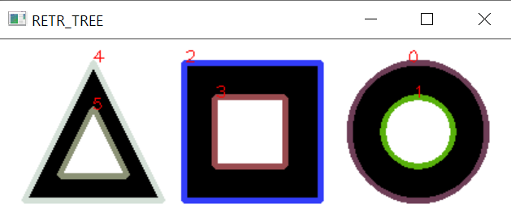
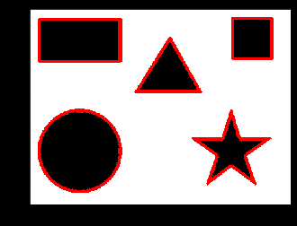

### 이미지 컨투어 3


1. Contour의 기초

   ```
image= cv2.imread('~~~') 
   image_gray=cv2.cvtColor(image, cv2.COLOR_BGR2GRAY) #그레이 형태로 불러옴 
   ret, thresh = cv2.threshold(image_gray, 127, 255, cv2.THRESH_BINARY) #이진화 처리 
   
   plt.imshow(cv2.cvtColor(thresh, cv2.COLOR_GRAY2RGB))
   plt.show()
   
   contours, hierarchy = cv2.findContours(thresh, cv2.RETR_TREE, cv2.CHAIN_APPROX_SIMPLE) #모든 계층 정보를 트리 구조로 제공/컨투어 꼭짓점 좌표만 제공
   
   image=cv2.drawContours(image, contours, -1, (0,255,0), 4) # 모든 컨투어를 그린다. 
   # -1은 전체의 컨투어
   
   plt.imshow(cv2.cvtColor(image, cv2.COLOR_BGR2RGB))
   plt.show()
   ```


2. 컨투어 계층트리

   ```python
   img=cv2.imread('~~~')
   img2 = img.copy()
   
   # 바이너리 이미지로 변환
   imgray=cv2.cvtColor(img, cv2.COLOR_BGR2GRAY)
   ret, imthres = cv2.threshold(imgray, 200, 255, cv2.THRESH_BINARY_INV) #이진화 처리 
   
   # 가장 바깥 컨투어만 수집   --- ①
   _, contour, hierarchy = cv2.findContours(imthres, cv2.RETR_EXTERNAL, cv2.CHAIN_APPROX_NONE) 
   
   # 컨투어 갯수와 계층 트리 출력 --- ②
   print(len(contour), hierarchy)
   
   # 모든 컨투어를 트리 계층 으로 수집 ---③
   _, contour2, hierarchy = cv2.findContours(imthres, cv2.RETR_TREE, cv2.CHAIN_APPROX_SIMPLE) 
   
   # 컨투어 갯수와 계층 트리 출력 ---④
   print(len(contour2), hierarchy)
   
   # 가장 바깥 컨투어만 그리기 ---⑤
   cv2.drawContours(img, contour, -1, (0, 255, 0), 3)
   
   # 모든 컨투어 그리기 ---⑥
   for idx, cont in enumerate(contour2): 
       
       # 랜덤한 컬러 추출 ---⑦
       color = [int(i) for i in np.random.randint(0,255, 3)]
       
       # 컨투어 인덱스 마다 랜덤한 색상으로 그리기 ---⑧
       cv2.drawContours(img2,contour2,idx,color,3)
       
       # 컨투어 첫 좌표에 인덱스 숫자 표시 ---⑨
       cv2.putText(img2,str(idx),tuple(cont[0][0]),cv2.FONT_HERSHEY_PLAIN,1, (0,0,255))
       
   # 화면 출력
   cv2.imshow('RETR_EXTERNAL', img)
   cv2.imshow('RETR_TREE', img2)
   cv2.waitKey(0)
   cv2.destroyAllWindows()
   ```

   

   

   | INDEX | NEXT | PREVIOUS | CHILD | PARENT |
   | ----- | ---- | -------- | ----- | ------ |
   | 0     | 2    | -1       | 1     | -1     |
   | 1     | -1   | -1       | -1    | -1     |
   | 2     | 4    | -1       | 3     | 2      |
   | 3     | -1   | -1       | -1    | -1     |
   | 4     | -1   | 2        | 5     | -1     |
   | 5     | -1   | -1       | -1    | 4      |

   

3. aproxPolyDP

   ```python
   image = cv2.imread('img/5shapes.jpg')
   image_gray = cv2.cvtColor(image, cv2.COLOR_BGR2GRAY) 
   
   ret, thresh = cv2.threshold(image_gray, 30, 255, 0) # 수행결과는 흰배경에 검은 객체
   thresh = cv2.bitwise_not(thresh) #반전
   
   _, contours, hierarchy = cv2.findContours(thresh, cv2.RETR_TREE, cv2.CHAIN_APPROX_SIMPLE) # 모든계층의 정보를 트리구조로 제공, 컨투어 꼭지점 좌표만이용
   image =cv2.drawContours(image, contours, -1, (0,0,255), 4) #모든 외곽(-1)의 contour 추출
   
   plt.imshow(cv2.cvtColor(image, cv2.COLOR_BGR2RGB))
   plt.show()
   ```

   


4. 도형검출

   ```python
   # 이미지를 읽어서 그레이 스케일 및 스레시홀드 변환
   img = cv2.imread("img/5shapes.jpg")
   
   imgray = cv2.cvtColor(img, cv2.COLOR_BGR2GRAY)
   ret, th = cv2.threshold(imgray, 127, 255, cv2.THRESH_BINARY_INV)
   
   # 컨투어 찾기
   _, contours, _ = cv2.findContours(th, cv2.RETR_EXTERNAL,  cv2.CHAIN_APPROX_SIMPLE)
   
   for contour in contours:
       # 각 컨투어에 근사 컨투어로 단순화 
       approx = cv2.approxPolyDP(contour, 0.005*cv2.arcLength(contour, True), True)
       # 꼭지점의 갯수
       vertices = len(approx)
       print("vertices:", vertices)
       
       # 중심점 찾기
       mmt = cv2.moments(contour)
       cx,cy = int(mmt['m10']/mmt['m00']), int(mmt['m01']/mmt['m00'])
       
       name = "Unkown"
       if vertices == 3: # 꼭지점이 3개는 삼각형
           name = "Triangle"
           color = (0,255,0)
       elif vertices == 4: # 꼭지점 4개는 사각형
           x,y,w,h = cv2.boundingRect(contour)
           if abs(w-h) <= 3:   # 폭과 높이의 차이가 3보다 작으면 정사각형
               name = 'Square'
               color = (0,125,255)
           else:               # 폭과 높이 차이가 3보다 크면 직사각형
               name = 'Rectangle'
               color = (0,0,255)
       elif vertices == 10:  # 꼭 지점 갯수 10개는 별 
           name = 'Star'
           color = (255,255,0)
       elif vertices >= 15: # 꼭 지점 10개 이상이면 원
           name = 'Circle'
           color = (0,255,255)
       # 컨투어 그리기    
       cv2.drawContours(img, [contour], -1, color, -1)
       # 도형 이름 출력
       cv2.putText(img, name, (cx-50, cy), cv2.FONT_HERSHEY_COMPLEX_SMALL,1, (100,100,100), 1)
   
   cv2.imshow('Input Shapes', img)
   cv2.waitKey(0)
   cv2.destroyAllWindows()
   ```

   

< 참고 >

http://www.gisdeveloper.co.kr/?paged=18&cat=130