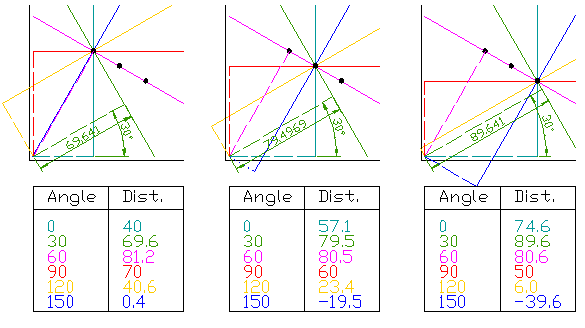
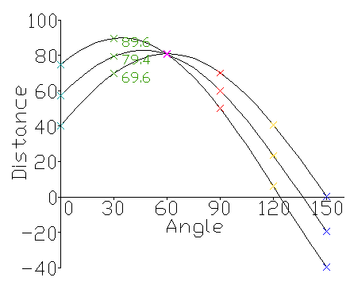

# Hough Transformation


허프변환은 이미지에서 모양을 찾는 가장 유명한 방법이다. 이 방법을 이용하면 이미지의 형태를 찾거나, 누락되거나 깨진 영역을 복원할 수 있습니다. 기본적으로 허프변환의 직선의 방정식을 이용합니다. 하나의 점을 지나는 무수한 직선의 방적식은 y=ax+b로 표현할 수 있으며, 이것을 삼각함수를 이용하여 변형하면 r = 𝑥 cos 𝜃 + 𝑦 sin 𝜃 으로 표현할 수 있다. 그럼 아래 이미지를 보자.



3개의 점이 있고, 그중 우리가 찾는 직선은 핑크색 직선이다. 그럼 각 점 (x,y)에 대해서 삼각함수를 이용하여 𝜃 값을 1 ~ 180까지 변화를 하면서 원점에서 (x,y)까지의 거리(r)을 구합니다. 그러면 (𝜃, r)로 구성된 180개의 2차원 배열을 구할 수 있습니다.

이렇게 해서 구해서 2차원 배열을 다시 그래프로 표현하면 아래와 같이 사인파 그래프로 표현이 된다. 아래 3개의 방정식의 만나는 점이 바로 직선인 확률이 높은 점이다. 즉, 𝜃가 60이고 거리가 80인 직선의 방정식을 구할 수 있는 것 입니다.



1. HoughLines, HoughCircles

   ```
   lines = cv2HoughLineP(img, rho, theta, threshold[, lines, minLineLength, maxLineGap]) : 검출한 선의 결과 값이 선의 시작과 끝 좌표이다.
   img : 입력영상, 이미지
   rho : 거리측정 해상도, 0~1
   theta : 각도 측정 해상도, 라디안 단위( np.pi/0~180)
   threshold : 직선으로 판단할 최소한의 동일 개수
   작은 값 : 정확도 감소, 검출 개수 증가
   큰 값 : 정확도 증가, 검출 개수 감소
   lines : 거물된 선 좌표, N X 1 X 4 배열 ( x1, y1, x2, y2 )
   minLineLength : 선으로 인정할 최소 길이
   maxLineGap : 선으로 판단한 최대 간격
   min_theta, max_theta : 검출을 위해 사용할 최대, 최소 각도
   ```

   ```
   circles = cv2.Houghcircles(img, method, dp, minDist[, circles, param1, param2, minRadius, maxRadius])
   img : 입력 영상, 이미지
   method : 검출 방식 선택,
   cv2.HOUGH_GRADIENT 만 가능
   dp : 입력 영상, 이미지와 경사 누적의 해상도 반비례율, 1: 입력과 동일, 값이 커질수록 부정확
   minDist : 원들 중심간의 최소 거리, 0: 에러 (동심원 검출 불가)
   circles : 검출 원 결과, N X 1 X 3 부동 소수점 배열 (x, y, 반지름)
   param1 : 캐니 엣지에 전달할 스레시홀드 최대 값(최소 값은 최대 값의 2배 작은 값을 전달)
   param2 : 경사도 누적 경계 값(값이 작을수록 잘못된 원 검출)
   minRadius, maxRadius : 원의 최소 반지름, 최대 반지름 (0이면 영상의 크기)
   ```

   ```
   import cv2 
   import numpy as np 
   import matplotlib.pyplot as plt 
   
   #이미지 그리기
   img = np.zeros((500,500), np.uint8)
   cv2.circle(img, (200, 200), 50, 255, 3)
   cv2.line(img, (100, 400), (400, 350), 255, 3)
   
   #선, 원검출
   lines=cv2.HoughLinesP(img, 1, np.pi/180, 100, 100 ,10)[0]
   circles=cv2.HoughCircles(img, cv2.HOUGH_GRADIENT, 1, 15, param1=200, param2=30)[0]
   
   dbg_img=np.zeros( (img.shape[0], img.shape[1], 3), np.uint8)
   
   for x1, y1, x2, y2 in lines:
       print('Detected line: ({} {}), ({} {})'.format(x1,y1,x2,y2))
       cv2.line(dbg_img, (x1,y1),(x2,y2),(0,255,0),2)
   
   for c in circles:
       print('Detected circle: center= ({},{}), radius={}'.format(c[0],c[1], c[2]))
       cv2.circle(dbg_img, (c[0],c[1]), c[2], (0,0,255), 2)
       
       #검출된 직선과 원을 그린다.
   
   #시각화한다. 
   plt.figure(figsize=(8,10))
   plt.subplot(121)
   plt.title('original')
   plt.axis('off')
   plt.imshow(img, cmap='gray')
   plt.subplot(122)
   plt.title('detected primitives')
   plt.axis('off')
   plt.imshow(dbg_img)
   plt.show()
   ```

   

2. 스도쿠 이미지 선 검출

   ```python
   img = cv2.imread('img/sudoku.jpg')
   img2 = img.copy()
   
   # 그레이 스케일로 변환 및 엣지 검출 ---①
   imgray = cv2.cvtColor(img,cv2.COLOR_BGR2GRAY)
   edges= cv2.Canny(imgray, 50, 200)
   
   # 확율 허프 변환 적용 ---②
   lines=cv2.HoughLinesP(edges, 1, (np.pi/180), 10, None, 20, 2)
   
   for line in lines:
   
       # 검출된 선 그리기 ---③
       x1,y1,x2,y2 =line[0]
       #print('Detected line: ({} {}), ({} {})'.format(x1,y1,x2,y2))
       cv2.line(img2, (x1,y1),(x2,y2),(0,255,0),1)
       
   
   merged = np.hstack((img, img2))
   cv2.imshow('Probability hough line', merged)
   cv2.waitKey()
   cv2.destroyAllWindows()
   ```

   

3. 체스판 그리드 패턴 검출

   ```
   image_chess = cv2.imread('data/chessboard.png')
   
   found, corners= cv2.findChessboardCorners(image_chess, (6,9))
   assert found == True, "can't find chess board pattern"
   
   dbg_image_chess = image_chess.copy()
   cv2.drawChessboardCorners(dbg_image_chess,(6,9),corners, found)
   plt.figure(figsize=(8,4))
   plt.subplot(121)
   plt.title('original')
   plt.axis('off')
   plt.imshow(image_chess)
   plt.subplot(122)
   plt.title('detected pattern')
   plt.axis('off')
   plt.imshow(dbg_image_chess)
   plt.show()
   
   ```


4. 체스판 원 그리드 패턴 검출

   ```
   image_circles = cv2.imread('data/circlesgrid.png')
   
   found, corners = cv2.findCirclesGrid(image_circles,(6,6),flags=cv2.CALIB_CB_SYMMETRIC_GRID)
   
   assert found == True, "can't find chess board pattern"
   
   dbg_image_circles = image_circles.copy()
   cv2.drawChessboardCorners(dbg_image_circles,(6,6),corners, found)
   
   plt.figure(figsize=(8,8))
   plt.subplot(221)
   plt.title('original')
   plt.axis('off')
   plt.imshow(image_chess)
   plt.subplot(222)
   plt.title('detected pattern')
   plt.axis('off')
   plt.imshow(dbg_image_chess)
   plt.show()
   plt.subplot(223)
   plt.title('original')
   plt.axis('off')
   plt.imshow(image_circles)
   plt.subplot(224)
   plt.title('detected pattern')
   plt.axis('off')
   plt.imshow(dbg_image_circles)
   plt.tight_layout()
   plt.show()
   ```

   


