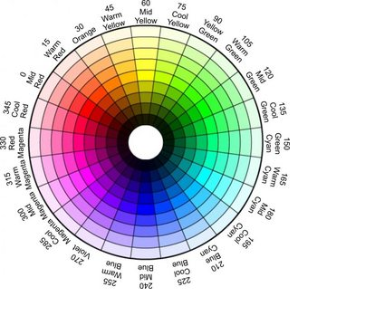

# 이미지 프로세싱

### 1. 이미지 Processing

디지털 영상의 표현 방법에 대해 알아보고, 그 중에 binary image, grayscale image, RGB image, HSV image에 대해 알 수 있다. 그리고 image에서 다른 image로의 변환 방법에 대해 알아보자.

1. 디지털 이미지

   디지털 영상은 2차원 행렬의형태로 표현할 수 있다. 격자 하나가 이미지의 픽셀(pixel)이라고 한다. 이런 이미지를 비트맵(bitmap) 이미지라 한다. 각 픽셀의 위치는 2가지 형태로 표현을 할 수가 있는데, 영상좌표와 행렬 위치로 표현한다. 주의해야 할 점은 **영상 좌표는 좌측 상단의 꼭지점을 기준으로 (x,y)로, 행렬 위치는 (y index, x index)로 표현한다.** 

   

   1. 바이너리 이미지(binary Image)

      바이너리 이미지는 픽셀당 1bit(0 또는 1)로 표현하는 영상이다. 즉, 흰색과 검은색으로만 표현이 되면 바이너리 이미지이다. 특징은 원하는 모양을 좀 더 정확하게 판단 할 수 있다.

   2. Grayscale Image

      Grayscale 이미지는 Pixel당 8bit로 256단계의 명암(빛의 세기)을 표현할 수 있는 이미지이다. 그리고 이미지 연산을 할 때, 연산의 양을 줄일때 유용하다.

   3. 컬러 이미지

      컬러 이미지는 픽셀의 색을 표현하기 위해서 픽셀당 24bit를 사용합니다. 총 16,777,216 가지의 색을 표현할 수 있다. 일반적으로 True color image라고 한다. 각 픽셀은 RGB 각각을 위해서 8bit를 사용하게 됩니다. OpenCV에서는 BGR을 기본으로 한다. 각 기본색의 표현은 blue->(255,0,0), green->(0,255,0), red->(0,0,255)이고 이 들을 조합하여 다양한 색을 만들 수 있다. 예를 들면, white->(255,255,255), black->(0,0,0)으로 표현할 수 있습니다. 각 pixel당 3Byte를 사용하기 때문에 용량이 큽니다. 이를 해결하기 위해서 lookup table을 사용하여, 해당 pixel에는 index만 을 저장하기도 합니다.

   4. HSV 

      이미지 처리에서 가장 많이 사용되는 형태의 컬러 모델이다. 하나의 모델로 색과 채도, 명도를 모두 알 수 있고 원뿔 형태의 모델로 표현이 됩니다. HSV의 특징은 H값 한가지로 색상을 확인 할 수 있어 색상 기반 작업에 효과적이다.

      HSV의 의미는 다음과 같습니다.

      > - H(ue) : 색상. 일반적인 색을 의미함. 원추모형에서 각도로 표현이 된다(0: Red, 120도 : Green, 240: Blue). RGB 색상의 범위에 맞는 H값은 다음과 같다.
      >   - 빨강 : 165 ~ 180, 0 ~ 15, 초록 : 45 ~ 75, 파랑 : 90 ~ 120
      >
      > - S(aturation) : 채도. 색의 순수성을 의미하며 일반적으로 짙다, 흐리다로 표현이 된다. 중심에서 바깥쪽으로 이동하면 채도가 높다. 255가 가장 순수한 색상을 의미한다.
      >
      > - V(alue) : 명도. 색의 밝고 어두운 정도로 수직축의 깊이로 표현하고 어둡다 밝다로 표현이 된다. 255 값을 가질 때 가장 밝다.

      

   5. Color-space 변환

      color-space 변환이란 위에서 보여준 특정 칼라에서 다른 칼라 이미지로 변환하는 방법을 뜻한다. 그 때 사용 하는 함수는 ``cv2.cvtColor()` 함수이다. 

      ```pyhon
      cv2.cvtColor(src, code)
      src: 대상 이미지
      code: 변환할 코드 
      ```

      예를 들면, Gray에서 RGB로 변환과 BGR에서 HSV로 BGR에서 RGB로 변환하는 방법을 보자.

      ```
      cv2.cvtColor(img, cv2.COLOR_GRAY2RGB)
      cv2.cvtColor(img, cv2.COLOR_BGR2HSV)
      cv2.cvtColor(img, cv2.COLOR_BGR2RGB)
      ```

      


### 2. 이미지 임계 처리

이진화란 영상을 흑/백으로 분류하여 처리하는 것이다. 정해진 임계값보다 크면 백, 작으면 흑이 되는 형태이다. 기본 임계처리는 사용자가 고정된 임계값을 결정하여 처리하는 단순한 형태이다. 하지만 기준이 되는 임계값을 어떻게 결정할 것인지가 중요한 문제이다. 

1. 기본 임계처리

   기본 임계처리 방법에서 사용하는 함수는 `cv2.threshold()`이다.

   ```
   cv2.threshold(img, thresh, Value, type)
   img – input image로 grayscale 이미지
   thresh(threshold) – 임계값(경계값)
   Value – 경계 값 기준에 만족하는 픽셀에 적용할 값
   type – thresholding type
   > cv2.THRESH_BINARY: 픽셀 값이 임계값보다 크면 픽셀 값으로 작으면 0으로 할당
   > cv2.THRESH_BINARY_INV: 픽셀 값이 임계값보다 크면 픽셀 값으로 작으면 0으로 할당
   > cv2.THRESH_TRUNC: 픽셀 값이 임계값보다 크면 임계값으로 작으면 픽셀 값 그대로 할당
   > cv2.THRESH_TOZERO: 픽셀 값이 임계값보다 크면 픽셀 값 그대로하고 작으면 0으로 할당
   > cv2.THRESH_TOZERO_INV: 픽셀 값이 임계값보다 크면 0으로 작으면 픽셀 값 그대로 할당
   ```

   예를 들면 다음과 같다.

   ```
   img =cv2.imread('~~~',cv2.IMREAD_GRAYSCALE)
   
   imgs=[]
   
   ret, t_bin=cv2.threshold(img,127,255,cv2.THRESH_BINARY)
   ret, t_bininv=cv2.threshold(img,127,255,cv2.THRESH_BINARY_INV)
   ret, t_truc=cv2.threshold(img,127,255,cv2.THRESH_TRUNC)
   ret, t_2zr=cv2.threshold(img,127,255,cv2.THRESH_TOZERO)
   ret, t_2zrinv=cv2.threshold(img,127,255,cv2.THRESH_TOZERO_INV)
   
   imgs.append(t_bin)
   imgs.append(t_bininv)
   imgs.append(t_truc)
   imgs.append(t_2zr)
   imgs.append(t_2zrinv)
   
   for i in imgs:
       plt.imshow(cv2.cvtColor(i,cv2.COLOR_GRAY2RGB))
       plt.show()
   ```

   

2. 적응 임계처리

   적용 하는 함수에에 따라 임계값을 결정하는 방법이다. 전체픽셀이 하나의 기준이 아니라 영역에 따라 다른 임계값 사용한다. `cv2.adaptiveThreshold()`를 함수를 사용한다.

   ```
   cv2.adaptiveThreshold(img, maxValue, adaptiveMethod, thresholdType, blockSize, C)
   img: input image로 grayscale 이미지
   maxValue: 임계값
   thresholdType: threshold type
   blockSize: 영역으로 나눌 이웃의 크기 (nxn), 홀수(3,5,7,…)
   C: 평균이나 가중평균에서 차감할 값
   adaptiveMethod – thresholding value를 결정하는 계산 방법
   > cv2.ADAPTIVE_THRESH_MEAN_C: 주변영역의 평균값으로 결정
   > cv2.ADAPTIVE_THRESH_GAUSSIAN_C:
   ```

   예를 들면 다음과 같다.

   ```
   image=cv2.imread('~~~',cv2.IMREAD_GRAYSCALE)
   
   ret, th1= cv2.threshold(image,127, 255, cv2.THRESH_BINARY)
   th2 = cv2.adaptiveThreshold(image, 255, cv2.ADAPTIVE_THRESH_MEAN_C, cv2.THRESH_BINARY, 21, 3)
   th3 = cv2.adaptiveThreshold(image, 255, cv2.ADAPTIVE_THRESH_GAUSSIAN_C, cv2.THRESH_BINARY, 21, 3)
   
   plt.imshow(cv2.cvtColor(image, cv2.COLOR_GRAY2RGB))
   plt.show()
   plt.imshow(cv2.cvtColor(th1, cv2.COLOR_GRAY2RGB))
   plt.show()
   plt.imshow(cv2.cvtColor(th2, cv2.COLOR_GRAY2RGB))
   plt.show()
   plt.imshow(cv2.cvtColor(th3, cv2.COLOR_GRAY2RGB))
   plt.show()
   ```

3. 오츠(Otsu) 이진화

   지금까지 thresholding처리를 하면서 임계값을 사용자가 결정하여 parameter로 전달하였습니다. 지금까지는 trial and error방식으로 결정했다. 그러나 **bimodal image** (히스토그램으로 분석하면 2개의 peak가 있는 이미지)의 경우는 히스토그램에서 임계값을 어느정도 정확히 계산 할 수 있습니다. Otsu의 이진화(Otsu’s binarization)란 bimodal image에서 임계값을 자동으로 계산해주는 것을 말합니다. 

   적용 방법은 `cv2.threshold()` 함수의 flag에 추가로 `cv2.THRESH_STSU` 를 적용하면 된다. 이때 임계값은 0으로 전달하면 된다.

   ```
   img = cv2.imread('images/noise.png',0)
   
   ret1, th1 = cv2.threshold(img, 127, 255, cv2.THRESH_BINARY)
   ret2, th2 = cv2.threshold(img, 0, 255, cv2.THRESH_BINARY+cv2.THRESH_OTSU)
   
   blur = cv2.GaussianBlur(img,(5,5),0)
   ret3, th3 = cv2.threshold(img, 0, 255, cv2.THRESH_BINARY+cv2.THRESH_OTSU)
   
   ```

   

