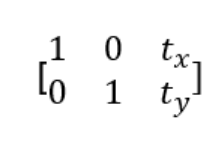
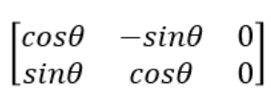
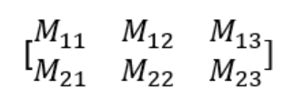

# 이미지 변환

이미지 변환은 주어진 영상에 특정 알고리즘을 적용하여 변환된 이미지를 얻어내는 것을 의미한다. 즉, 주어진 영상을 크기 변환, 평행이동, 회전, Affine변환과 시점변환 등을 적용해 원하는 이미지를 얻는 것이다. 

1. Scailing(크기 변환)

   Scaling은 이미지의 사이즈가 변하는 것이다. `cv2.resize()` 함수를 사용하여 적용할 수 있다. 사이즈가 변하게 되면 픽셀 사이의 값을 결정을 해야 하는데, 이때 사용하는 것을 보간법이다. 많이 사용되는 보간법은 사이즈를 줄일 때는 `cv2.INTER_AREA` , 사이즈를 크게할 때는 `cv2.INTER_CUBIC` , `cv2.INTER_LINEAR` 을 사용한다.

   ```
   cv2.resize(img, dsize, fx, fy, interpolation)
   img: Image
   dsize: Manual Size. 가로, 세로 형태의 튜플(예를 들면, (100,200))
   fx – 가로 사이즈의 배수. 2배로 크게하려면 2. 반으로 줄이려면 0.5
   fy – 세로 사이즈의 배수
   interpolation – 보간법
   > cv2.INTER_LINEAR: bilinear interpolation (디폴트 값)
   > cv2.INTER_AREA: 픽셀 영역 관계를 이용한 resampling 방법으로 이미지 축소에 있어 선호되는 방법
   > cv2.INTER_CUBIC: 4x4 픽셀에 적용되는 bicubic interpolation
   > cv2.INTER_LINEAR: 8x8 픽셀에 적용되는 Lanczos interpolation
   ```

   

2. Translation(이동)

   Translation은 이미지의 위치를 변경하는 변환이다. 변환 행렬은 다음과 같다. $t_{x}$와 $t_{y}$ 값에 따라 이미지 변환이 결정된다.

   

   ```
   cv2.warpAffine(image, M, dsize) 
   image: 이미지
   M: 변환 행렬
   dsize: Manual Size
   ```

   예를 들면 다음과 같다.


   ```
   image = cv2.imread('img/image.jpg')
   
   height,width= image.shape[:2]
   
   M=np.float32([ [1,0,100], [0,1,200] ])
   dst=cv2.warpAffine(image, M, (width, height))
   ```

   위에서 M이라는 행렬이 있는데, 첫번째 열의 3번째 값은 $t_x$를 의미하고, 두번째 행의 3번째 열의 값은 $t_y$를 의미한다. 즉, $t_x$가 100이므로 x축으로 100만큼, $t_y$가 200이므로 y축으로 200만큼 이동하라는 의미이다.

   

3. Rotation(회전)

   물체를 평면상의 원점을 중심으로 𝜃 만큼 회전하는 변환이다. 양의 각도는 반시계방향으로 회전을 의미한다. 변환 행렬이 필요한데, 변환 행렬을 생성하는 함수가 `cv2.getRotationMatrix2D()` 함수입니다. 회전변환의 행렬은 다음과 같다.

   

   다음과 같이 변환 행렬을 직접 만들어서 회전시킬 수 있다.

   ```python
   img=cv2.imread('~~~.jpg')
   rows, cols= img.shape[:2]
   
   angle = 45 # 회전시키려는 각도
   d90= angle*np.pi/180
   
   M_ro=np.float32([ [np.cos(d90), -1*np.sin(d90), rows],
                    [np.sin(d90), np.cos(d90), 0]] )
   
   r90=cv2.warpAffine(img, M_ro, (rows,cols))
   ```

   또는 이미지 회전을 위한 변환행렬 함수 `cv2.getRotationMatrix2D()` 를 사용해도 된다.

   ```
   cv2.getRotationMatrix2D(center, angle, scale)
   center: 이미지의 중심 좌표
   angle: 회전 각도
   scale: scale factor
   ```

   변환 행렬을 만들어 적용하면 다음과 같다.

   ```python
   img = cv2.imread('~~~.jpg')
   
   # 행과 열 정보만 저정합니다. 
   rows, clos= image.shape[:2]
   M = cv2.getRotationMatrix2D( ((rows/2, cols/2)), 90, 1.0)
   dst = cv2.warpAffine(img, M, (rows,cols))
   
   plt.imshow(cv2.cvtColor(dst, cv2.COLOR_BGR2RGB))
   plt.show() 
   ```

   

4. Affine tranform

   Affine Transformation은 선의 평행성은 유지가 되면서 이미지를 변환하는 작업입니다. **이동, 확대, Scale, 반전까지 포함된 변환**입니다. 즉, 위에서 이동, 회전, 크기 변환을 일반화 한 변환을 Affine 변환이라 할 수 있다.  Affine 변환을 위해서는 3개의 일치하는 점이 있으면 변환행렬을 구할 수 있습니다. 함수는 `cv.2getAffineTranfrom()`를 사용한다. 변환행렬의 모양은 다음과 같다. 변환행렬에 적절한 값을 주면 이동, 확대, scale을 동시에 적용할 수 있고, 특정 값을 주면 회전만 이동만 시킬 수도 있다.

   

   ```
   cv2.getAffineTransform(pts1, pts2) 
   pts1: 변환 전 영상의 좌표 3개 
   pts2: 변환 후 영상의 좌표 3개
   ```

   

   

   ```python
   img=cv2.imread('~~~`)
   rows, cols = img.shape[:2]
   
   # ---① 변환 전, 후 각 3개의 좌표 생성
   pts1= np.float32([ [100,50], [200,50], [100,200] ])
   pts2= np.float32([ [20,70] , [150,60], [120,120] ])
   
   # ---② 변환 전 좌표를 이미지에 표시
   cv2.circle(img, (100,50), 5, (255,0), -1)
   cv2.circle(img, (200,50), 5, (0,255,0), -1)
   cv2.circle(img, (100,200), 5, (0,0,255), -1)
   
   #---③ 짝지은 3개의 좌표로 변환 행렬 계산
   mtrx= cv2.getAffineTransform(pts1,pts2)
   
   #---④ 어핀 변환 적용
   dst=cv2.warpAffine(img, mtrx, (int(cols),rows) )
   
   #---⑤ 결과 출력
   plt.imshow(cv2.cvtColor(img, cv2.COLOR_BGR2RGB))
   plt.show()
   plt.imshow(cv2.cvtColor(dst, cv2.COLOR_BGR2RGB))
   plt.show()
   
   ```

   

5. Perspective transform(원근 변환)

   Perspective transform은 직선의 성질만 유지가 되고, 선의 평행성은 유지가 되지 않는 변환입니다. 기차길은 서로 평행하지만 원근변환을 거치면 평행성은 유지 되지 못하고 하나의 점에서 만나는 것 처럼 보인다. 4개의 점의 input값과 이동할 output point가 필요합니다. 변환 행렬을 구하기 위해서는 `cv2.getPerspectiveTransform()` 함수가 필요하며, `cv2.warpPerspective()` 함수에 변환행렬값을 적용하여 최종 결과 이미지를 얻을 수 있습니다.

   ```
   cv2.getPerspectiveTransform(pts1, pts2) 
   
   pts1 : 변환 이전 영상의 좌표 4개
   pts2 : 변환 이전 영상의 좌표 4개
   mtrx : 변환행렬 반환, 3 X 3 행렬
   
   cv2.warpPerspective(src, mtrx, dsize[, dst, flags, borderMode, borderValue]) 
   cv2.warpAffine()함수와 기능 동일하다.
   
   src : image
   mtrx : 변환행렬
   dsize : Manual Size
   ```

   예는 다음과 같다.

   ```python
   img=cv2.imread('~~~.jpg')
   rows, cols = img.shape[:2]
   
   #---① 원근 변환 전 후 4개 좌표, 코드 전체 작성후 pts2 좌표 변경해보기
   pts1 = np.float32([[0,0], [0,rows], [cols, 0], [cols,rows]])
   pts2 = np.float32([[100,50], [10,rows-50], [cols-100, 50], [cols-10,rows-50]])
   
   # ---② 변환 전 좌표를 이미지에 표시
   cv2.circle(img, (0,0), 10, (255,0,0), -1)
   cv2.circle(img, (0,rows), 10, (0,255,0), -1)
   cv2.circle(img, (cols,0), 10, (0,0,255), -1)
   
   #---③ 원근 변환 행렬 계산
   mtrx=cv2.getPerspectiveTransform(pts1,pts2)
   
   #---④ 원근 변환 적용
   dst=cv2.warpPerspective(img, mtrx, (cols, rows))
   
   plt.imshow(cv2.cvtColor(img, cv2.COLOR_BGR2RGB))
   plt.show()
   plt.imshow(cv2.cvtColor(dst, cv2.COLOR_BGR2RGB))
   plt.show()
   ```

   