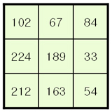

# 이미지 필터링

이미지 필터링이란 입력 값에서 원하지 않는 값은 걸러내어 원하는 결과를 얻어내는 것을 의미한다. 예를 들면, 영상을 흐리게 만들거나 명확하게 만들어 영상의 품질을 높인다. 또는, 이미지 안에 있는 물체의 경계(edge)를 검출하고 경계(edge)의 방향을 알아내는 등 객체 인식과 분리의 기본이 되는 정보를 계산하는 것을 의미한다. 

대표적으로 컨볼루션 계산이 있는데 필터링에서 가장 많이 사용하는 계산방법이다. 계산 방법은 n x n 크기의 커널의 각 요소와 대응하는 입력 픽셀 값을 곱해서 결과 값으로 결정하는 연산의 반복이다. 

다른 예는 블러링인데 이는 이미지를 초점이 맞지 않은 것처럼 흐릿하게 만드는 것이다. 그 중에 평균 블러링은 주변 픽셀 값들의 평균을 적용한다. 픽셀값이 주변과 차이가 적어져 전체적으로 흐려진다. 가우시안 블러링은 정규분포를 따르는 모양으로 가운데에 있을 수록 크고 멀어질수록 작아지는 커널을 사용 한다. 선택 픽셀에 가까울 수록 많은 영향을 주고 멀어질수록 적은 영향을 주기 때문에 노이즈를 제거하는 효과가 있다. 미디언 블러링은 커널 윈도우와 픽셀의 값들을 정렬한 후에 중간값을 선택하여 적용하여 점 잡음을 제거하는데 효과적이다. 즉, 화면에 점처럼 찍힌 노이즈를 제거하는데 효과적입니다.


1. 필터를 직접 만들어 필터링 적용(Filtering)

   ```
   cv2.filter2D(img, ddepth, kernel[, dst, anchor, delta, borderType])
   img: 입력값
   ddepth: 출력값의 dtype
   > -1 : 입력 값과 동일
   > CV_8U, CV16UCV16S, CV_32F, CV_64F
   > kelnel: 컨볼루션 커널, float32의 n x n 크기의 배열 
   ```

   평균 필터를 만들어서 블러링 적용하는 예는 다음과 같다.
   $$
   X = \frac{1}{25}\begin{bmatrix}
   1&1&1&1&1\\
   1&1&1&1&1\\
   1&1&1&1&1\\
   1&1&1&1&1\\
   \end{bmatrix}
   $$

   ```python
   img=cv2.imread('~~~')
   
   '''
   #5x5 평균 필터 커널 생성    ---①
   kernel = np.array([[0.04, 0.04, 0.04, 0.04, 0.04],
                      [0.04, 0.04, 0.04, 0.04, 0.04],
                      [0.04, 0.04, 0.04, 0.04, 0.04],
                      [0.04, 0.04, 0.04, 0.04, 0.04],
                      [0.04, 0.04, 0.04, 0.04, 0.04]])
   '''
   # 5x5 평균 필터 커널 생성  ---②
   kernel = np.ones((10,10))/(5**2)
   # 필터 적용             ---③
   blured=cv2.filter2D(img,-1,kernel)
   
   plt.imshow(cv2.cvtColor(img, cv2.COLOR_BGR2RGB))
   plt.show()
   plt.imshow(cv2.cvtColor(blured, cv2.COLOR_BGR2RGB))
   plt.show()
   ```

2. 전용 함수를 사용한 필터링(Averaging Filtering)

   Box형태의 kernel을 이미지에 적용한 후 평균값을 box의 중심점에 적용하는 형태이다.

   ```
   cv2.blur(src, ksize[, dst, anchor, borderType]) : 커널 크기만 정하면 평균 커널을 생성
   cv2.boxFilter(src, ksize)
   src : 입력 영상
   ksize : 커널의 크기
   ```

   전용 함수를 사용한 블러링의 예는 다음과 같다.

   ```python
   img=cv2.imread('~~~')
   
   # blur() 함수로 블러링
   blur=cv2.blur(img, (15,15) )
   
   # 결과 출력
   plt.imshow(cv2.cvtColor(img, cv2.COLOR_BGR2RGB))
   plt.show()
   plt.imshow(cv2.cvtColor(blur, cv2.COLOR_BGR2RGB))
   plt.show()
   ```

   

3. 가우시안 필터링(Gaussian Filtering)

   평균이 아닌 가우시안 분포를 갖는 커널로 중앙값이 가장 크고 멀어질수록 그 값이 작아지는 커널이다. 이미지의 Gaussian Noise (전체적으로 밀도가 동일한 노이즈, 백색노이즈)를 제거하는 데 가장 효과적입니다.

   ```
   cv2.GaussianBlur(img, ksize, sigmaX)
   
   img: Chennel수는 상관없으나, depth(Data Type)은 CV_8U, CV_16U, CV_16S, CV_32F or CV_64F.
   ksize: width, height 형태의 kernel size. width와 height는 서로 다를 수 있지만, 양수의 홀수로 지정해야 함.
   sigmaX: 가우시안 커널 표준편차의 X 방향, 0을 전달하면 자동으로 표준편차 값을 선택해서 사용
   ```

   예를 들면

   ```
   img=cv2.imread('~~~')
   
   # Gaussian blur() 함수로 블러링
   dst=cv2.GaussianBlur(img, (25,25), 20)
   
   # 결과 출력
   plt.imshow(cv2.cvtColor(dst, cv2.COLOR_BGR2RGB))
   plt.show()
   ```

   

4. 미디언 필터링(Median Filtering)

   `cv2.medianBlur()`함수를 사용하여 미디언 블러링을 한다. Kernel window와 pixel의 값들을 정렬한 후에 중간값을 선택하여 적용합니다. salt-and-pepper noise 제거에 가장 효과적입니다. 예를 들면 아래와 같이 kernel window을 적용시킨 결과가 다음과 같다면 

   

   크기순으로 정렬을 하면 33,54,67,84,102,163,189,212,224이다. 이 중에 중간값인 102가 중앙값으로 결정이 됩니다(중앙에 있는 189가 102로 변경된다).

   ```
   cv2.medianBlur(src, ksize)
   src: 입력영상
   ksize: 1보다 큰 홀수
   ```

   예를 들면,

   ```python
   img=cv2.imread('~~~')
   
   # 미디언 블러 적용 --- ①
   blur=cv2.medianBlur(img,5)
   
   # 결과 출력 
   merged=np.hstack( (img,blur) )
   cv2.imshow('media',merged)
   cv2.waitKey()
   cv2.destroyAllWindows()
   ```

5. 바이레터럴 필터링(Bilateral Filtering)

    Blur처리는 경계선까지 Blur처리가 되어, 경계선이 흐려지게 됩니다. Bilateral Filtering(양방향 필터)은 경계선을 유지하면서 gaussian blur처리를 해주는 방법입니다. Gaussian 필터를 적용하고, 또 하나의 Gaussian 필터를 주변 pixel까지 고려하여 적용하는 방식이다.  이전의 블러링 필터는 경계까지 흐릿하게 만드는 데 이 필터링을 통하면 경계가 유지 된다. 따라서 노이즈는 없고 경계가 비교적 또렷한 영상을 얻을 수 있지만 단점은 연산속도가 느리다. 함수는 `cv2.bilateralFilter()`이다.

   ```
   cv2.bilateralFilter(img, d, sigmaColor, sigmaSpace[, dst, borderType])
   img: 입력 영상
   d: 필터의 직경, 5보다 크면 매우 느림
   sigmaColor: 색공간 필터의 시그마 값
   sigmaSpace: 좌표 공간의 시그마값 (sigmaSpace와 같은 값을 권장하며, 10~150 사이 값을 권장)
   ```

   예제는 다음과 같다.

   ```
   img = cv2.imread("~~~~")
   
   # 가우시안 필터 적용 ---①
   blur1=cv2.GaussianBlur(img, (5,5), 10)
   
   # 바이레터럴 필터 적용 ---②
   blur2=cv2.bilateralFilter(img, 5, 75, 75)
   
   # 결과 출력
   merged=np.hstack( (blur1,blur2) )
   cv2.imshow('media',merged)
   cv2.waitKey()
   cv2.destroyAllWindows()
   ```

   