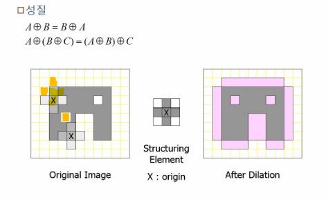

# Morphological Transformations

Morphologicla Transformation은 이미지를 세분화하여 단순화, 제거, 보정을 통해서 형태를 파악하는 목적으로 사용이 된다. 즉, 노이즈 제거, 구멍메꾸기, 연결되지 않은 경계 이어붙이기 등 형태학적 관점에서의 영상 연산을 생각하면 된다. 일반적으로 이진(binary) 이미지나 회색조(grayscale) 이미지에 사용된다. 사용하는 방법으로는 dilation(팽창), erosion(침식), 그리고 2개를 조합한 opening(erosion first dilation after)과 closing(dilation first erosion after)총 4가지가 있다. 공통적으로 morphological transformation을 적용하기 전에 커널을 생성하는 함수는 다음과 같다. `cv2.getStructuringElement()`함수를 사용한다.

```
cv2.getStructuringElement(shape, ksize[, anchor]) 
shape : 구조화 요소 커널의 모양 결정(0과 1로 이루어진 커널)
> cv2.MORPH_RECT: 사각형
> cv2.MORPH_ELLIPSE: 타원형
> cv2.MORPH_CROSS: 십자형
ksize : 커널 크기
anchor : 구조화 요소의 기준점, cv2.MORPH_CROSS에만 의미 있고 기본 값은 중심점(-1, -1)
```


1. Erosion(침식)

   침식의 정의는 각 Pixel에 structuring element를 적용하여 하나라도 0이 있으면 대상 pixel을 제거하는 방법입니다. 아래 그림은 대상 이미지에 십자형 structuring element를 적용한 결과 입니다.

   

   십자형 Structuring Element를 Original Image에 적용을 합니다. 원본의 각 pixel에 적용을 하여 겹치는 부분이 없는 부분이 하나라도 있으면 그 중심 pixel을 제거하는 방식입니다. 최종적으로 우측의 분홍색 영역만 남게 됩니다. 말 그대로 **이미지 내부의 물체의 크기를 깍아서 줄여주는 것**이라 생각하면 된다. 

   ```
   cv2.erode(src, kernel [, anchor, iterations, borderType, borderValue]) 
   
   img: 입력영상, 바이너리 영상( 검은색 : 배경, 흰색 : 전경)
   kernel: 구조화 요소 커널 객체
   anchor: cv2.getStruchturingElement()와 동일
   interatios: 침식 연산 적용 반복 횟수
   borderType: 외곽 영역 보정 방법 설정
   borserValue: 외곽 영역 보정 값
   ```

   ```python
   img=cv2.imread('~~~')
   
   # 구조화 요소 커널, 사각형 (3x3) 생성 ---①
   k=cv2.getStructuringElement(cv2.MORPH_RECT, (2,2) )
   
   # 침식 연산 적용 ---②
   erosion=cv2.erode(img, k)
   
   # 결과 출력
   merged=np.hstack((img,erosion))
   plt.imshow(cv2.cvtColor(merged, cv2.COLOR_BGR2RGB))
   plt.show()
   ```

   침식의 예는 다음과 같다.

   

2. Dilation(팽창)

   Erosion과 반대로 대상을 확장한 후 작은 구멍을 채우는 방법입니다. Erosion과 마찬가지로 각 pixel에 structuring element를 적용합니다. 대상 pixel에 대해서 OR 연산을 수행합니다. 즉 겹치는 부분이 하나라도 있으면 이미지를 확장합니다.

   

   위 그림은 십자형 structuring element를 원본이미지에 OR 연산을 적용합니다. 최종적으로 확장된 이미지를 얻을 수 있습니다. **결과적으로 경계가 부드러워 지고, 구멍이 채워지는 효과를 얻을 수 있습니다.** 말 그대로 **이미지 내부의 픽셀의 영향을 더 많이 미치게 만들어주는 것**이라고 생각하면 된다.

   ```
   cv2.dilate(src, kernel [, anchor, iterations, borderType, borderValue]) 
   
   img: 입력영상, 바이너리 영상(검은색: 배경, 흰색: 전경)
   kernel: 구조화 요소 커널 객체
   anchor: cv2.getStruchturingElement()와 동일
   interatios: 팽창 연산 적용 반복 횟수
   borderType: 외곽 영역 보정 방법 설정
   borserValue: 외곽 영역 보정 값
   ```

   ```python
   img=cv2.imread('~~~')
   
   # 구조화 요소 커널, 사각형 (3x3) 생성 ---①
   k=cv2.getStructuringElement(cv2.MORPH_RECT, (3,3) )
   
   # 팽창 연산 적용 ---②
   dilation=cv2.dilate(img, k)
   
   # 결과 출력
   merged=np.hstack((img,erosion))
   plt.imshow(cv2.cvtColor(merged, cv2.COLOR_BGR2RGB))
   plt.show()
   ```

   침식과 팽창을 응용한 morphological transformation을 사용하는 함수는 `cv2.morphologEx()`이다.

   ```
   cv2.morphologyEx(src, op, kernel, [, dst, anchor, iteration, borderType, borderValue])
   
   src: 입력 영상, Numpy 배열
   op: 모폴로지 연산 종류
   cv2.MORPH_OPEN : 열림 연산 > 밝은 곳 제거
   cv2.MORPH_CLOSE : 닫힘 연산 > 어두운 곳 제거
   cv2.MORPH_GRADIENT : 그레이디언트 연산
   cv2.MORPH_TOPHAT : 탑햇 연산 > 밝은 곳 강조
   cv2.MORPH_BLACKHAT : 블랫햇 연산 > 어두운 곳 강조
   kernel : 구조화 요소 커널
   dst : 결과 영상
   anchor : 커널의 기준점
   iteration : 연산 반복 횟수
   borderType : 외곽 보정 방식
   borserValue : 외곽 보정 값
   ```

   팽창의 예는 다음과 같다.


3. Opening(침식 후 팽창), Closing(팽창 후 침식)

   Opening은 주변보다 밝은 노이즈 제거하여 독립된 개체 분리하는 것이다. 즉, 돌출된 픽셀 제거를 한다고 생각하면 된다. 정리하면 침식을 하면 이미지내의 노이즈를 제거하면서 물체의 픽셀 영역이 줄어들지만, 다시 팽창을 하면 이미지 내의 물체의 픽셀 영역이 증가한다. 노이즈가 제거 되었기 때문에 그 부분은 팽창이 일어나지 않는다. 즉, **opening을 하게 되면 원본 이미지에서 노이지를 제거하는 효과**가 발생하게 된다.

   Closing은 주변보다 어두운 노이즈 제거하고 끊어져 보이는 개체 연결하는 것이다. 즉, 구멍 메우기를 하는 것이라고 보면 된다. 정리하면 팽창을 하면 이미지 안에 물체의 비운 부분을 채우고 픽셀이 차지하는 영역이 커지고 그 후에 침식을 하면 다시 픽셀이 차지하는 영역이 작아진다. 즉, **closing을 하게 되면 원본 이미지에서 구멍 나 있는 곳이 채워지는 효과**가 발생하게 된다.

   

   

   ```
   img1 = cv2.imread('~~~', cv2.IMREAD_GRAYSCALE)
   img2 = cv2.imread('~~~', cv2.IMREAD_GRAYSCALE)    
   
   # 구조화 요소 커널, 사각형 (5x5) 생성 ---①
   k=cv2.getStructuringElement(cv2.MORPH_RECT, (5,5) )
   
   # 열림 연산 적용 ---②
   d_op= cv2.morphologyEx(img1, cv2.MORPH_OPEN,k)
   
   # 닫힘 연산 적용 ---③
   d_cl= cv2.morphologyEx(img2, cv2.MORPH_CLOSE,k)
   
   # 결과 출력
   merged_1=np.hstack((img1,d_op))
   merged_2=np.hstack((img2,d_cl))
   
   merged=np.vstack((merged_1,merged_2))
   
   #plt.imshow(cv2.cvtColor(img1, cv2.COLOR_BGR2RGB))
   #plt.show()
   
   plt.imshow(cv2.cvtColor(merged, cv2.COLOR_BGR2RGB))
   plt.show()
   ```

   원본이미지와 원본 이미지를 opening한 결과 비교

   

   원본이미지와 원본 이미지를 closing한 결과 비교

   

4. 그래디언트 연산

   이미지의 dilation과 erosion의 픽셀 간의 차이 연산을 한 결과이다. 이 연산은 객체의 경계를 검출하는데 유용하다. 정리하면, 이미지 dilation을 하면 이미지 안에서 물체의 픽셀이 차지하는 영역이 커지고 erosion을 하면 이미지 안에서 물체의 픽셀이 차지하는 영역이 작아진다. 그리고 서로 간의 차이를 하면 겹치는 부분은 사라지고 남게 되는 곳은 대체로 dilation한 영역이 될 것인데, 그곳이 이미지 내의 객체의 경계일 것이다.

   ```python
   img = cv2.imread('~~~')
   
   # 구조화 요소 커널, 사각형 (5x5) 생성 ---①
   k=cv2.getStructuringElement(cv2.MORPH_RECT, (5,5) )
   
   # 열림 연산 적용 ---②
   gradient = cv2.morphologyEx(img, cv2.MORPH_GRADIENT,k )
   
   # 결과 출력
   merged=np.hstack( (img, gradient) )
   plt.imshow(cv2.cvtColor(merged, cv2.COLOR_BGR2RGB))
   plt.show()
   ```

   예를 들면 다음과 같다.

   

   

5. 탑햇, 블랙햇 연산

   탑햇연산은 원본 이미지에서 열림 연산을 한 이미지의 차이이다. 밝은 부분 영역을 강조하기 위한 연산이다. 블랙햇연산은 닫힘 연산을 한 이미지에서 원본 이미지의 차이이다. 어두운 부분 강조하기 위한 연산이다.

   ```
   img = cv2.imread('~~~.jpg')
   
   # 구조화 요소 커널, 사각형 (5x5) 생성 ---①
   k=cv2.getStructuringElement(cv2.MORPH_RECT, (9,9) )
   
   # 탑햇 연산 적용 ---②
   top_hat = cv2.morphologyEx(img, cv2.MORPH_TOPHAT,k )
   
   # 블랫햇 연산 적용 ---③
   black_hat = cv2.morphologyEx(img, cv2.MORPH_BLACKHAT,k )
   
   # 결과 출력
   
   merged=np.hstack( (img, top_hat, black_hat) )
   plt.imshow(cv2.cvtColor(merged, cv2.COLOR_BGR2RGB))
   plt.show()
   ```

   탑햇의 예는 다음과 같다.

   

   블랙햇 예는 다음과 같다.

   


< 참고 >

1. http://www.gisdeveloper.co.kr/?paged=22&cat=130
2. https://opencv-python.readthedocs.io/en/latest/doc/12.imageMorphological/imageMorphological.html