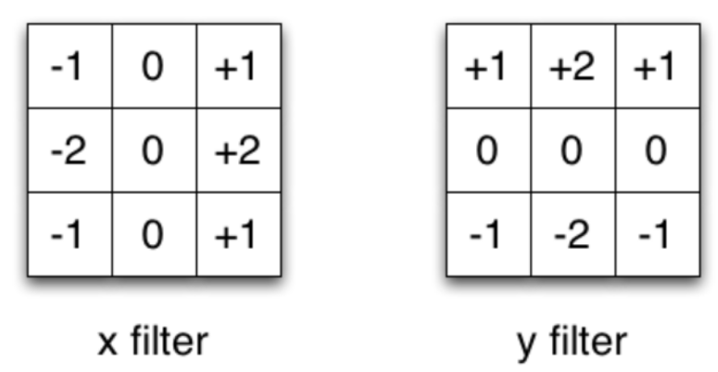
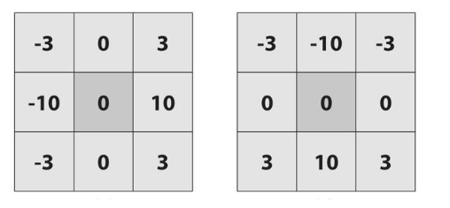
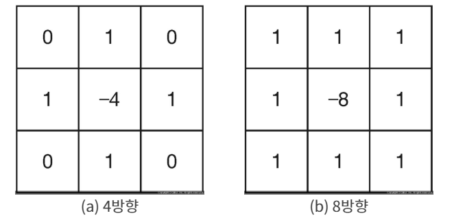

# Image Gradients 

**가장자리(edge)**란 물체의 외각을 나타내는 선이며 이런 가장자리는 영상처리에서 영상을 특징 짓는 선 요소이다. 영상처리에 있어서도 윤곽을 추출하는 것은 중요한 개념이다. 영상 중의 물체와 배경의 경계가 가장자리이기 때문에 영상의 픽셀 값이 급격히 변하는 부분이라고 할 수 있다. 미분에 의한 영상처리 방법이 있다. 기울기가 급격히 변하는 곳이 가장자리가 될 가능성이 높다. 2차원 공간에서 미분은 그래디언트라고 하는데 그래디언트 방법을 사용하여 가장자리를 구하고자 한다.

그래디언트(gradient)의 정의는 스칼라장에서 변화율이 최대의 증가율을 나타내는 벡터장(크기와 방향을 가지는 field)을 뜻한다. 영상처리에서 그래디언트는 영상의 가장자리(edge) 및 그 방향을 찾는 용도로 활용 된다. 이미지 (x,y)에서의 그래디언트 값(크기와 방향, 즉 밝기와 밝기의 변화하는 방향)을 구해서 해당 픽셀이 가장자리에 얼마나 가까운지, 그리고 그 방향이 어디인지 쉽게 알수 있게 합니다. 그래서 이 그래디언트를 이용해서 이미지의 가장자리를 검출하고자 한다. 


1. 소벨 필터(Sobel Filter)

   ```
cv2.Sobel(img, ddepth, dx, dy[, dst, ksize, scale, delta, borderType)
   img: 입력 영상
   ddepth: 출력 영상의 dtype( -1 : 입력 영상과 동일)
   dx, dy: 미분 차수(0, 1, 2, 둘 다 0은 안됨)
   ksize: 커널의 크기(1, 3, 5, 7 중 선택 )
   scale: 미분에 사용할 계수
   delta: 연산 결과에 가산할 값
   ```
   
   

   

   

   ```python
img = cv2.imread("~~~")
   
   # 소벨 커널을 직접 생성해서 엣지 검출 ---①
   ## 소벨 커널 생성
   gx_k=np.array( [ [-1,0,1], [-2,0,2], [-1,0,1] ])
   gy_k=np.array( [ [-1,-2,-1], [0,0,0], [1,2,1] ])
   
   # 소벨 필터 적용
   edge_gx=cv2.filter2D(img,-1,gx_k)
   edge_gy=cv2.filter2D(img,-1,gy_k)
   
   # 소벨 API를 생성해서 엣지 검출
   sobel_x=cv2.Sobel(img,-1,1,0,ksize=3)
   sobel_y=cv2.Sobel(img,-1,0,1,ksize=3)
   
   # 결과 출력
   merged_1= np.hstack( (img, edge_gx, edge_gy, edge_gx+edge_gy))
   merged_2= np.hstack( (img, sobel_x, sobel_y, sobel_x+sobel_y))
   merged = np.vstack( (merged_1, merged_2) )
   
   cv2.imshow('sobel', merged)
   cv2.waitKey(0)
   cv2.destroyAllWindows()
   ```
   
   

2. 샤르 필터(Scharr Filter)

   

   

   

   ```
   cv2.Scharr(src, ddepth, dx, dy[, dst, scale, delta, borderType]) :
   src : 입력 영상
   ddepth : 출력 영상의 dtype( -1 : 입력 영상과 동일)
   dx, dy : 미분 차수(0, 1, 2, 둘 다 0은 안됨)
   scale : 미분에 사용할 계수
   delta : 연산 결과에 가산할 값
   ```

   ```python
   img = cv2.imread("~~~")
   
   # 샤르 커널을 직접 생성해서 엣지 검출 ---①
   gx_k = np.array([[-3,0,3], [-10,0,10],[-3,0,3]])
   gy_k = np.array([[-3,-10,-3],[0,0,0], [3,10,3]])
   edge_gx=cv2.filter2D(img,-1,gx_k)
   edge_gy=cv2.filter2D(img,-1,gy_k)
   
   # 샤르 API로 엣지 검출 ---②
   Scharr_x=cv2.Scharr(img,-1,1,0)
   Scharr_y=cv2.Scharr(img,-1,0,1)
   
   # 결과 출력
   merged_1= np.hstack( (img, edge_gx, edge_gy, edge_gx+edge_gy))
   merged_2= np.hstack( (img, Scharr_x, Scharr_y, Scharr_x+Scharr_y))
   merged = np.vstack( (merged_1, merged_2) )
   
   cv2.imshow('Scharr', merged)
   cv2.waitKey(0)
   cv2.destroyAllWindows()
   ```

   

3. 라플라시안 필터(Laplacian Filter)

   이미지의 가로와 세로에 대한 Gradient를 2차 미분한 값입니다. Sobel filter에 미분의 정도가 더해진 것과 비슷합니다.(dx와 dy가 2인 경우) blob(주위의 pixel과 확연한 picel차이를 나타내는 덩어리)검출에 많이 사용됩니다.

   

   ```
   cv2.Laplacian(src, ddepth[, dst, ksize, scale, delta, borderType):
   src : 입력 영상
   ddepth : 출력 영상의 dtype( -1 : 입력 영상과 동일)
   dx, dy : 미분 차수(0, 1, 2, 둘 다 0은 안됨)
   ksize : 커널의 크기(1, 3, 5, 7 중 선택 )
   scale : 미분에 사용할 계수
   delta : 연산 결과에 가산할 값
   ```

   

   ```
   img = cv2.imread("img/sudoku.jpg")
   
   # 라플라시안 필터 적용 ---①
   edge=cv2.Laplacian(img,-1)
   
   # 결과 출력
   merged=np.hstack( (img,edge) )
   cv2.imshow('Laplacian', merged)
   cv2.waitKey(0)
   cv2.destroyAllWindows()
   
   ```

   

4. 캐니 경계 검출(Canny Edge Detection)

   가장 유명한 Edge Detection방법입니다. 여러 단계의 Algorithm을 통해서 경계를 찾아 냅니다.

   ​	1) Noise Reduction

   ​	이미지의 Noise를 제거합니다. 이때 5x5의 Gaussian filter를 이용합니다.

   ​	2) Edge Gradient Detection

   ​	이미지에서 Gradient의 방향과 강도를 확인합니다. 경계값에서는 주변과 색이 다르기 때문에 미분값	이 급속도로 변하게 됩니다. 이를 통해 경계값 후보군을 선별합니다.

   ​	3) Non-maximum Suppression

   ​	이미지의 pixel을 Full scan하여 Edge가 아닌 pixel은 제거합니다.

   ​	4) Hysteresis Thresholding

   ​	이제 지금까지 Edge로 판단된 pixel이 진짜 edge인지 판별하는 작업을 합니다. max val과minVal(임	계값)을 설정하여 maxVal 이상은 강한 Edge, min과 max사이는 약한 edge로 설정합니다. 이제 약한 	edge가 진짜 edge인지 확인하기 위해서 강한 edge와 연결이 되어 있으면 edge로 판단하고, 그러지 	않으면 제거합니다.

   

   ```
   cv2.Canny(img, threshold1, threshold2, [, edges, apertureSize, L2gardient])
   
   img : 입력 영상, Numpy 배열
   threshold1, threshold2 : 스레시홀딩에 사용할 최소, 최대값
   apertureSize : 마스크에 사용할 커널 크기
   L2gradient : 그레이디언트 강도를 구할 방식 지정 플레그
   True : 제곱합의 루트
   False : 절대값 합
   edges : 엣지 결과 값을 갖는 2차원 배열
   ```

   

   ```
   img=cv2.imread('~~~')
   
   # 케니 엣지 적용 
   edges=cv2.Canny(img,200,200)
   
   # 결과 출력
   cv2.imshow('qq',cv2.cvtColor(img, cv2.COLOR_BGR2RGB))
   #.show()
   
   cv2.imshow('pp',cv2.cvtColor(edges, cv2.COLOR_BGR2RGB))
   cv2.waitKey()
   cv2.destroyAllWindows()
   ```

   

   


