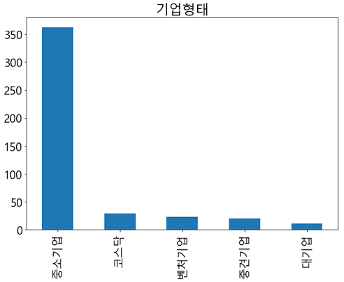
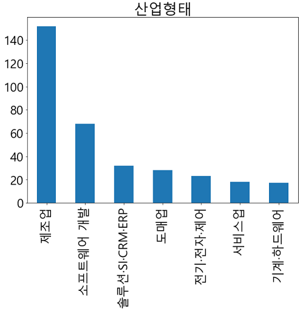
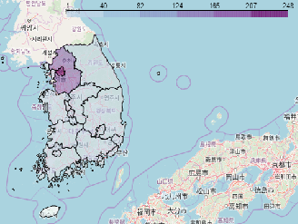

# SemiProject 1 

## Title: 이미지분석 기업 정보 제공

### 1.주제 선정 이유 및 목표

- 교육 수료 후 방향성 제시

### 2.데이터 수집 방법

- 크롤링을 사용하여 데이터 수집

- 취업정보 대표 사이트: JOBKOREA, saramin
- Keyword: 영상처리, 컴퓨터비전, 영상SW

### 3.분석 프로세스

- 기준설정
- 전처리
- 분류

### 4.결과

- 기업형태에서는 중소기업이 제일 많고 약 73.4% 차지
- 산업형태에서는 제조업이 제일 많고 약 30.8% 차지
- 지역별로는 대부분의 기업이 서울, 경기에 존재하고 약 81.6%에 해당 