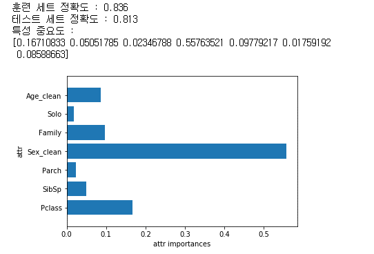
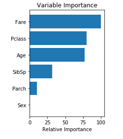

# SemiProject 2

## Title:타이타닉 승객 정보를 이용한 생존자 예측

### 1. 목표

- 타이타닉 데이터를 통해 생존자의 생사여부와 다른 데이터들 간의 연관성을 분석하여 생존에 영향을 미치는 요소를 찾아내는 것

### 2. 데이터 처리

- 결측치 채우기
- 불필요한 열 제거하기
- 텍스트로 되어있는 요소는 숫자로 바꿔주기 
- 실수 범위를 구간 범위로 바꿔주기
- 정규화

### 3. 머신러닝 방법

- 로지스틱 회귀(logistic regression)
- 주성분 분석(principal component analysis)
- 결정 트리(decision tree)
- 그래디언트 부스팅 분류기(gradient boosting classifier)
- 서포트 벡터 머신(support vector machine, SVM)

### 4. 결과

- 랜덤 포레스트를 이용한 결과

- 그래디언트 부스팅 분류기 이용한 변수 중요도

  

### 5. 결론

- 머신 러닝 모델 중에서 다른 모델보다 랜덤 포레스트와 서포트 벡터 머신이 점수가 높았고 두 모델 정확도는 약 0.81이다.

- 문제에 접근할 때 중요하다고 생각했던 열은 성별, 나이, 좌석등급이었지만 모델에 따라서 중요한 열이 달랐다.

- 머신러닝을 사용하지 않은 데이터 분석에서 성별과 좌석등급이 생존에 큰 영향을 미쳤다.