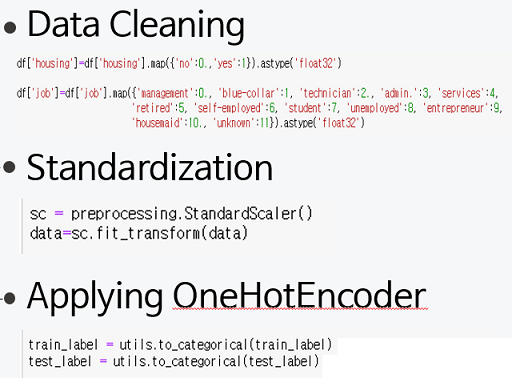
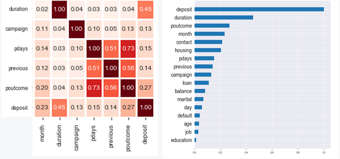
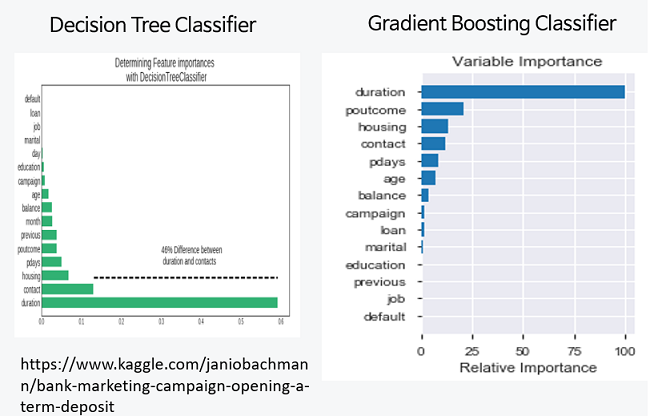
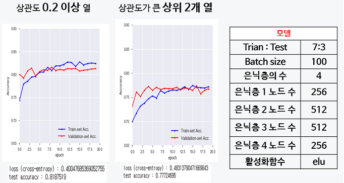
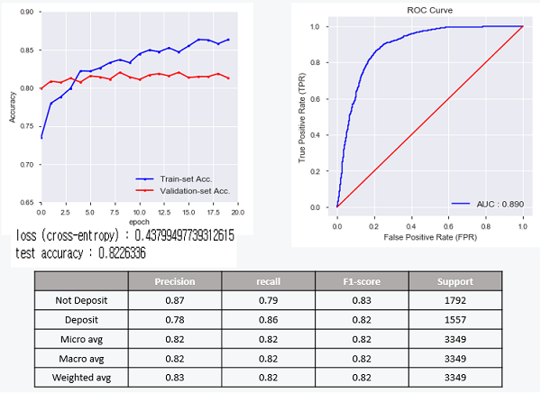

# SemiProject 3

## Title: Bank Marketing Dataset (Predicting Term Deposit Subscriptions)

### 1. 주제 선정 이유 및 목표

- **Telemarketing** is a method of direct marketing to advertise or sell of goods or services by phone.

- Find the best strategies to **improve** for the next marketing campaign. How can the financial institution have a greater **effectiveness** for future marketing campaigns? 

- Propose a **data mining** (DM) approach to **predict** the success of telemarketing calls for selling bank long-term deposits.

### 2. 데이터 처리 및 중요한 열 추출

- 데이터 처리 예

- 피어슨 상관 관계로 부터 중요한 열 추출

- 머신러닝을 활용해 특징 중요도 추출

### 3. 결과

- 특정 열을 선택하여 딥러닝한 결과

- 딥러닝 모델을 사용한 정확도와 ROC Curve

