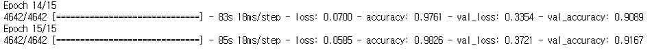
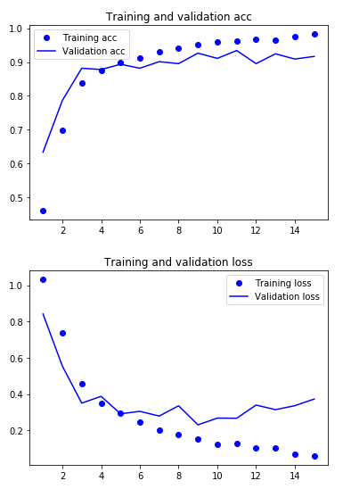

# SemiProject 4

## Title: **CNN을 사용하여 영화 속에서 등장 인물 식별**

### 1. **소개** 및 목표

- 등장인물의 이미지 크롤링을 하고 CNN(Convolutional Neural Network)을 사용하여 인물 이미지에 대한 학습을 한다.
- 학습된 모델을 영화에 적용한다. 영화 속에서 인물 등장 시 학습된 이미지와 일치하면 이름을 출력하고 그 인물을 추적한다.

### 2. 이미지를 얻기 위한 사전 작업

1. **이미지 크롤링**하여 이미지 획득(https://github.com/jglee087/AI-ImageCourse/blob/master/SemiProject%204/1.%20GoogleImageCrawling.ipynb)
2. 크롤링하여 얻은 이미지에서 **얼굴 사진 추출**(https://github.com/jglee087/AI-ImageCourse/blob/master/SemiProject%204/2.%20ImageExtraction.ipynb)
3. 얼굴 사진을 읽어 **CNN을 사용하여 이미지 학습**하고 모델 저장(https://github.com/jglee087/AI-ImageCourse/blob/master/SemiProject%204/3.%20ReadImageApplyCNN.ipynb)
4. 저장된 모델을 불러와서 동영상을 재생시켜 가면서 학습된 이미지가 영상에 나오는지 확인하고 **추적하고 등장시 이미지 파일로 저장**(https://github.com/jglee087/AI-ImageCourse/blob/master/SemiProject%204/4.%20ReadModelandImageSave.ipynb)

### 3.결과

- 손실 값과 정확도

- Epoch 당 training accuracy와 validation accuracy와 training Loss와 validation loss

- 크롤링한 이미지를 CNN으로 학습했을 때 정확도(accuracy)는 약 98.26%가 나오고 validation accuracy는 약 90%이었다. 이미지만 학습했을 때는 정확도가 높았지만, 학습된 모델을 사용하여 영상을 추적하면서 비교했을 때는 일치도가 낮았다. 영상에서 haarcascade_frontface.xml 파일을 사용하여 얼굴을 추출하였는데 이 파일은 얼굴의 정면 영상이 나올때만 정확하게 인식하기 때문이라고 생각한다.

- 이미지의 저작권으로 인해 배우들의 얼굴을 직접 올릴 수 없었다.
